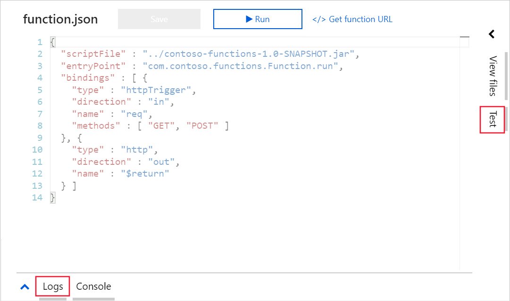
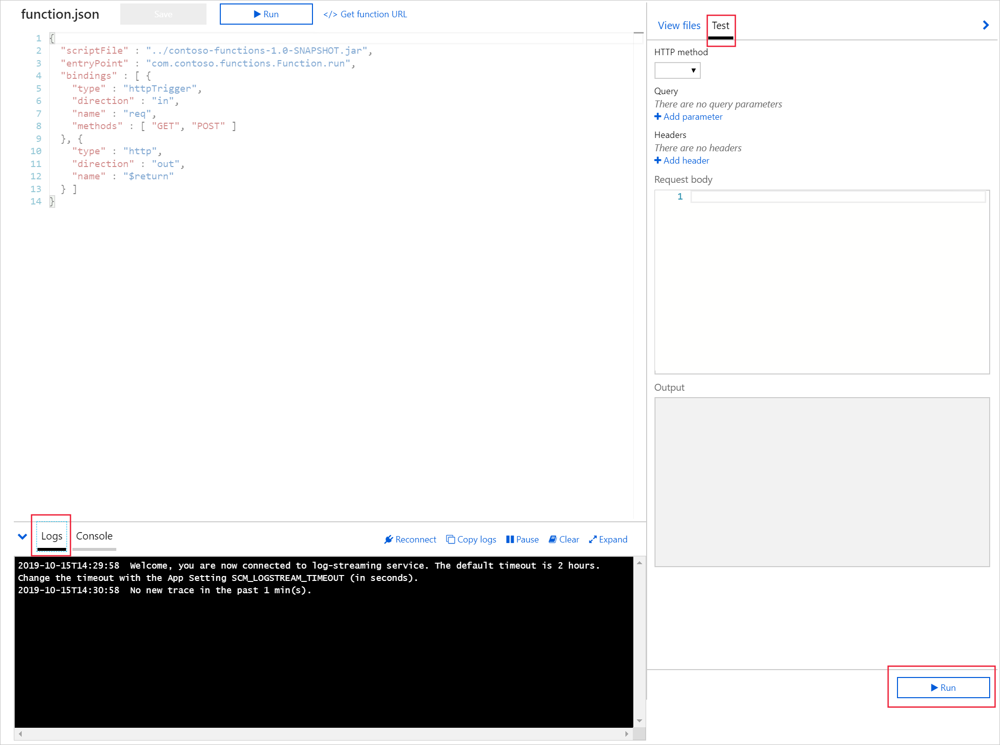
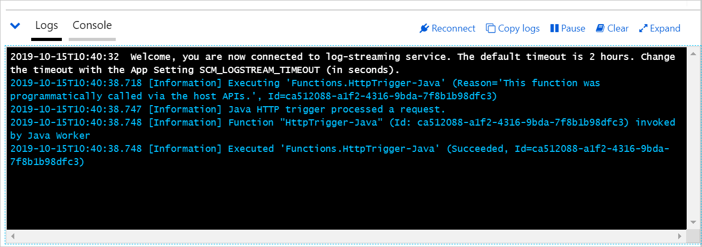

You have successfully run the Azure Functions app locally through the Azure CLI and tested it. 

Now you'll need to deploy this application to Azure and create an Azure Function.

In this unit, you'll learn how to use Maven to deploy your application and turn it into an Azure Function.

## Deploy your Azure Function

Up until now, you've created, built, run, and tested your application locally through the Azure CLI.  Next, you'll learn how to deploy the application to Azure and turn it into an Azure Function.

1. Return to your Azure CLI session.  This is the one that you used to run and test the Azure Function the last time.
1. Now use the Maven command to deploy your application.  

    ```BASH
    cd ~/contoso-functions
    mvn azure-functions:deploy
    ```

    The deploy command takes your application and deploys it to the Azure Functions area.  It uses many of the parameters you supplied during the creation of the Function. 

    When the deployment is successful, you should see something similar to this:

    ```console
    [INFO] Scanning for projects...
    [INFO]
    [INFO] ------------------------------------------------------------------------
    [INFO] Building Azure Java Functions 1.0-SNAPSHOT
    [INFO] ------------------------------------------------------------------------
    [INFO]
    [INFO] --- azure-functions-maven-plugin:1.3.4:deploy (default-cli) @ contoso-functions ---
    [INFO] In the Azure Cloud Shell, use MSI to authenticate.
    [INFO] The specified function app does not exist. Creating a new function app...
    [INFO] Set function worker runtime to java
    [INFO] Successfully created the function app: contoso-functions-201910153436223
    [INFO] Trying to deploy the function app...
    [INFO] Trying to deploy artifact to contoso-functions-201910153436223...
    [INFO] Successfully deployed the artifact to https://contoso-functions-201910153436223.azurewebsites.net
    [INFO] Successfully deployed the function app at https://contoso-functions-201910153436223.azurewebsites.net
    [INFO] ------------------------------------------------------------------------
    [INFO] BUILD SUCCESS
    [INFO] ------------------------------------------------------------------------
    [INFO] Total time: 29.389 s
    [INFO] Finished at: 2019-10-15T14:03:32+00:00
    [INFO] Final Memory: 37M/332M
    [INFO] ------------------------------------------------------------------------

    ```
    
1. Make a note of the URL for the deployed Function. You'll need it next.

## Test your Azure Function in the portal

From the results view, you might think you can click one of the https links and see the application function running in your browser.  The link will work, but the address line is incomplete.  

In a similar fashion to when you tested the Function through the Azure CLI, there are a few more steps required.  First of all, we need to build the URL.

1. Open the Azure portal associated with your sandbox instance.
1. Select All resources from the left pane.
1. Select your Function app from the list, its name being with `contoso-function-`.
1. When the function overview is displayed, select the HttpTrigger-Java function from the list.  This will show you the function.json code page.  
1. While you're accessing the function, it is a good idea to run a quick test.  From the function view, scroll down to the bottom of the page and select the **Logs** option.

    

1. From the right-hand side of the page, select the **Test** option.

1. Select **POST** as from the HTTP method.

    

1. Select **Run**.

1. You'll see a log entry appear in the window, which confirms the function is behaving as expected.

    

## Test your Azure Function in your browser

1. At the top of the function page, select **</> get function URL**.
1. A small panel will appear with the title: Get function URL. Press the **Copy** button to make a copy of the URL and then close the dialogue box.
1. You now have the URL for your Function.
1. Open a new tab in your browser and paste the function URL and run. You'll receive a message asking you to supply a name parameter.
1. You need to add the parameter to the end of the URL.  Append this text to the URL line.

    ```TXT
    &name=CloudTest
    ```

1. The completed URL will look like this:

    ```TXT
    https://contoso-functions-20191010093741216.azurewebsites.net/api/HttpTrigger-Java?code=45ToKzriO7ITlXfm9VxV/jWyQz6qC4XKVIkbhp/a7p7JZFZk2JgFxg==&name=CloudTest
    ```

1. Copy this into your URL and refresh your web page. You'll see the message, `Hello, CloudTest`.
