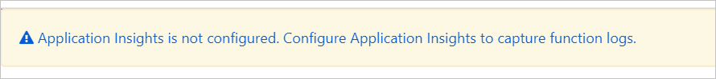
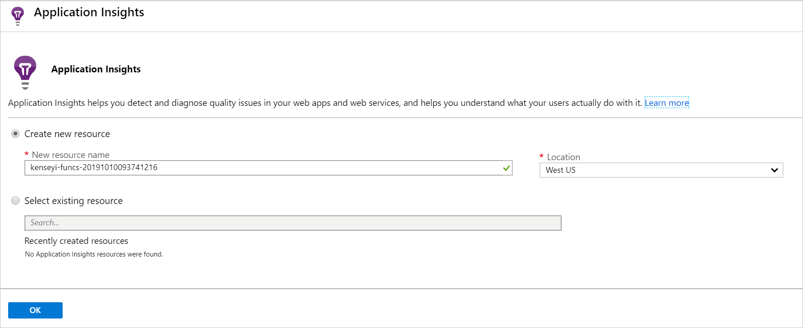

You've now successfully deployed your first serverless web function, built from the Azure Functions Maven Archetype.

Now you need to monitor its usage using Azure Application Insights.

In this unit, you'll learn about Azure Functions integration with Application Insights, how to set up Application Insights for your Azure Function.

## Understand Application Insights

Azure's Application Insights helps you to view and analyze live data on an application as it's being used by customers. It provides a comprehensive set of tools that analyze and respond to issues affecting your app.

Application Insights supports applications developed in Node.js, Java EE, or .NET. Allowing your development team greater flexibility and choice in how they structure and build applications.

Application Insights is an Application Performance Management (APM) service included with Azure Monitor and is integrated with Azure Functions.

## Enabling Application Insights for your Function application in Azure

If you'd built and deployed your application using the Azure portal, then Application Insights are automatically enabled. Since you've used Maven to create the app from an archetype, you'll need to enable Application Insights for your application.

Enabling Application Insight is done through the Azure portal. You'll need to find your function application in the Function Apps area. The first time you select your function, you'll see a pale yellow banner across the top, notifying you that Application Insights aren't configured.

The banner is a link that will take you to the Application Insights configuration page for your function.

Application Insights will provide essential information on failed requests, server response time, server requests, and availability.  It can also use telemetry data sent from the application.  However, this will require you to include telemetry tracking points in your code.

## Adding instrumentation to your Java Project

To get the best from Application Insights, you'll need to update your Functions project.  There are two types of changes to be made.  The first are configuration changes. These add Application Insights and logging support.  The other type is code injection-based, which allows for fine-grained usage of the application, for instance, the page a user visits, or options they select.

### Updating the project configuration files

The first thing you'll need to do is update the project pom file and add a dependency for the Application Insights library.

Then in the host.json file, you'll add in parameters to define how the logging and Application Insights will work for your application.

### Updating the project code

To implement the event tracking in Application Insight, you'll need to add a tracker to your code.  These are added at critical points in the execution of your code, for example, when a new page is selected, or specific data load or saves occur.

## Understanding log tracking

While the recommendation is to use Application Insights in your Function apps to provide fine details monitoring of your application usage. You can also get insights into the operation of your applications from the logs.  The logs can be found by accessing your application function and then selecting platform features and Log streaming.
