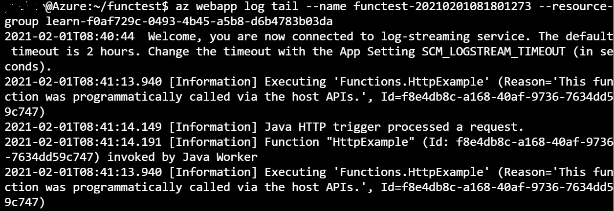
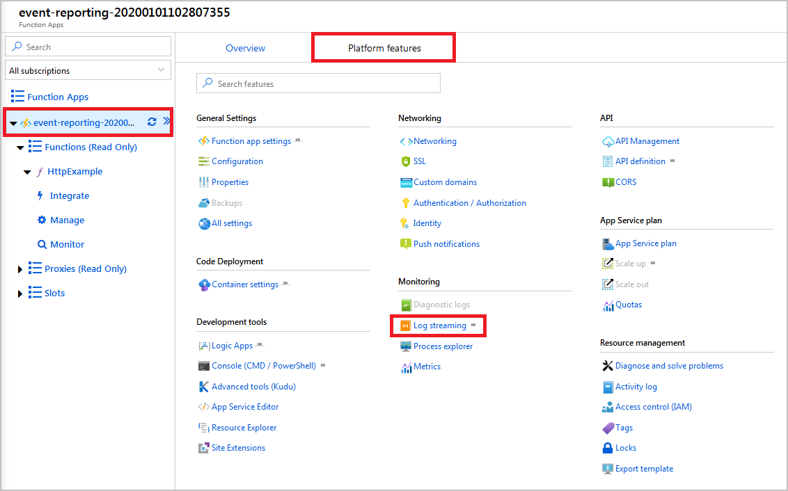

Now that your first serverless web function using the Azure Functions Maven Archetype is successfully deployed, your company would like you to research how to analyze your application's usage with Azure Application Insights.

In this unit, you learn about log streaming as a basic troubleshooting tool and the integration between Azure Functions and Application Insights.

## Stream logs in real-time with Azure CLI

Once you have your function app deployed and running. You can use the following Azure CLI command to get real-time log streaming from the app for basic troubleshooting:

```azcli
az webapp log tail -n <function app name> -g <resource group name>
```

The traffic to your Function app might produce a streaming log like this example:



For more complicate troubleshooting and monitoring scenarios, Application Insights is a better fit.

## What is Application Insights?

Azure Application Insights is an Application Performance Management (APM) service included with Azure Monitor, and is integrated with Azure Functions. Application Insights helps developers view and analyze live data about their applications as they're being used by customers. Application Insights provides a comprehensive set of tools that can help you analyze and respond to issues that might be affecting your application.

Application Insights supports applications that are developed in Node.js, Java, or .NET. It allows your development team greater flexibility and choice in how they structure and build your company's applications.

Application Insights provides essential information on failed requests, server response time, server requests, and availability. Application Insights is enabled by default for your Azure Functions. If you include telemetry tracking points in your code, Application Insights can also use telemetry data sent from your application.

## Adding instrumentation to your Java project

To get the best from Application Insights, you need to update your function project. There are two types of changes that you need to make:

- The first set of changes is updates to your configuration in order to add Application Insights and logging support:

  - Update your project's *pom.xml* file to add a dependency for the Application Insights library.

  - Update your project's *host.json* file to add parameters that define how you want the logging and Application Insights to work for your application.

- The second set of changes is modifications to your application's code, which provides you with opportunities to fine-tune your application's reporting:

  - To implement the event tracking in Application Insight, you need to add a *tracker* to your code.

  - Trackers are added at critical points in your code's execution; for example: when a new page is selected, or when specific data is saved to your application.

## Understanding logging and monitoring options

The recommended method for using Application Insights in your function applications is to fine-tune your application's monitoring and reporting. However, you can also retrieve data about the operation of your applications from the built-in logs that Azure provides you.

For example, **Log streaming** is available by selecting **Log stream** on the **Function App** menu. Then choose **Filesystem Logs** or **App Insights Logs**.


