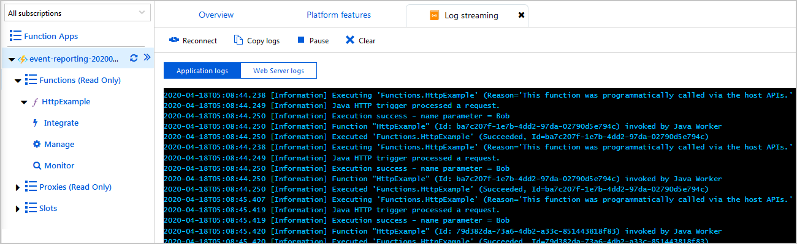
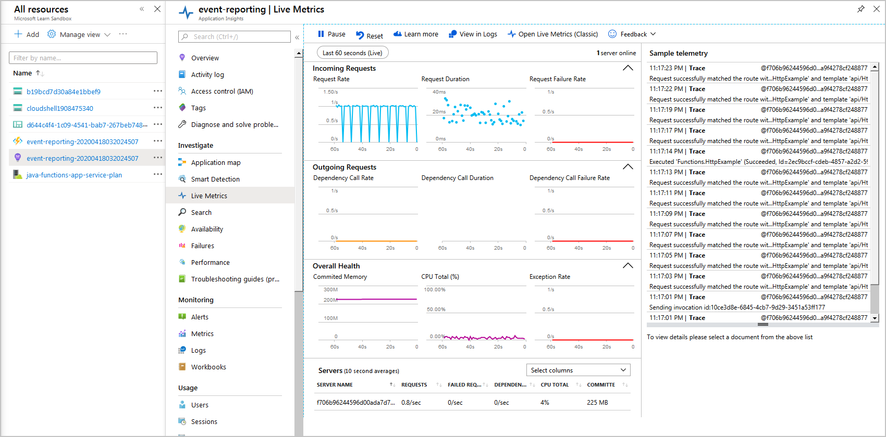

In the previous unit, you learned about a few of the benefits for incorporating Application Insights into your function application. You also learned about some of the other logging features that are available to your team of developers.

At this stage in your project research, you deployed your function application to Azure using Maven, and you tested your function application in production. Your next task is to add tracking and logging functionality to your application.

In this exercise, you update your function project configuration files to support both log streaming and Application Insights. You also learn how to add custom tracking and Application Insight event triggers to your project code.

## Stream logs in real time

Now that your Function app is deployed and running on Azure, you can troubleshoot it by using the simple Azure CLI command to get real time log streaming from the app.

1. In the Azure portal, on the **Overview** page for your **HttpExample** function. Use the **Copy to clipboard** icon to copy the value of your **Resource group** and **Function app**.

1. In the Azure Cloud Shell window, enter the `az webapp log tail -n <functionAppName> -g <resourceGroup>` command to stream logs. Replace `<functionAppName>` and `<resourceGroup>` with the values that you saved in the previous step. For example:  

    ```azcli
    az webapp log tail -n event-reporting-20240125192009873 -g learn-f0af729c-0493-4b45-a5b8-d6b4783b03da

1. You should see output like the following message.

    ```output
    2024-01-25T20:44:58  Welcome, you are now connected to log-streaming service. The default timeout is 2 hours. Change the timeout with the App Setting SCM_LOGSTREAM_TIMEOUT (in seconds). 
    2024-01-25T20:45:58  No new trace in the past 1 min(s).
     ```

1. Open a new tab in your web browser, and paste the fully constructed URL from the previous exercise to access your function app to generate some logs.

1. When you're done testing, press <kbd>Ctrl+C</kbd> in your Cloud Shell to close the log stream.

## Adding instrumentation to your Java project for Application Insights

Now that Application Insights is enabled for your application, your next task to enable it in your application. To enable application logging and Application Insights, you need to modify the configuration files to include the requisite libraries and other dependencies.

There are two configuration files you need to update: *pom.xml* and *host.json*.

### Modifying your *pom.xml* file

1. Using the Azure Cloud Shell, change directory to the root of your project:

    ```bash
    cd ~/event-reporting
    ```

1. Open your *pom.xml* file using the Cloud Shell's code editor:

    ```bash
    code pom.xml
    ```

1. Add the following elements to the standalone `<dependencies>` section to enables Application Insights for your application:

    ```xml
    <dependency>
        <groupId>com.microsoft.azure</groupId>
        <artifactId>applicationinsights-web-auto</artifactId>
        <version>2.6.0</version>
    </dependency>
    ```

    > [!NOTE]
    >
    > Make sure that you add the `<dependency>` for Application Instights to the standalone `<dependencies>` collection, not the `<dependencies>` collection that is contained within the `<dependencyManagement>` element.

1. Press <kbd>Ctrl+S</kbd> to save your *pom.xml* file, and then press <kbd>Ctrl+Q</kbd> to close the code editor.

### Modifying your *host.json* file

1. Open your *host.json* file using the Cloud Shell's code editor:

    ```bash
    code host.json
    ```

1. Remove the existing JSON code, and replace it with the following settings:

    ```json
    {
        "version": "2.0",
        "extensionBundle": {
            "id": "Microsoft.Azure.Functions.ExtensionBundle",
            "version": "[1.*, 2.0.0)"
        },
        "logging": {
            "fileLoggingMode": "always",
            "logLevel": {
                "default": "Information"
            }
        },
        "applicationInsights": {
            "samplingSettings": {
                "isEnabled": true,
                "maxTelemetryItemsPerSecond" : 5
            }
        }
    }
    ```

    The settings for `extensionBundle` were already defined, but the `logging` and `applicationInsights` define various settings for those features.

1. Press <kbd>Ctrl+S</kbd> to save your *host.json* file, and then press <kbd>Ctrl+Q</kbd> to close the code editor.

## Adding logging and Application Insights tracking to your project code

To improve the usefulness of the data collected by Application Insights that appears in your log files, you need to add a few data logging commands to your application code.

### Adding logging to your *Function.java* file

To add general logging to your function, you can add code like the following example at key points in your application code, where you replace the `[LOG MESSAGE]` string with a message you want to see in your application's log files.

```java
context.getLogger().info("[LOG MESSAGE]");
```

To add logging to your application, use the following steps.

1. Open your application's *Function.java* file in the Cloud Shell editor:

    ```bash
    code ~/event-reporting/src/main/java/com/contoso/functions/Function.java
    ```

    If you examine the existing code, you'll notice that there's an existing `context.getLogger()` command; it's the first instruction after the definition of the `run()` function.

1. Locate the following section of code, which tests for an empty GET query string or empty POST request:

    ```java
    if (name == null) {
        return request.createResponseBuilder(HttpStatus.BAD_REQUEST).body("Please pass a name on the query string or in the request body").build();
    } else {
        return request.createResponseBuilder(HttpStatus.OK).body("Hello, " + name).build();
    }
    ```

1. Modify this section of code so that it contains two `context.getLogger()` command that output the status of your function to the logging system:

    ```java
    if (name == null) {
        context.getLogger().info("Execution failure - Incorrect or missing parameter used.");
        return request.createResponseBuilder(HttpStatus.BAD_REQUEST).body("Please pass a name on the query string or in the request body").build();
    } else {
        context.getLogger().info("Execution success - name parameter = " + name);
        return request.createResponseBuilder(HttpStatus.OK).body("Hello, " + name).build();
    }
    ```

1. Press <kbd>Ctrl+S</kbd> to save your *Function.java* file, but don't close the editor; you're going to add code to your application in the next section of this exercise.

### Adding Application Insights tracking to your *Function.java* file

1. Add the following `import` statement to the existing set of imports; this statement imports the Application Insights telemetry library:

    ```java
    import com.microsoft.applicationinsights.TelemetryClient;
    ```

1. Add the following definition to your application's `Function()` class; this statement instantiates a `TelemetryClient` object:

    ```java
    private TelemetryClient telemetry = new TelemetryClient();
    ```

1. Copy each of the `context.getLogger()` statements and modify the code so that each of the duplicate entries calls `telemetry.trackEvent()` instead of `context.getLogger()`:

    ```java
    . . .
    context.getLogger().info("Java HTTP trigger processed a request.");
    telemetry.trackEvent("Java HTTP trigger processed a request.");
    
    // Parse query parameter
    String query = request.getQueryParameters().get("name");
    String name = request.getBody().orElse(query);
    
    if (name == null) {
        context.getLogger().info("Execution failure - Incorrect or missing parameter used.");
        telemetry.trackEvent("Execution failure - Incorrect or missing parameter used.");
        return request.createResponseBuilder(HttpStatus.BAD_REQUEST).body("Please pass a name on the query string or in the request body").build();
    } else {
        context.getLogger().info("Execution success - name parameter = " + name);
        telemetry.trackEvent("Execution success - name parameter = " + name);
        return request.createResponseBuilder(HttpStatus.OK).body("Hi, " + name).build();
    }
    . . .
    ```

1. Press <kbd>Ctrl+S</kbd> to save your *Function.java* file, and then press <kbd>Ctrl+Q</kbd> to close the code editor.

1. The last thing to do is to build, package, and redeploy your function application.

    ```bash
    cd ~/event-reporting
    mvn clean package azure-functions:deploy
    ```
<!--
1. Each time you redeploy your application using Maven, you'll need to run the following commands in the Azure Cloud Shell in order to view your functions in the Azure portal:

    ```bash
    export RESOURCEGROUP=$(az group list | jq -r '.[0].name')
    export FUNCTIONAPP=$(az functionapp list | jq -r '.[0].repositorySiteName')
    az functionapp config appsettings set --name $FUNCTIONAPP --resource-group $RESOURCEGROUP --settings "WEBSITE_RUN_FROM_PACKAGE=0"
    ```
-->

Logging and Application Insights data collection is now added to your function.

## Using Application Insights to monitor your Azure Function

Your application is now updated to support fine grained logging with both the system logger and Application Insights. 

1. To generate some sample HTTP traffic, copy the URL that you used to test your application in a web browser in the previous exercise. Use that URL with cURL to create a loop in the Azure Cloud Shell; for example:

    ```bash
    while :; do curl https://event-reporting-20200102030405006.azurewebsites.net/api/HttpExample?name=Bob; sleep 1; done
    ```

1. Sign in to the [Azure portal](https://portal.azure.com/learn.docs.microsoft.com?azure-portal=true) using the same account that you used to activate the sandbox.

1. Select **All resources** from the menu on the left.

1. Select your function from the list of resources; for this exercise, your function's name begins with *event-reporting*. For example: *event-reporting-20200102030405006*.

1. View your **Log Streaming** activity:

    1. Select **Log stream** on the **Function App** menu.

    1. Open the **App Insights Logs** dropdown, and select **Filesystem Logs**.

        

    1. Notice that your sample traffic generates a series of log entries.

        

1. View your **Live Metrics** activity:

    1. Select the **Filesystem Logs** dropdown and select **App Insights Logs**.

    1. Select **Open in Live Metrics**. Now you can see that your sample traffic generates Application Insights and Live Metrics results.

        

Congratulations, you successfully configured your Azure Function for detailed logging.

Before continuing, switch back to the Cloud Shell and press <kbd>Ctrl+C</kbd> to close the command loop.
