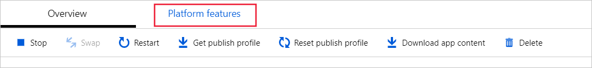
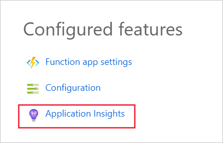
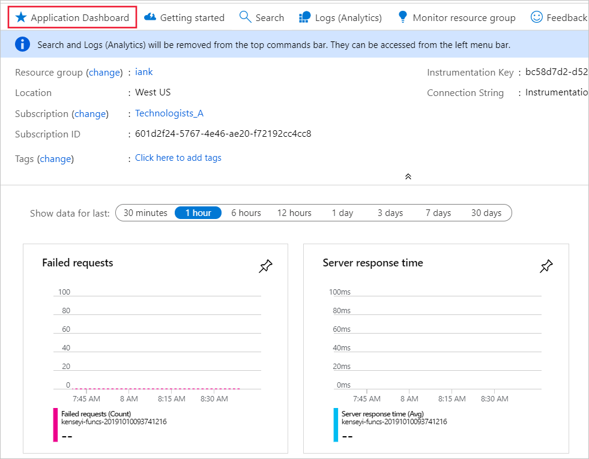
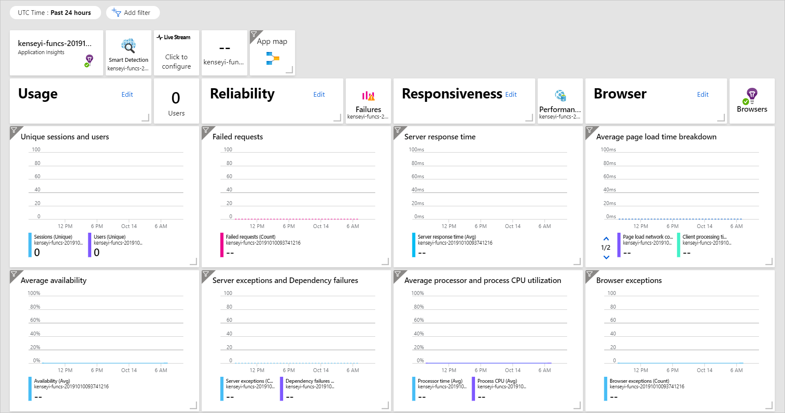

The function application has been deployed into Azure and has been tested.  Any updates to the code base are made outside of Azure, and can be deployed to Azure using Maven commands.

Now you need to enable tracking and logging to the application.  As you now know, you can use both log tracking and Application Insights.

In this unit, you'll learn how to update your function project configuration files to support both tracking and Application Insights.  You'll also learn how to add tracking and Application Insight event triggers to your code base.

## Enabling Application Insights

While all the exercises so far have used the Azure CLI and Maven to build, package and deploy your function app to Azure. To make use of Application Insights, you'll need to use the portal.

1. Open the Azure portal
1. Select All resources from the left pane.
1. The function you deployed earlier will be shown in the list. Select it. The application details will take a moment to load.
1. Above the overview pane, you'll see a pale yellow banner with the message: Application Insights isn't configured. Configure Application Insights to capture function logs. 

    

1. The words in the banner are a link. Click on them to enable the Application Insights.

    

1. Accept the defaults and click on OK, which will configure Application Insights for your function. When it's completed, you may see a warning about the Application Insights SDK missing.  Don't worry.

Now that you have enabled Application Insights for your application, the next thing to do is to enable it in your application.

## Adding instrumentation to your Java Project

To fully enable application logging and Application Insight, you'll need to modify the configuration files to include libraries and other dependencies.

There are two configuration files that need to be updated. The first is the Pom.xml file.

1. Return to the Azure CLI
1. Navigate to the root of your project.
1. Use this command to edit the pom.xml file

    ```BASH
    cd ~/contoso-functions
    code pom.xml
    ```

1. Within the dependencies section, add the following code, to enabled Application Insights for your application.

    ```XML
        <dependency>
            <groupId>com.microsoft.azure</groupId>
            <artifactId>applicationinsights-web-auto</artifactId>
            <!-- or applicationinsights-web for manual web filter registration -->
            <!-- or applicationinsights-core for bare API -->
            <version>2.5.0</version>
        </dependency>
    ```

    When you have put the code in the right place, use <kbd>Ctrl</kbd>+<kbd>S</kbd> to save and then <kbd>Ctrl</kbd>+<kbd>Q</kbd> to quit code.

Next you'll update the host.json file.

1. Load into Code the host.json file using this command:

    ```BASH
    code host.json
    ```

1. Replace the configuration settings in the JSON file with the content below.  The first part is a copy of what was already there.  The next item in the JSON is logging, which enables the logging level for your function.  The last JSON item defines how many instances of the Application Insights telemetry data are sent.

    ```JSON
        {
          "version": "2.0",
          "extensionBundle": {
            "id": "Microsoft.Azure.Functions.ExtensionBundle",
            "version": "[1.*, 2.0.0)"
          },
          "logging": {
            "fileLoggingMode": "always",
            "logLevel": {
              "Function.MyFunction": "Information",
              "default": "None"
            }
          },
          "applicationInsights": {
                "samplingSettings": {
                  "isEnabled": true,
                  "maxTelemetryItemsPerSecond" : 5
                }
            }
        }
    ```

    When you have put the code in the right place, use <kbd>Ctrl</kbd>+<kbd>S</kbd> to save and then <kbd>Ctrl</kbd>+<kbd>Q</kbd> to quit code.

## Adding logging and Application Insight tracking to your Project Code

To improve the meaningfulness of the data collected by Application Insights and also for reporting in your log files, you'll need to add data logging commands into your function code.

### Adding logging

To add general logging to your function, you need to add this command at key points.

```JAVA
context.getLogger().info("[LOG MESSAGE]");
```

You'll replace the [LOG MESSAGE] with the message you want to see in the log files.

1. From the root of the project folder. Use this command to navigate to and open the Function.java file.

    ```BASH
    code src/main/java/com/contoso/functions/Functions.java
    ```

    If you examine the code, you'll see there's already one context.getLogger command. It's the first instruction after the definition of the run function.

1. You'll add two more logging commands to the code. The first will report when the function is called with the wrong parameters. Add this line of code:

    ```JAVA
        context.getLogger().info("Execution failure - Incorrect or missing parameter used.");
    ```

    into here.

    ```JAVA
    if (name == null) {
            /* Insert the logging command here */
            return request.createResponseBuilder(HttpStatus.BAD_REQUEST).body("Please pass a name on the query string or in the request body").build();
    }
    ```

1. The second reporting point will be on a success. Add this line of code:

    ```JAVA
        context.getLogger().info("Execution success - name parameter = " + name);
    ```
    
    into here.
    
    ```JAVA
    } else {
        /* Insert the logging command here */
        return request.createResponseBuilder(HttpStatus.OK).body("Hi, " + name).build();
    }
    ```

1. The completed code change looks like this:

    ```JAVA
    if (name == null) {
        context.getLogger().info("Execution failure - Incorrect or missing parameter used.");
        return request.createResponseBuilder(HttpStatus.BAD_REQUEST).body("Please pass a name on the query string or in the request body").build();
    } else {
        context.getLogger().info("Execution success - name parameter = " + name);
        return request.createResponseBuilder(HttpStatus.OK).body("Hi, " + name).build();
    }
    ```

When you have put the code in the right place, use <kbd>Ctrl</kbd>+<kbd>S</kbd> to save.

### Add Application Insight Tracking

1. Add an import command to the code, which imports the Application Insights telemetry library.  Add this line to your imports.

    ```JAVA
    import com.microsoft.applicationinsights.TelemetryClient;
    ```

1. Instantiate the TelemetryClient. Within your function, add this line.

    ```JAVA
    private TelemetryClient telemetry = new TelemetryClient();
    ```

1. Much the same as the logging command, you'll need to add in a telemetry.trackEvent command wherever you need tracking data captured.  Add this line, amending the string message, to be in the same place as the previous logging commands.

    ```JAVA
    telemetry.trackEvent("Java HTTP trigger processed a request.");
    ```

    In total, there will be three of these commands in your final code.  

1. When you have made all the changes, see that the code matches this code fragment:

    ```JAVA
        ...
        context.getLogger().info("Java HTTP trigger processed a request.");
        telemetry.trackEvent("Java HTTP trigger processed a request.");

        // Parse query parameter
        String query = request.getQueryParameters().get("name");
        String name = request.getBody().orElse(query);

        if (name == null) {
            context.getLogger().info("Execution failure - Incorrect or missing parameter used.");
            telemetry.trackEvent("Execution failure - Incorrect or missing parameter used.");
            return request.createResponseBuilder(HttpStatus.BAD_REQUEST).body("Please pass a name on the query string or in the request body").build();
        } else {
            context.getLogger().info("Execution success - name parameter = " + name);
            telemetry.trackEvent("Execution success - name parameter = " + name);
            return request.createResponseBuilder(HttpStatus.OK).body("Hi, " + name).build();
        }
        ...
    ```

    If your code matches the example, press <kbd>Ctrl</kbd>+<kbd>S</kbd> to save and then <kbd>Ctrl</kbd>+<kbd>Q</kbd> to quite code.

1. The last thing to do is to build, package, and deploy your function application to Azure using these commands.  From the root of the project folder.

    ```BASH
    mvn package azure-functions:deploy
    ```

You've now successfully added logging and Application Insight data collection to your function.

## Using Application Insights to monitor your Azure Function app

Your application is now updated to support fine grained logging with both the system logger and Application Insights.  

1. Return to Azure portal.
1. Open the Function App area.
1. Select you function application from the list.
1. To enable log streaming, from the overview page, select **Platform features**.

    

1. From the list of available features, from the Monitoring group, select **Log Streaming**, as shown below. 

    

    Log streaming will appear as a tab at the top of the page.  If you switch to the browser tab you used for testing earlier, and run a few tests, you'll see the getLogger messages appearing.

1. Select the **Overview** tab.

1. From the Configured Features area, select **Application Insights**.

    

1. This page will display a default overview page for your application, which includes failed requests, server response time, server requests, and availability.

    

1. From the top navigation bar, select **Application dashboard**.

1. The dashboard shows usage, reliability, responsiveness and browser columns, and you can adapt the dashboard to meet you requirements.

    
