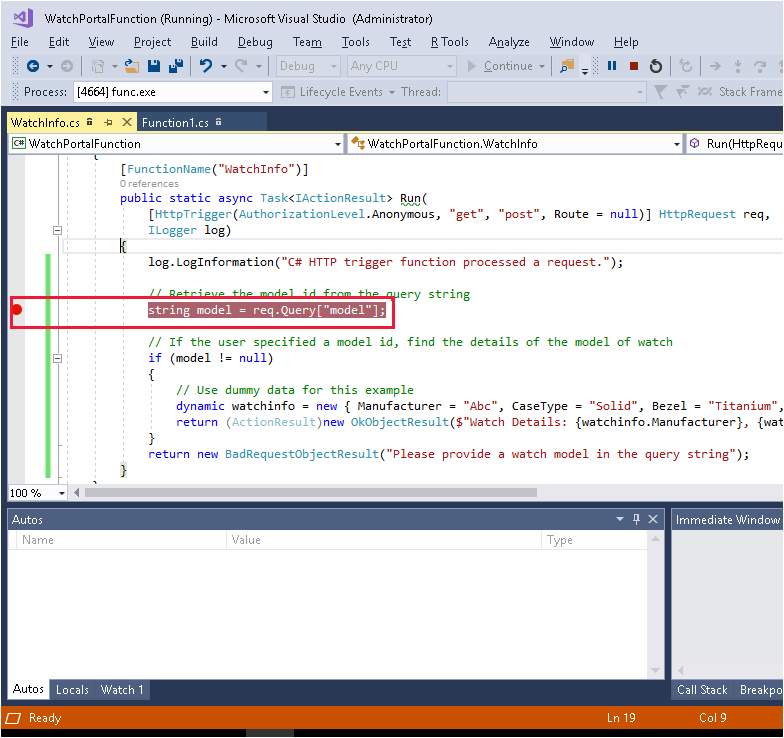

Visual Studio provides an excellent environment for creating and testing an Azure Functions app. You can develop an Azure Function locally, and verify that it operates correctly, before deploying it to the cloud.

In the luxury watch online website scenario, there's a requirement for a function that returns information about a type of watch when given the model number of the watch. The information includes data such as the manufacturer, the type of case back (solid, transparent, engraved), the bezel, the style of the dial, the finishing of the case, the number of jewels, and so on.

In this exercise, you'll implement a version of this function locally, and test it using Visual Studio.

## Create an Azure Functions app

Create an Azure Functions app using the **Azure Functions** template.

1. In Visual Studio, on the **File** menu, select **New**, and then select **Project**. The **Create a new project** page appears. Scroll down, select **Azure Functions**, and then select **Next**.

    :::image type="content" source="../media/3-create-project.png" alt-text="Screenshot of the Visual Studio 2019 with Create a new project link." loc-scope="vs":::

1. The **Configure your new project** page appears. In the **Project name** field, enter **WatchPortalFunction**. For the **Location** field, select a convenient location on your computer to store the project. The **Solution name** field should default to **WatchPortalFunction**. Make sure **Place solution and project in the same directory** is NOT selected (unchecked). This will result in the proper folder structure throughout the learning module.

1. Select **Create.**

    :::image type="content" source="../media/3-configure-project.png" alt-text="Screenshot of the Visual Studio 2019 with Configure your new project link." loc-scope="vs":::

1. The **Create a new Azure Functions application** page appears. From the dropdown, select **Azure Functions v2 (.NET Core)**, and then select **Http Trigger**. Leave the **Storage Account** dropdown set to **Storage Emulator** because you'll be running the Azure Functions app locally to start with. Under the **Authorization level**, select **Anonymous**, and then select **Create**.

    :::image type="content" source="../media/3-function-triggers.png" alt-text="Screenshot showing the Azure Function triggers available, with HTTP Trigger highlighted." loc-scope="vs":::

1. Wait while Visual Studio creates and configures the Azure Functions app. When it's complete, you'll see the code for a class named `Function1` in the code window. This code contains the boilerplate code for an HTTP trigger. The `Run` method is annotated with the `[FunctionName ("Function1")]` attribute. Recall from the previous unit that the parameters to the `Run` method are an `HttpRequest` object containing the details of the request that triggered the function, and a reference to a trace log that you can use for recording trace information.

    ```csharp
    namespace WatchPortalFunction
    {
        public static class Function1
        {
            [FunctionName("Function1")]
            public static async Task<IActionResult> Run(
            [HttpTrigger(AuthorizationLevel.Anonymous, "get", "post", Route = null)] HttpRequest req,
            ILogger log)
            {
                log.LogInformation("C# HTTP trigger function processed a request.");

                string name = req.Query["name"];

                string requestBody = await new StreamReader(req.Body).ReadToEndAsync();
                dynamic data = JsonConvert.DeserializeObject(requestBody);
                name = name ?? data?.name;

                return name != null
                    ? (ActionResult)new OkObjectResult($"Hello, {name}")
                    : new BadRequestObjectResult("Please pass a name on the query string or in the request body");
            }
        }
    }
    ```

## Create the WatchInfo Azure Function

1. In the **Solution Explorer** window, right-click the **WatchPortalFunction** project, select **Add**, and then select **New Azure Function**.

    :::image type="content" source="../media/3-new-azure-function.png" alt-text="Screenshot of the Solution Explorer window. The user has selected Add -> New Azure Function." loc-scope="vs":::

1. In the **Add New Item - WatchPortalFunction** window, select **Azure Function**. In the **Name** box, enter **WatchInfo.cs**, and then select **Add**.

    :::image type="content" source="../media/3-new-item.png" alt-text="Screenshot of the Add New Item window. The user has selected the Azure Function template, and named the new function WatchInfo.cs." loc-scope="vs":::

1. In the **New Azure Function - WatchInfo** window, select **Http trigger**. Under **Access rights**, select **Anonymous**, and then select **Add**.

    :::image type="content" source="../media/3-new-azure-function-trigger.png" alt-text="Screenshot of the New Azure Function window. The user has selected the Http Trigger with Anonymous access rights." loc-scope="vs":::

1. Visual Studio creates a new Azure Function, and adds it to the Azure Function app. This function has the same boilerplate code as **Function1**, except that the class is named `WatchInfo`, and the `Run` method is annotated with the `[FunctionName("WatchInfo")]` attribute.

1. Delete the code from the body of the `Run` function apart from the first statement that writes to the trace log. The method should look like this.

    ```csharp
    namespace WatchPortalFunction
    {
        public static class WatchInfo
        {
            [FunctionName("WatchInfo")]
            public static async Task<IActionResult> Run(
                [HttpTrigger(AuthorizationLevel.Anonymous, "get", "post", Route = null)] HttpRequest req,
                ILogger log)
            {
                log.LogInformation("C# HTTP trigger function processed a request.");
            }
        }
    }
    ```

1. Add the following code to the body of the method, after the statement that writes to the trace log. This code reads the `model` parameter from the query string from the URL of the HTTP request. The code then retrieves the details for this model of watch; in this example, the function simply returns some dummy data. Lastly, the function returns a response that contains these details. If the initial request doesn't include a query string with the `model` parameter, the function returns an error message.

    ```csharp
    // Retrieve the model id from the query string
    string model = req.Query["model"];

    // If the user specified a model id, find the details of the model of watch
    if (model != null)
    {
        // Use dummy data for this example
        dynamic watchinfo = new { Manufacturer = "Abc", CaseType = "Solid", Bezel = "Titanium", Dial = "Roman", CaseFinish = "Silver", Jewels = 15 };

        return (ActionResult)new OkObjectResult($"Watch Details: {watchinfo.Manufacturer}, {watchinfo.CaseType}, {watchinfo.Bezel}, {watchinfo.Dial}, {watchinfo.CaseFinish}, {watchinfo.Jewels}");
    }
    return new BadRequestObjectResult("Please provide a watch model in the query string");
    ```

## Test the Azure Function locally

1. On the **Debug** menu, select **Start Debugging**.

    Visual Studio builds the Azure Functions app and starts the Azure Functions runtime. You'll see a window appear displaying messages as the runtime starts up. When the runtime is ready, you'll see a list of the HTTP functions available, and the URL that you can use to trigger each function.

    :::image type="content" source="../media/3-azure-functions-runtime.png" alt-text="Screenshot of the Azure Functions runtime window. The runtime has started the Azure Functions app, and is displaying the URLs for the Function1 and WatchInfo Azure Functions." loc-scope="vs":::

1. Open a web browser, and enter the URL `http://localhost:7071/api/WatchInfo?model=abc`. This request triggers the `WatchInfo` function and passes the model `abc` as the query string parameter. The web browser should display the dummy details generated by the Azure Function.

    :::image type="content" source="../media/3-azure-functions-response.png" alt-text="Screenshot of a web browser triggering the WatchInfo Azure Function. The function has returned the dummy details for the model specified in the query string of the URL provided." loc-scope="vs":::

1. Enter the URL `http://localhost:7071/api/WatchInfo`. This request doesn't include a query string. The trigger returns the error response and the web browser displays the message *Please provide a watch model in the query string*.

1. Close the web browser, but leave the Azure Functions app running.

1. In Visual Studio, set a breakpoint on the line of code that retrieves the model from the query string.

    

1. Restart the web browser, and enter the URL without the query string again, `http://localhost:7071/api/WatchInfo`.

    You'll drop into Visual Studio at the breakpoint.

1. In Visual Studio, to step over the statement at the breakpoint, press F10.

1. In the `Autos` window, verify that the `model` variable is `null`. This is because the query string doesn't contain a model parameter.

    :::image type="content" source="../media/3-visual-studio-debug.png" alt-text="Screenshot of Visual Studio. The user has dropped into the debugger and is examining the value of the model variable." loc-scope="vs":::

1. Press F10 again, and verify that control jumps to the statement that returns a `BadRequestObjectResult` object.

1. To continue running the method and return to the web browser, press F5. It should display the same error message as before.

1. In the web browser, enter the URL with a query string and a model parameter. Step through the Azure Function in the debugger, and verify that the model is retrieved correctly. The `model` variable should be populated with the value of the parameter, and the details of the model returned as an `OkObjectResult` object.

1. On the *Debug* menu, select **Stop Debugging**.

You've now seen how the Azure Functions Tools extension simplifies the experience of creating an Azure Functions app, and enables you to use familiar tools to build and debug your code.
