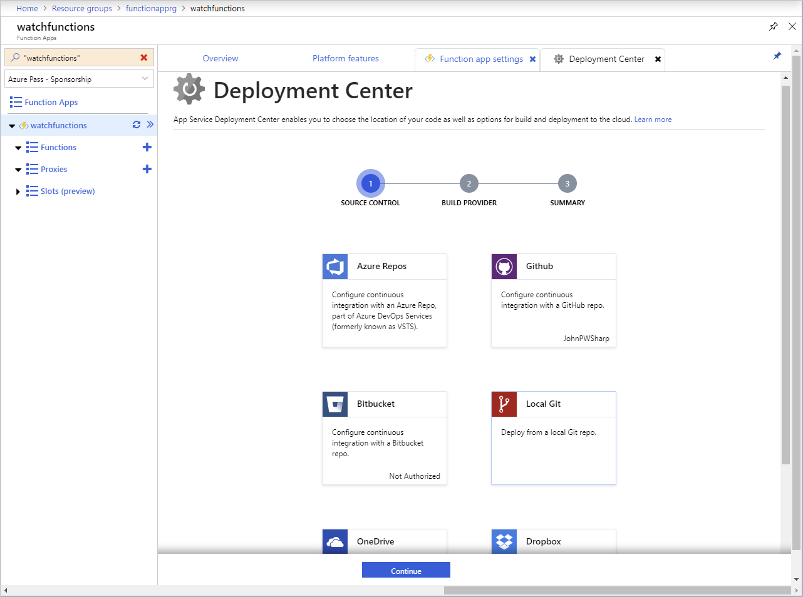

An Azure Function runs in the cloud in the context of an Azure Function App. A Function App is a container that specifies the operating system and resources, such as the memory, computing power, and disk space, for running an Azure Function. The Azure Function App also provides the public URL for running your function. Behind the scenes, an Azure Function App is a collection of one or more virtual machines (VMs) running a web server. When you publish an Azure Function, you deploy it to these VMs.

In the luxury watch online website scenario, you'll deploy the Azure Functions you create to the cloud. First create an Azure Function App, and then publish your functions to the Function App.

There are several options available for publishing an Azure Function, and you want to determine the best method. In the overview material here, and in the following exercise, you'll learn about some of these options.

## Deploy from Visual Studio

Azure Functions tools for Visual Studio enable you to deploy an Azure Function directly from Visual Studio. The Azure Functions template in Visual Studio provides a Publish wizard. The wizard helps connect to your Azure account, and prompts you to either specify an existing Azure Function App, or create a new one. The functions in your project are then rebuilt and deployed to the Azure Functions App.

The Visual Studio **Publish** wizard requires that you either have access to the Azure Functions App that will host your functions, or you have an Azure subscription that you can use to create an Azure Functions App as part of the publication process. You'll investigate the **Publish** wizard in more detail in the exercise in the next unit.

Deployment from Visual Studio is a great feature for developers. If developers have access to an Azure subscription, they can create an Azure Function App and publish code to Azure, allowing them to perform testing in an environment that is similar to their production environment. When a function is stable, it can be deployed to an Azure Functions App in the production environment.

## Continuous deployment

Azure Functions makes it easy to deploy your function app using App Service continuous integration. Azure Functions integrates with numerous deployment sources, which support a workflow where function code updates triggers deployment to Azure.

Continuous deployment is a great option for projects where multiple and frequent contributions are being integrated. It also lets you maintain source control on your functions code. The following deployment sources are currently supported:

- Bitbucket
- Dropbox
- External repository (Git or Mercurial)
- Git local repository
- GitHub
- OneDrive
- Azure DevOps



You can configure continuous deployment from the Azure portal, using the **Deployment Center** feature of an Azure Functions App. Deployment is configured on a per-function app basis.

## Zip deployment

Azure Functions can be deployed from a zip file using `push` deployment, either from the Azure CLI, or by using the REST interface.

The zip file contains the executable code for your functions. Zip deployment copies these files to the `wwwwroot` folder in the Azure Function App. You can perform zip deployment using the `functionapp deployment` command in the Azure CLI.

```azurecli
az functionapp deployment source config-zip \
-g <resource-group> \
-n <function-app-name> \
--src <zip-file>
```
