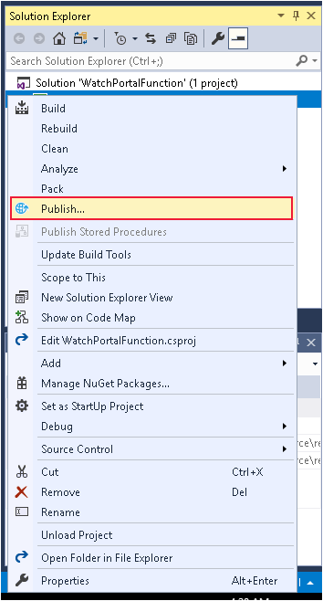
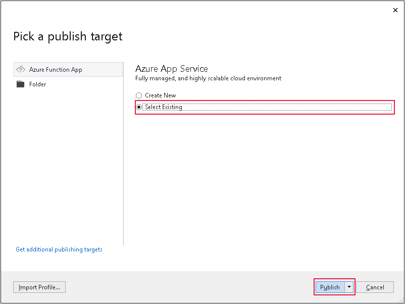
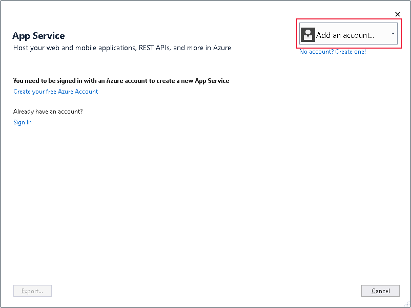
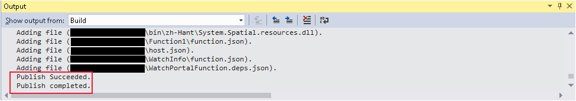
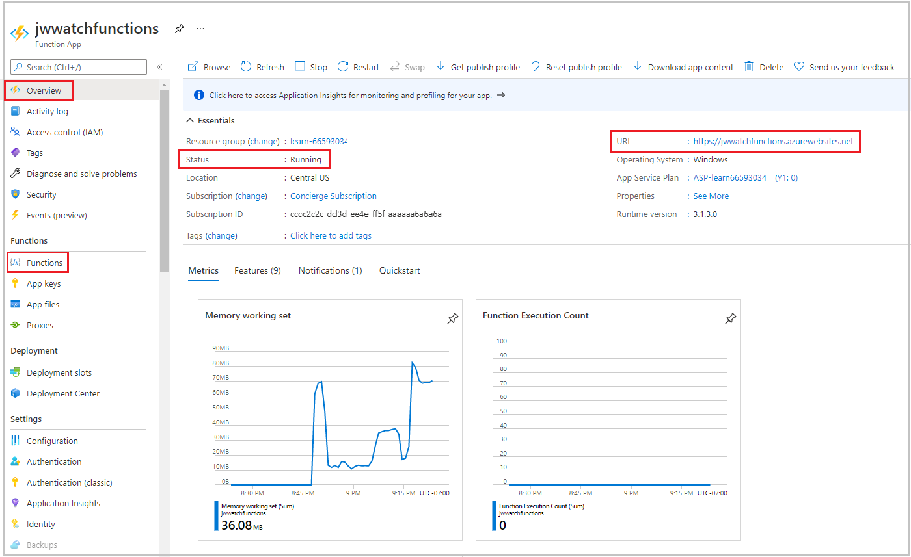
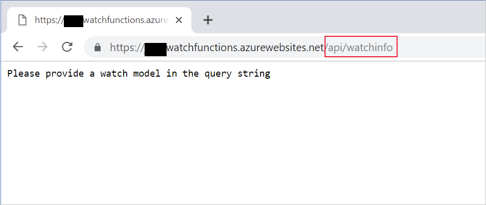
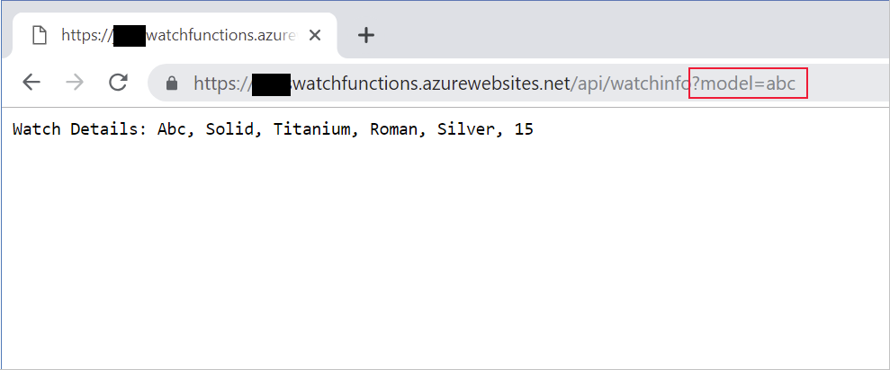

The **Publish** wizard in the Azure Functions template provides the most straightforward way to deploy Azure Functions, especially for testing purposes.

In the luxury watch online website scenario, you decide to use Visual Studio to deploy your functions to an Azure Functions App in the cloud. First, you'll create an Azure Function App, and you'll use the **Publish** wizard in Visual Studio to deploy your functions.

In this exercise, you'll see how to use the Azure portal to create an Azure Functions App. Then, you'll deploy the **WatchInfo** function. Finally, you'll test the function to verify that it has been deployed correctly.

## Create an Azure Functions App using the Azure portal

[!include]

1. Sign into the [Azure portal](https://portal.azure.com/learn.docs.microsoft.com?azure-portal=true) using the same account you activated the sandbox with.

1. Click **Create a resource**, click **Compute**, and then click **Function App**.

1. In the **Function App** window, specify the following settings:

    > [!NOTE]
    > The function app must have a unique name. We suggest using something like **\<*your name or initials*\>watchfunctions**. Use this name wherever you see *\<your-function-app-name\>* in this exercise.

    | Property  | Value  |
    |---|---|
    | Name | *\<your-function-app-name\>* |
    | Subscription | Concierge Subscription  |
    | Resource Group | Use the existing resource group <rgn>[Sandbox resource group]</rgn> |
    | OS | Windows |
    | Hosting Plan | Consumption |
    | Location | Accept the default location |
    | Runtime Stack | .NET |
    | Storage | Create new, accept the default name |

1. Click **Create**, and wait while the function app is created before continuing.

## Deploy the WatchInfo function to the Azure Functions App

1. On your desktop, return to Visual Studio.

1. In the **Solution Explorer** window, right-click the **WatchPortalFunction** project, and then click **Publish**.

    

1. In the **Pick a publish target** window, under **Azure App Service**, click **Select Existing**, and then click **Publish**

    

1. In the **App Service** window, select your Azure account. If you aren't already signed in to Azure, then click **Add an account** first and sign in.

    

1. After signing in, enter the following details in the **App Service** window.

    | Property  | Value  |
    |---|---|
    | Subscription | Concierge Subscription  |
    | View | Resource Group |

1. In the lower **Search** box, expand the resource group that is displayed, click your Azure Functions App, and then click **OK**. 

1. Wait for your functions to be deployed. The **Output** window in Visual Studio shows the progress of the build and publish processes. If everything works, the final two messages should be **Publish Succeeded** and **Publish completed**.

    

## Verify the functions have been deployed

1. Return to the Azure portal.

1. Click **All resources**, and select *\<your-function-app-name\>*.

1. In the *\<your-function-app-name\>* window, expand **Functions**, and verify that the **Function1** and  **WatchInfo** functions are listed. In the right pane, check that the status of the Azure Functions App is **Running**.

    

    > [!NOTE]
    > The functions are marked as *Read Only*. You cannot modify their settings or configuration from the Azure portal because you published them from Visual Studio. If you need to update either of these functions, make the changes in Visual Studio and publish them again.

1. In the right pane, click the **URL** (highlighted in the image above). A browser window will open, and confirm that the functions app is up and running.

    

1. Append the URL of the **watchinfo** function, `api/watchinfo` to the URL in the browser and refresh the display. This invokes the **WatchInfo** function without a query string. You'll see the error response with the message *Please provide a watch model in the query string*.

   

1. Add the querystring `?model=abc`  to the URL and refresh the browser window. This time, you'll see the details of the watch model returned by the function.

    

You've now created an Azure Functions App in the cloud, and published your functions to this app from Visual Studio.