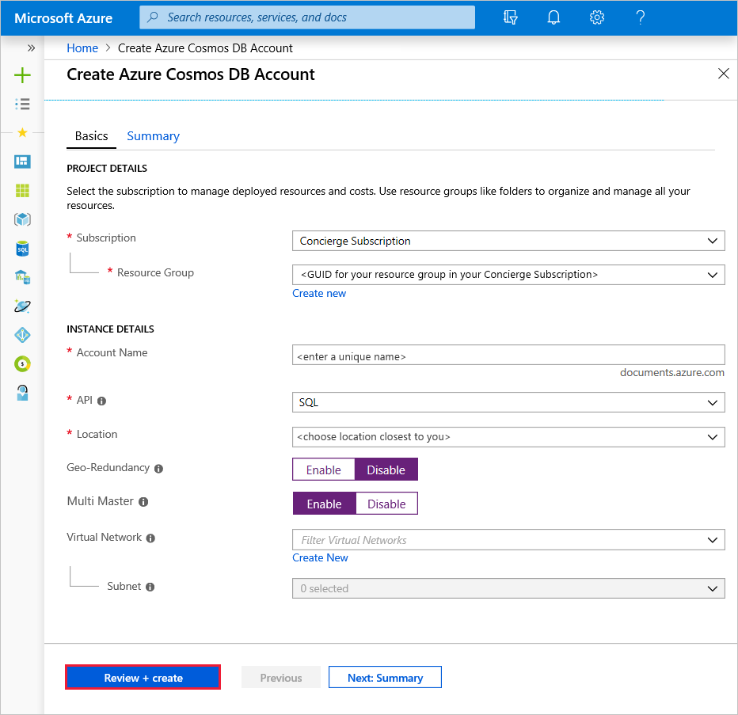
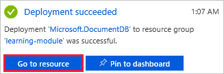
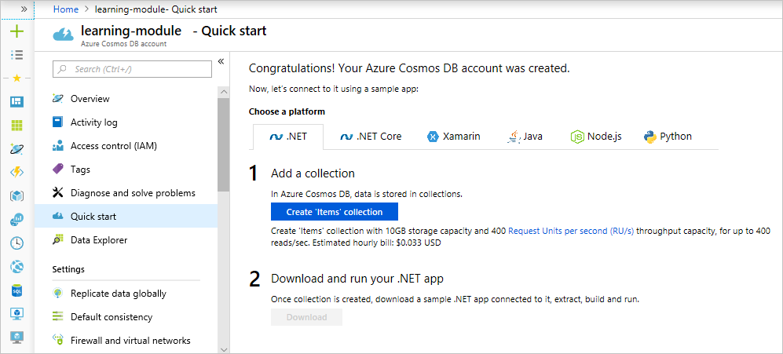
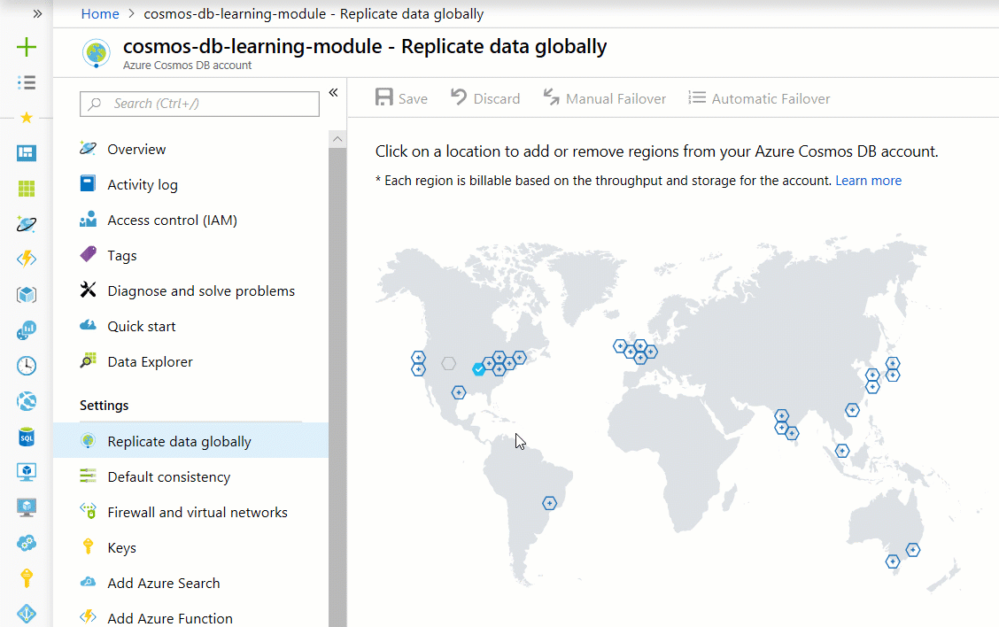

Providing your customers the fastest access to the products on your online clothing site is paramount to your customers, and your businesses success. By decreasing the distance data has to travel to your users, you can deliver more content faster. If your data is stored in Azure Cosmos DB, replicating your site's data to multiple regions around the world is a point and click operation.

In this unit you'll learn the benefits of global distribution and a natively multi-mastered database service, and then replicate your account into three additional regions.

## Global distribution basics

Global distribution enables you to replicate data from one region into multiple Azure regions. You can add or remove regions in which your database is replicated at any time, and Azure Cosmos DB ensures that when you add an additional region, your data is available for operations within 30 minutes, assuming your data is 100 TBs or less.

There are two common scenarios for replicating data in two or more regions:

1. Delivering low-latency data access to end users no matter where they are located around the globe
2. Adding regional resiliency for business continuity and disaster recovery (BCDR)

To deliver low-latency access to customers, it is recommended that you replicate the data to regions closest to where your users are. For your online clothing company, you have customers in Los Angeles, New York, and Tokyo. Take a look at the [Azure regions](https://azure.microsoft.com/global-infrastructure/regions/) page, and determine the closest regions to those sets of customers, as those are the locations you'll replicate users to.

To provide a BCDR solution, it is recommended to add regions based on the region pairs described in the [Business continuity and disaster recovery (BCDR): Azure Paired Regions](https://azure.microsoft.com/documentation/articles/best-practices-availability-paired-regions/) article.

When a database is replicated, the throughput and storage are replicated equally as well. So if your original database had 10GB of storage, and throughput of 1,000 RU/s, and if you replicated that to three additional regions, each region would have 10GB of data and 1,000 RU/s of throughput. Because the storage and throughput is replicated in each region, the cost of replicating to a region is the same as the original region, so replicating to 3 additional regions, would cost approximately four times the original non-replicated database.

## Creating an Azure Cosmos DB account in the portal

1. Sign in to the [Azure portal](https://portal.azure.com/learn.docs.microsoft.com?azure-portal=true) using the same account you used to activate the sandbox.

    > [!IMPORTANT]
    > Login to the Azure portal and the sandbox with the same account.
    >
    > Login to the Azure portal using the link above to ensure you are connected to the sandbox, which provides access to a Concierge Subscription.

1. Click **Create a resource** > **Databases** > **Azure Cosmos DB**.

   

1. On the **Create Azure Cosmos DB Account** page, enter the settings for the new Azure Cosmos DB account, including the location.

    <!-- Resource selection -->  
    [!include]

    Setting|Value|Description
    ---|---|---
    Subscription|*Concierge Subscription*|Select your Concierge Subscription. If you do not see the Concierge Subscription listed, you have multiple tenants enabled on your subscription, and you need to change tenants. To do so, login again using the following portal link: [Azure portal for sandbox](https://portal.azure.com/learn.docs.microsoft.com?azure-portal=true).
    Resource Group|Use existing  <rgn>[sandbox resource group name]</rgn>|Select **Use existing**, and then enter <rgn>[sandbox resource group name]</rgn>.
    Account Name|*Enter a unique name*|Enter a unique name to identify this Azure Cosmos DB account. Because *documents.azure.com* is appended to the ID that you provide to create your URI, use a unique but identifiable ID.  The ID can contain only lowercase letters, numbers, and the hyphen (-) character, and it must contain 3 to 31 characters.
    API|SQL|The API determines the type of account to create. Azure Cosmos DB provides five APIs to suit the needs of your application: SQL (document database), Gremlin (graph database), MongoDB (document database), Azure Table, and Cassandra, each of which currently requires a separate account.   Select **SQL** because in this module you are creating a document database that is queryable using SQL syntax and accessible with the SQL API.|
    Location|*Select the region closest to you*|Select the region closest to you from the list of regions above.
    Geo-Redundancy| Disable | This setting creates a replicated version of your database in a second (paired) region. Leave this set to disabled for now, as you will replicate the database later.
    Multi-region Writes | Enable | This setting enables you to write to multiple regions at the same time. This setting can only be configured during account creation.

1. Click **Review + Create**.

    

1. After the settings are validated, click **Create** to create the account.

1. The account creation takes a few minutes. Wait for the portal to display the notification that the deployment succeeded and click the notification.

    

1. In the notification window, click **Go to resource**.

    

    The portal displays the **Congratulations! Your Azure Cosmos DB account was created** page.

    

## Replicate data in multiple regions

Let's now replicate your database closest to your global users in Los Angeles, New York, and Tokyo.

1. On the left-hand menu, click **Replicate data globally** from the menu.
1. In the **Replicate data globally** page, select the West US 2, East US, and Japan East regions, and then click **Save**.

    If you don't see the map in the Azure portal, minimize the menus of the left side of the screen to display it.

    The page will display an **Updating** message while the data is written to the new regions. Data in the new regions will be available within 30 minutes.

    

## Summary

In this unit, you replicated your database to the regions of the world in which your users are most concentrated, providing them lower-latency access to the data on your site.
