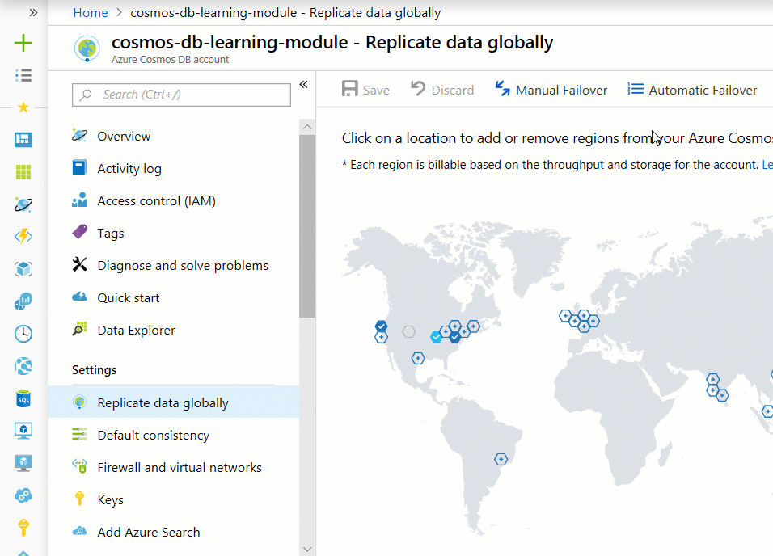

Once you've replicated your data in multiple regions, you can take advantage of the automated failover solutions Azure Cosmos DB provides. Automated failover is a feature that comes into play when there's a disaster or other event that takes one of your read or write regions offline, and it redirects requests from the offline region to the next most prioritized region. 

If you enable multi-region writes when creating the Azure Cosmos DB account, every region is both read and write. So if a regional failure happens the SDK will redirect to the next closest region and this region supports both read and write requests. So the concept of automatic and manual failover is applicable to single-region write account only. 

For your online clothing site, which you just replicated into West US 2, East US, and Japan East. Assuming it's a single-write region, you can prioritize that if the East US goes offline, you can redirect reads to West US 2 instead of Japan East, to limit latency.

In this unit you'll learn about how failover works and see how you'd set the priority for the regions in which your company's data has been replicated. 

## Failover basics

In the rare event of an Azure regional outage or data center outage, Azure Cosmos DB automatically triggers failovers of all Azure Cosmos DB accounts with a presence in the affected region.

**What happens if a read region has an outage?**

Azure Cosmos DB accounts with a read region in one of the affected regions are automatically disconnected from their write region and marked offline. The Azure Cosmos DB SDKs implement a regional discovery protocol that allows them to automatically detect when a region is available and redirect read calls to the next available region in the preferred region list. If none of the regions in the preferred region list is available, calls automatically fall back to the current write region. No changes are required in your application code to handle regional failovers. During this entire process, consistency guarantees continue to be honored by Azure Cosmos DB.

Once the affected region recovers from the outage, all the affected Azure Cosmos DB accounts in the region are automatically recovered by the service. Azure Cosmos DB accounts that had a read region in the affected region will then automatically sync with current write region and turn online. The Azure Cosmos DB SDKs discover the availability of the new region and evaluate whether the region should be selected as the current read region based on the preferred region list configured by the application. Subsequent reads are redirected to the recovered region without requiring any changes to your application code.

**What happens if a write region has an outage?**

If the affected region is the current write region and automatic failover is enabled for the Azure Cosmos DB account, then the region is automatically marked as offline. Then, an alternative region is promoted as the write region for the affected Azure Cosmos DB account.

During automatic failovers, Azure Cosmos DB automatically chooses the next write region for a given Azure Cosmos DB account based on the specified priority order. Applications can use the WriteEndpoint property of DocumentClient class to detect the change in write region.

Once the affected region recovers from the outage, all the affected Azure Cosmos DB accounts in the region are automatically recovered by the service.

Now let's modify the read region for your database.

## Set read region priorities

 The following steps apply when you have a single-region write Azure Cosmos DB account. If you enabled multi-region writes when you created your Azure Cosmos DB account, you can't complete the following steps.

1. Select **disable** on the **Configure regions Multi-region writes**.
2. In the Azure portal, on the **Replicate data globally** screen, click **Automatic Failover**. Automatic failover is only enabled if the database has already been replicated to more than one region.
3. On the **Automatic Failover** screen, change **Enable Automatic Failover** to **ON**.
4. In the **Read regions** section, click the left portion of the **East US** row, and then drag and drop at the top position.
5. Click the left portion of the **Japan East** row, and then drag and drop to the second position.
6. Click **OK**.

    

## Summary

In this unit, you've learned what automatic failover provides, how you can use it to protect against unforeseen outages, and how to modify read region priorities.
