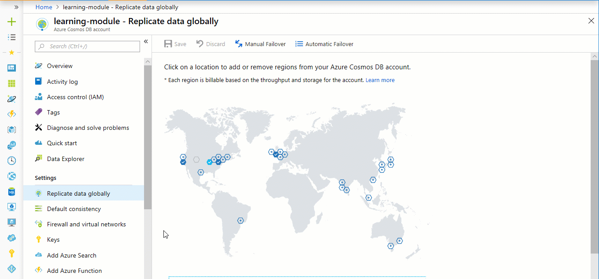

Azure Cosmos DB allows developers to choose between five well-defined consistency models along the consistency spectrum – strong, bounded staleness, session, consistent prefix, and eventual. These consistency levels enable you to maximize the availability and performance of your database, depending on your needs. For cases when data must be processed in a specific order, strong consistency might be the right choice. Or for cases when data doesn't need to be immediately consistent, eventual consistency might be the right choice. 

In this unit, you'll familiarize yourself with the available consistency levels in Azure Cosmos DB and determine the correct consistency level for your online clothing site.

## Consistency basics

Each database account has a default consistency level, which determines the consistency of data within the account. At one end of the spectrum is Strong consistency, which offers a linearizability guarantee with the reads guaranteed to return the most recent version of an item. At the other end of the spectrum is Eventual consistency, which guarantees that in absence of any further writes, the replicas within the group eventually converge. In the middle is Session consistency, which is the most popular because it guarantees monotonic reads, monotonic writes, and read your own writes (RYW) guarantees.

Guarantees about each consistency level are listed in the following table.
 
**Consistency levels and guarantees**

| Consistency Level	| Guarantees |
| --- | --- |
| Strong | Linearizability. Reads are guaranteed to return the most recent version of an item.|
| Bounded Staleness	| Consistent Prefix. Reads lag behind writes by at most k prefixes or t interval. |
| Session	| Consistent Prefix. Monotonic reads, monotonic writes, read-your-writes, write-follows-reads. |
| Consistent Prefix	| Updates returned are some prefix of all the updates, with no gaps. |
| Eventual	| Out of order reads. |

You can configure the default consistency level on your Azure Cosmos DB account (and later override the consistency on a specific read request) in the Azure portal. Internally, the default consistency level applies to data within the partition sets, which may span regions.

In Azure Cosmos DB, reads served at session, consistent prefix and eventual consistency are twice as cheap, in terms of request unit consumption, as reads with strong or bounded staleness consistency.

### Use of consistency levels

About 73% of Azure Cosmos DB tenants use session consistency and 20% prefer bounded staleness. Approximately 3% of Azure Cosmos DB customers experiment with various consistency levels initially before settling on a specific consistency choice for their application. Only 2% of Azure Cosmos DB tenants override consistency levels on a per request basis.

## Consistency levels in detail

To learn more about the consistency levels, review the music-note based consistency examples provided in the Azure portal, then review the information below about each level.

1. In the Azure portal, click **Default consistency**.
2. Click through each of the different consistency models and watch the musical examples. See how data is written to the different regions and how the choice of consistency impacts how the note data is written. Note that Strong is grayed out as it is only available for data written to a single region.

    

Let's learn more about the consistency levels. Think about how each of these consistency levels could work for your product and user data for your clothing retail site.

### Strong consistency

* Strong consistency offers a [linearizability](https://aphyr.com/posts/313-strong-consistency-models) guarantee with the reads guaranteed to return the most recent version of an item.
* Strong consistency guarantees that a write is only visible after it is committed durably by the majority quorum of replicas. A write is either synchronously committed durably by both the primary and the quorum of secondaries, or it is aborted. A read is always acknowledged by the majority read quorum, a client can never see an uncommitted or partial write and is always guaranteed to read the latest acknowledged write. 
* Azure Cosmos DB accounts that are configured to use strong consistency cannot associate more than one Azure region with their Azure Cosmos DB account.  
* The cost of a read operation (in terms of request units consumed) with strong consistency is higher than session and eventual, but the same as bounded staleness.

### Bounded staleness consistency

* Bounded staleness consistency guarantees that the reads may lag behind writes by at most *K* versions or prefixes of an item or *t* time-interval.
* Therefore, when choosing bounded staleness, the "staleness" can be configured in two ways: number of versions *K* of the item by which the reads lag behind the writes, and the time interval *t*.
* Bounded staleness offers total global order except within the "staleness window." The monotonic read guarantees exist within a region both inside and outside the "staleness window."
* Bounded staleness provides a stronger consistency guarantee than session, consistent-prefix, or eventual consistency. For globally distributed applications, we recommend you use bounded staleness for scenarios where you would like to have strong consistency but also want 99.99% availability and low latency.
* Azure Cosmos DB accounts that are configured with bounded staleness consistency can associate any number of Azure regions with their Azure Cosmos DB account. 
* The cost of a read operation (in terms of RUs consumed) with bounded staleness is higher than session and eventual consistency, but the same as strong consistency.

### Session consistency

* Unlike the global consistency models offered by strong and bounded staleness consistency levels, session consistency is scoped to a client session.
* Session consistency is ideal for all scenarios where a device or user session is involved since it guarantees monotonic reads, monotonic writes, and read your own writes (RYW) guarantees.
* Session consistency provides predictable consistency for a session, and maximum read throughput while offering the lowest latency writes and reads.
* Azure Cosmos DB accounts that are configured with session consistency can associate any number of Azure regions with their Azure Cosmos DB account.
* The cost of a read operation (in terms of RUs consumed) with session consistency level is less than strong and bounded staleness, but more than eventual consistency.

### Consistent prefix consistency

* Consistent prefix guarantees that in absence of any further writes, the replicas within the group eventually converge. 
* Consistent prefix guarantees that reads never see out of order writes. If writes were performed in the order `A, B, C`, then a client sees either `A`, `A,B`, or `A,B,C`, but never out of order like `A,C` or `B,A,C`.
* Azure Cosmos DB accounts that are configured with consistent prefix consistency can associate any number of Azure regions with their Azure Cosmos DB account. 

### Eventual consistency

* Eventual consistency guarantees that in absence of any further writes, the replicas within the group eventually converge.
* Eventual consistency is the weakest form of consistency where a client may get the values that are older than the ones it had seen before.
* Eventual consistency provides the weakest read consistency but offers the lowest latency for both reads and writes.
* Azure Cosmos DB accounts that are configured with eventual consistency can associate any number of Azure regions with their Azure Cosmos DB account. 
* The cost of a read operation (in terms of RUs consumed) with the eventual consistency level is the lowest of all the Azure Cosmos DB consistency levels.

## Summary

In this unit, you've learned how consistency levels can be used to maximize high-availability and minimize latency.