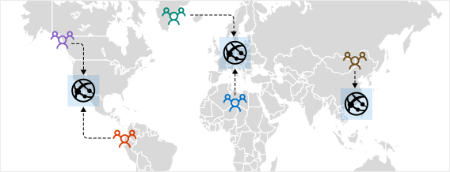
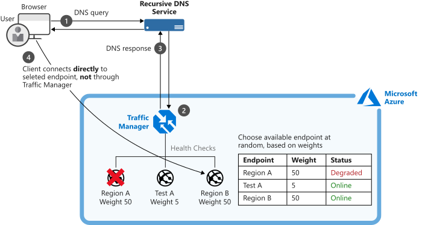
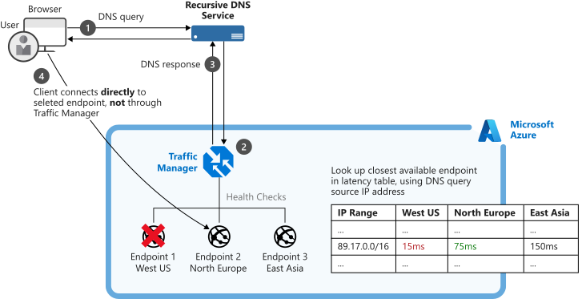
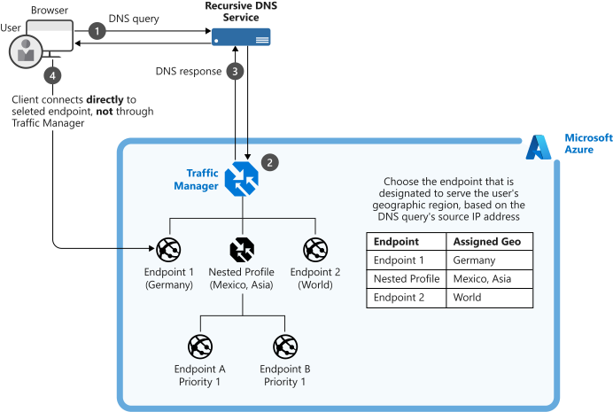
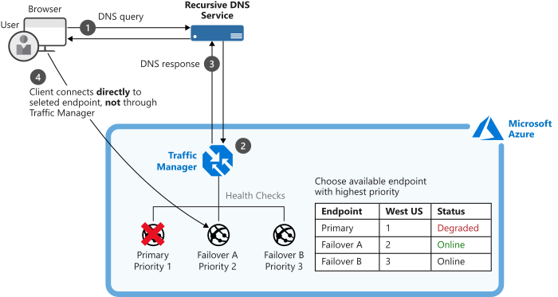

Your customers require 24x7 availability of the streaming music application. Cloud services in one region may become unavailable because of technical issues, such as planned maintenance, or scheduled security updates. During these situations, your company wants to have a failover endpoint so that your customers can continue to access the services. To manage the routing of traffic and to handle these situations, you've decided to implement the Azure Traffic Manager.

## How Azure Traffic Manager works

When a client attempts to connect to a service, it must first resolve the DNS name of the service to an IP address. The client then connects to that IP address to access the service.

Traffic Manager uses DNS to direct clients to specific service endpoints IP address based on the rules of the traffic routing method. Clients connect to the selected endpoint directly. Traffic Manager isn't a proxy or a gateway. Traffic Manager doesn't see the traffic passing between the clients and the service, it just gives clients the IP address of where they need to go.

## Azure Traffic Manager routing methods

Azure Traffic Manager supports different methods to decide how traffic should be routed to multiple endpoints. Traffic Manager applies a traffic routing method to each DNS query it receives and determines which endpoint is returned in the response. There are six traffic-routing methods to choose from.

### Weighted routing

Choose weighted when you want to distribute traffic across a set of endpoints, either evenly or based on different weights. The weight is an integer from 1 to 1000. For each DNS query received, Traffic Manager randomly chooses an available endpoint. The probability of choosing an endpoint is based on the weights assigned to all available endpoints.

### Performance routing

If you have endpoints in different geographic locations, you can use Performance routing to send users to the endpoint with the best performance respective to the user. To decide which endpoint is the best to use, this routing method uses an Internet Latency Table, which actively tracks network latencies to the endpoints from locations around the globe. When a user makes a request, traffic manager will return the best performing endpoint based on the location of the request.

### Geographic routing

With the Geographic routing method, users are directed to specific endpoints based on which geographic location their DNS query originates from. Using this method allows you to geo-fence content to specific users region. For example, European users can be directed to an endpoint in Europe with specific terms and conditions for regional compliance. Users in China could be directed to an endpoint that has been localized in Mandarin.

### Multivalue routing

The Multivalue routing method allows you to get multiple healthy endpoints in a single DNS query response. This enables to caller to do client-side retries with other endpoints if an endpoint is unresponsive. This pattern can increase the availability of a service and reduce the latency associated with a new DNS query to obtain a healthy endpoint.

### Subnet routing

This method maps the set of end-user IP address ranges to specific endpoints within a Traffic Manager profile. When a request is received, the endpoint returned will be the one mapped for that request's source IP address. For example, using subnet routing, a customer can make all requests from their corporate office be routed to a different endpoint where they might be testing an internal only version of their app. Another scenario is if you want to provide a different experience to users connecting from a specific ISP (For example, block users from a given ISP).

### Priority routing

The Traffic Manager profile contains a prioritized list of service endpoints. By default, Traffic Manager sends all traffic to the primary (highest-priority) endpoint. If the primary endpoint is not available, Traffic Manager routes the traffic to the second endpoint. If both the primary and secondary endpoints are not available, the traffic goes to the third, and so on. Availability of the endpoint is based on the configured status (enabled or disabled) and the ongoing endpoint monitoring.

