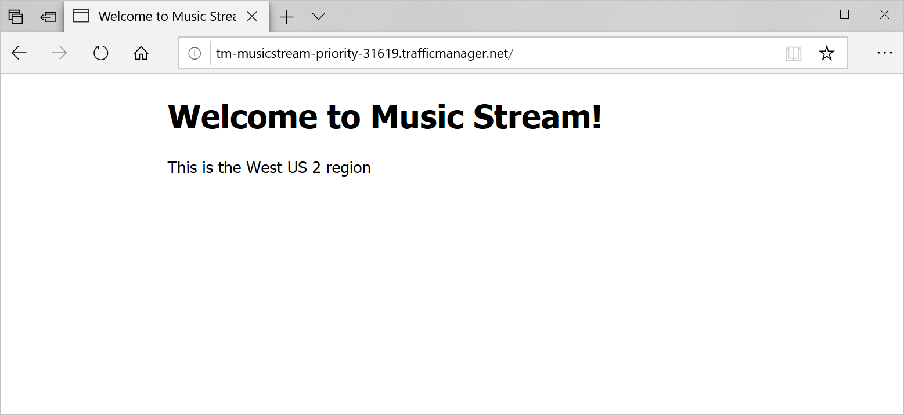
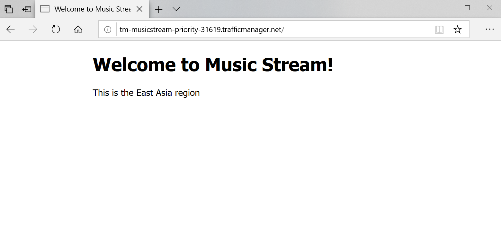

Let's assume that your music streaming application has an equal distribution of users in the western United States and eastern Asia. You'd like to have a failover version of the app in one region.

The sample application we use for this exercise displays the region it's running in. One of the two instances has higher priority and is the primary endpoint. The other instance has a lower priority and is the failover endpoint. Taking the primary endpoint offline automatically routes all traffic to the failover endpoint.

In this exercise, you set up Traffic Manager to use the United States endpoint as the primary, failing over to the Asian endpoint if any errors occur.

[!include[](../../../includes/azure-exercise-subscription-prerequisite.md)]

## Create a new Traffic Manager profile

1. Sign in to the [Azure portal](https://portal.azure.com/?azure-portal=true). Open the Cloud Shell and run these commands to create a new resource group and Traffic Manager profile. Fill in `<location>` in the first command with your choice of Azure region (you can list all available regions with `az account list-locations --query [].name`).

    ```azurecli
    az group create --name mslearn-trafficmanager --location <location>

    az network traffic-manager profile create \
        --resource-group mslearn-trafficmanager \
        --name TM-MusicStream-Priority \
        --routing-method Priority \
        --unique-dns-name TM-MusicStream-Priority-$RANDOM
    ```

    You use these parameters in the second command:

    - **--routing-method Priority**: Creates the Traffic Manager profile by using the priority routing method.
    - **--unique-dns-name**: Creates the globally unique domain name `<unique-dns-name>.trafficmanager.net`. We use the `$RANDOM` Bash function to return a random whole number to ensure that the name is unique.

## Deploy the web apps to the regions

1. Deploy the East Asia web app.

    ```azurecli
    EASTAPP="MusicStore-EastAsia-$RANDOM"

    az appservice plan create \
        --resource-group mslearn-trafficmanager \
        --name MusicStore-EastAsia-Plan \
        --location eastasia \
        --sku S1

    az webapp create \
        --resource-group mslearn-trafficmanager \
        --name $EASTAPP \
        --plan MusicStore-EastAsia-Plan \
        --runtime "node|10.6" \
        --deployment-source-url https://github.com/MicrosoftDocs/mslearn-distribute-load-with-traffic-manager
    ```

    Note the `--sku S1` parameter when you created the Azure App Service plan. Traffic Manager is a premium feature that requires that a web app be running on at least an S1 pricing tier plan.

1. Deploy the West US 2 web app.

    ```azurecli
    WESTAPP="MusicStore-WestUS-$RANDOM"

    az appservice plan create \
        --resource-group mslearn-trafficmanager \
        --name MusicStore-WestUS-Plan \
        --location westus2 \
        --sku S1

    az webapp create \
        --resource-group mslearn-trafficmanager \
        --name $WESTAPP \
        --plan MusicStore-WestUS-Plan \
        --runtime "node|10.6" \
        --deployment-source-url https://github.com/MicrosoftDocs/mslearn-distribute-load-with-traffic-manager
    ```

## Add the endpoints to Traffic Manager

1. Add the web apps as endpoints to the Traffic Manager profile.

    ```azurecli
    WestId=$(az webapp show \
        --resource-group mslearn-trafficmanager \
        --name $WESTAPP \
        --query id \
        --out tsv)

    az network traffic-manager endpoint create \
        --resource-group mslearn-trafficmanager \
        --profile-name TM-MusicStream-Priority \
        --name "Primary-WestUS" \
        --type azureEndpoints \
        --priority 1 \
        --target-resource-id $WestId

    EastId=$(az webapp show \
        --resource-group mslearn-trafficmanager \
        --name $EASTAPP \
        --query id \
        --out tsv)

    az network traffic-manager endpoint create \
        --resource-group mslearn-trafficmanager \
        --profile-name TM-MusicStream-Priority \
        --name "Failover-EastAsia" \
        --type azureEndpoints \
        --priority 2 \
        --target-resource-id $EastId
    ```

    The code gets the unique IDs from both web apps. Then, the code uses the IDs to add them as endpoints to the Traffic Manager profile. The code uses the `--priority` flag to set the West US app to the highest priority.

1. Let's take a quick look at the endpoints we configured.

    ```azurecli
    az network traffic-manager endpoint list \
        --resource-group mslearn-trafficmanager \
        --profile-name TM-MusicStream-Priority \
        --output table
    ```

## Test the app

1. Let's take a look at what DNS shows for the web apps and for our Traffic Manager profile. The following command displays the IP addresses for each of the resources we've created.

    ```bash
    # Retrieve the address for the West US 2 web app
    nslookup $WESTAPP.azurewebsites.net
    # Retrieve the address for the East Asia web app
    nslookup $EASTAPP.azurewebsites.net
    # Retrieve the address for the Traffic Manager profile
    nslookup $(az network traffic-manager profile show \
                --resource-group mslearn-trafficmanager \
                --name TM-MusicStream-Priority \
                --query dnsConfig.fqdn \
                --out tsv)
    ```

    The address for the Traffic Manager profile should match the West US 2 web app.

1. Go to the Traffic Manager profile's fully qualified domain name (FQDN). Your request is routed to the endpoint that responds with the highest priority.

    ```bash
    echo http://$(az network traffic-manager profile show \
        --resource-group mslearn-trafficmanager \
        --name TM-MusicStream-Priority \
        --query dnsConfig.fqdn \
        --out tsv)
    ```

    The code prints out the FQDN in Cloud Shell. You can select the FQDN to open a new browser window or tab.

1. Verify that the application is working and the location shown at the bottom of the page is West US 2.

    

1. Disable the primary endpoint.

    ```bash
    az network traffic-manager endpoint update \
        --resource-group mslearn-trafficmanager  \
        --name "Primary-WestUS" \
        --profile-name TM-MusicStream-Priority \
        --type azureEndpoints \
        --endpoint-status Disabled
    ```

1. Let's look again at what DNS shows for the web apps and for our Traffic Manager profile.

    ```bash
    # Retrieve the address for the West US 2 web app
    nslookup $WESTAPP.azurewebsites.net
    # Retrieve the address for the East Asia web app
    nslookup $EASTAPP.azurewebsites.net
    # Retrieve the address for the Traffic Manager profile
    nslookup $(az network traffic-manager profile show \
                --resource-group mslearn-trafficmanager \
                --name TM-MusicStream-Priority \
                --query dnsConfig.fqdn \
                --out tsv)
    ```

    The address for the Traffic Manager profile should now match the East Asia web app.

1. Test the application again from your browser by refreshing the web page. Traffic Manager should automatically redirect the traffic to the East Asia endpoint. Depending on your browser, it might take a few minutes for the cached address to expire. Opening the site in a private window should bypass the cache, so you can see the change immediately.

    
