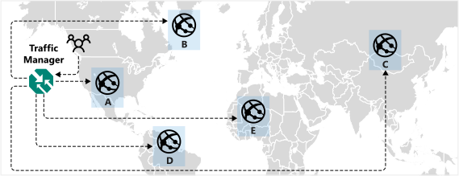

The music streaming app has users from different regions around the world. Some users are located far from where the application is deployed. Streaming performance is partially dependent on the distance between the users' device and the host. To offer the best possible performance to your users, you'll deploy your application in multiple regions. As you add additional regions, you'd like the Traffic Manager to automatically direct the traffic to the best performing endpoint.

The **Performance** traffic-routing method will enable the end users to connect to their best performing server. This could be because it's physically closer to the user, but could also be due to congestion on internet network connectivity. Azure stores historical DNS query latency for connecting clients in an Internet Latency Table. Azure can use this information to direct traffic to the fastest responding server, the server with the lowest latency. Traffic Manager maintains the Internet Latency Table by tracking the round-trip time between IP address ranges and each Azure datacenter. If an endpoint becomes unavailable, Traffic Manager does not include it in DNS query responses.

You don't have to do anything more than configure a Traffic Manager profile, and select **performance** as the routing method. Endpoints don't need to be prioritized, Traffic Manager will route all the traffic automatically to the fastest responding server.

In the following example, if endpoint A stopped performing as well as endpoint B, customer traffic will be routed to endpoint B automatically.

Client traffic is routed consistently. A client will be directed to the same endpoint for each request it makes if nothing changes in the underlying servers and networking. If you need more granular control, for example choosing a preferred failover within a region, the Traffic Manager can be used in a nested configuration.
