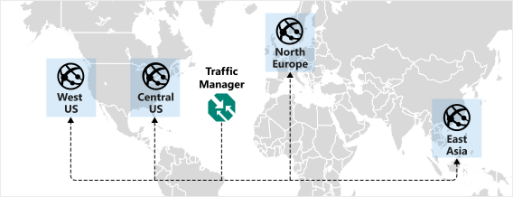
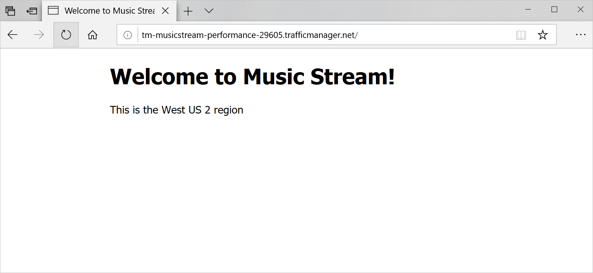

Your network architect would like to take advantage of performance routing to ensure customers have the best performance. They need you to deploy the Music Stream app into two more regions and configure performance routing.



You'll now deploy the application into two more regions. Then you'll create a new Traffic Manager to use all four endpoints.

## Deploy additional instances and configure Traffic Manager

1. Create two new endpoints in Central US and North Europe by deploying the application to new instances of App Service in those regions.

    ```azurecli
    CENTRALAPP="MusicStore-CentralUS-$RANDOM"

    az appservice plan create \
        --resource-group <rgn>[sandbox resource group name]</rgn>  \
        --name MusicStore-CentralUS-Plan \
        --location centralus \
        --sku S1

    az webapp create \
        --resource-group <rgn>[sandbox resource group name]</rgn> \
        --name $CENTRALAPP \
        --plan MusicStore-CentralUS-Plan \
        --runtime "node|10.6" \
        --deployment-source-url https://github.com/MicrosoftDocs/mslearn-distribute-load-with-traffic-manager

    EUROPEAPP="MusicStore-Europe-$RANDOM"

    az appservice plan create \
        --resource-group <rgn>[sandbox resource group name]</rgn>  \
        --name MusicStore-Europe-Plan \
        --location northeurope \
        --sku S1

    az webapp create \
        --resource-group <rgn>[sandbox resource group name]</rgn> \
        --name $EUROPEAPP \
        --plan MusicStore-Europe-Plan \
        --runtime "node|10.6" \
        --deployment-source-url https://github.com/MicrosoftDocs/mslearn-distribute-load-with-traffic-manager
    ```

1. Create a new Traffic Manager profile with performance routing.

    ```azurecli
        az network traffic-manager profile create \
        --resource-group <rgn>[sandbox resource group name]</rgn> \
        --name TM-MusicStream-Performance \
        --routing-method Performance \
        --unique-dns-name TM-MusicStream-Performance-$RANDOM \
        --output table
    ```

1. Create four new endpoints that can use the deployed four web apps.

    ```azurecli
    CentralId=$(az webapp show \
        --resource-group <rgn>[sandbox resource group name]</rgn> \
        --name $CENTRALAPP \
        --query id \
        --out tsv)

    az network traffic-manager endpoint create \
        --resource-group <rgn>[sandbox resource group name]</rgn>  \
        --profile-name TM-MusicStream-Performance \
        --name "Central-US" \
        --type azureEndpoints \
        --target-resource-id $CentralId

    EuropeId=$(az webapp show \
        --resource-group <rgn>[sandbox resource group name]</rgn> \
        --name $EUROPEAPP \
        --query id \
        --out tsv)

    az network traffic-manager endpoint create \
        --resource-group <rgn>[sandbox resource group name]</rgn>  \
        --profile-name TM-MusicStream-Performance \
        --name "Europe" \
        --type azureEndpoints \
        --target-resource-id $EuropeId

    az network traffic-manager endpoint create \
        --resource-group <rgn>[sandbox resource group name]</rgn>  \
        --profile-name TM-MusicStream-Performance \
        --name "West-US" \
        --type azureEndpoints \
        --target-resource-id $WestId

    az network traffic-manager endpoint create \
        --resource-group <rgn>[sandbox resource group name]</rgn>  \
        --profile-name TM-MusicStream-Performance \
        --name "East-Asia" \
        --type azureEndpoints \
        --target-resource-id $EastId
    ```

## Test the new configuration

1. Navigate to the Traffic Manager profiles Fully Qualified Domain Name (FQDN), your request will be routed to the endpoint that responds with the lowest latency.

    ```bash
    echo http://$(az network traffic-manager profile show \
        --resource-group <rgn>[sandbox resource group name]</rgn> \
        --name TM-MusicStream-Performance \
        --query dnsConfig.fqdn \
        --output tsv)
    ```

1. Depending on where you're located, you'll be directed to the best performing endpoint.

    

1. Use `nslookup` to resolve the Traffic Manager profile domain name.

    ```bash
    nslookup $(az network traffic-manager profile show \
            --resource-group <rgn>[sandbox resource group name]</rgn> \
            --name TM-MusicStream-Performance \
            --query dnsConfig.fqdn \
            --output tsv)
    ```

    `nslookup` will return where the domain name resolves to, for example if you're closest to Europe:

    ```output
    Non-authoritative answer:
    tm-musicstream-performance-13522.trafficmanager.net
    canonical name = musicstore-europe-23644.azurewebsites.net.

    musicstore-europe-23644.azurewebsites.net
    canonical name = waws-prod-db3-129.sip.azurewebsites.windows.net.

    waws-prod-db3-129.sip.azurewebsites.windows.net
    canonical name = waws-prod-db3-129.cloudapp.net.

    Name:   waws-prod-db3-129.cloudapp.net
    Address: 23.100.56.27
    ```

If your customers have two endpoints that have equal network latency, they could be routed to either endpoint. Refresh your web page to see if you are served the same endpoint.
