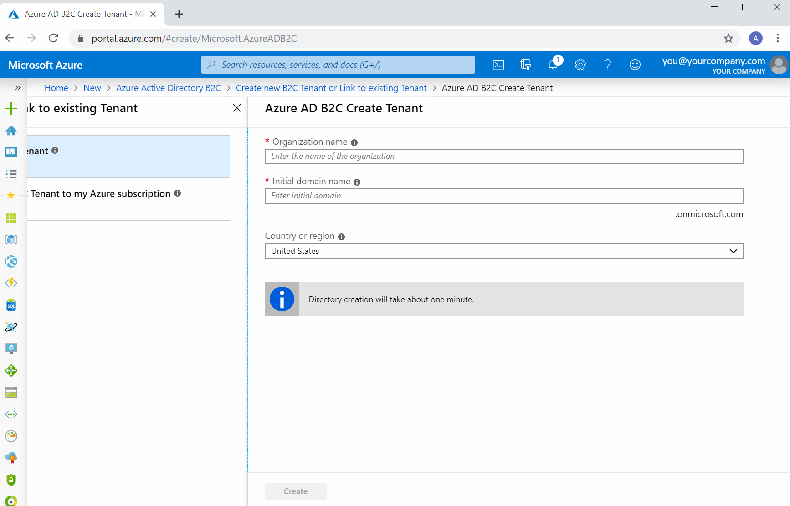
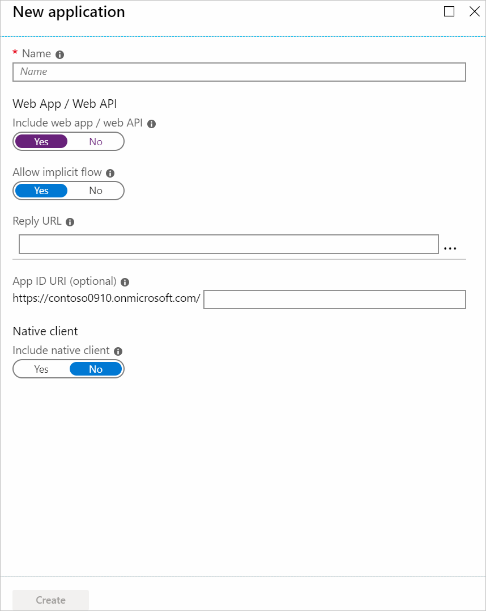
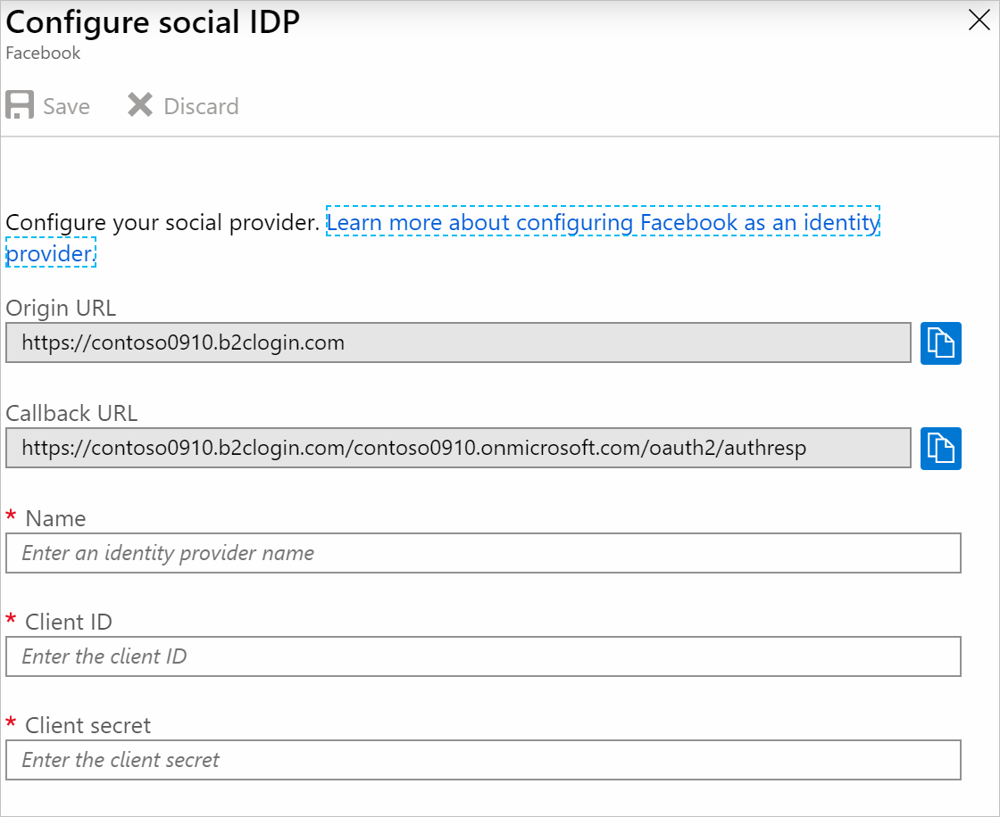
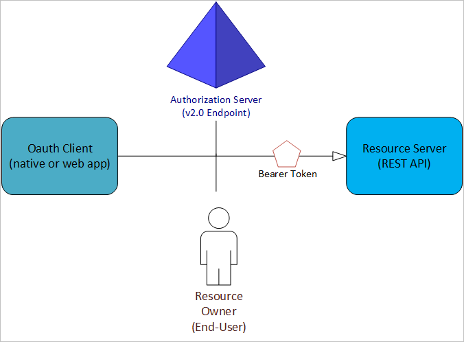
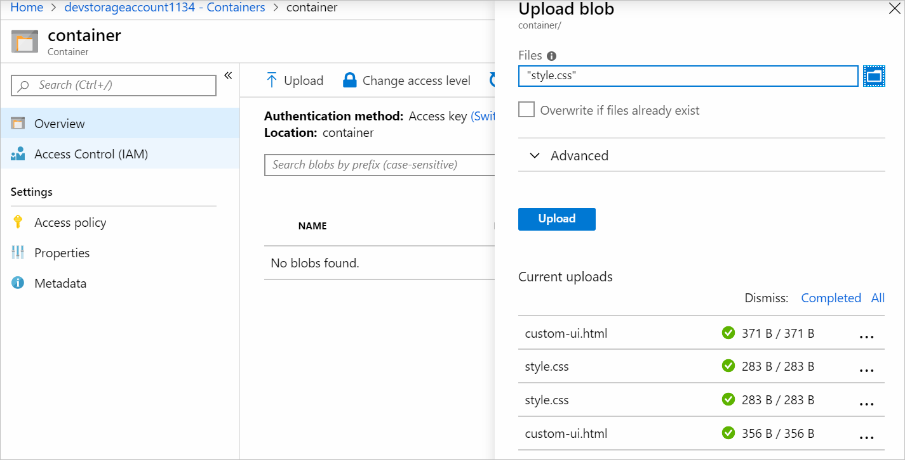
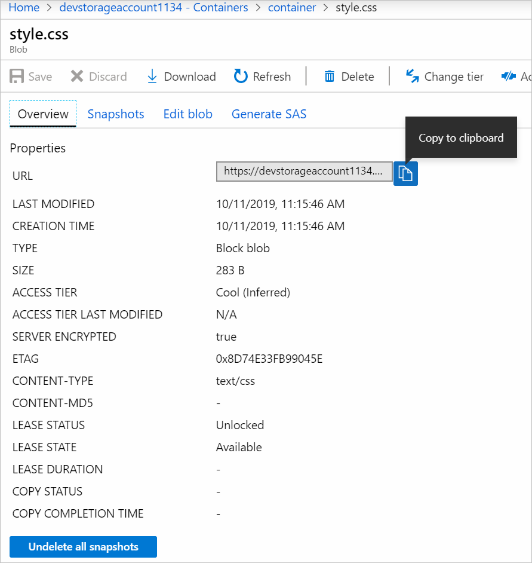
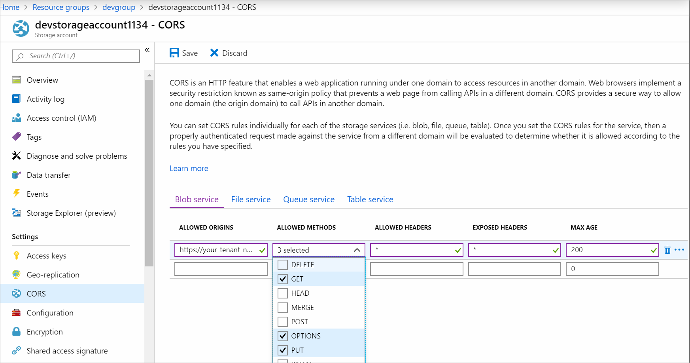
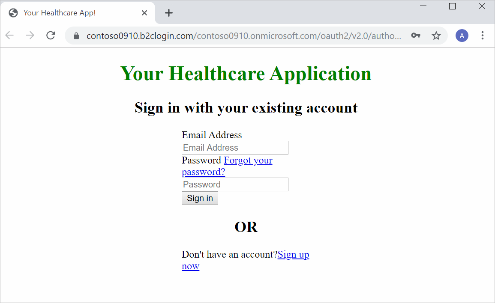

Your application is a web app that needs to handle patients' healthcare-related data. You've been asked to ensure patients can securely access the data they need through the application. Patients should be able to use an existing social identity, such as Facebook or Twitter.

Here, you'll discover why you should use Azure Active Directory B2C. You'll also explore the concepts that will help you achieve customized, and secure access for your patients.

## Why should you use Azure Active Directory B2C?


Azure Active Directory B2C (Azure AD B2C) is a service you use to manage your customers' identities and access. The service can support millions of users. Use Azure AD B2C to securely authenticate your customers through their preferred identity providers. Azure AD B2C can handle billions of authentications per day. Use the service to monitor for, and automatically take care of, threats like brute force and denial-of-service attacks. Azure AD B2C integrates with other services, such as Application Insights. Use this integration to improve your applications' security and user experience.

## Register tenants with applications



You'll need to create a tenant in Azure to use Azure Active Directory B2C. The tenant is a logical representation of your customer users and the applications they use. You provide a name for your tenant, along with details like its domain name and geographical location.

You add, delete, or edit users through your tenant. Users are also added to the tenant when they've successfully registered through your application.  Your tenant also lets you manage your applications. You use the tenant to add, delete, or make changes to your applications.

Your applications need to register with your tenant if you want to add them. After you've created a tenant, you'll register the application using Azure AD B2C.


You have to fill in a form. Because your healthcare application is a web app, you'll need to provide some of its URL details. Below is the kind of form you'll complete to register your healthcare application to your tenant.



## Configure user journeys through policies

A user journey is the path you want a user to take on your application to achieve their goal. For example, a user might want to make a new account, or update their profile. You use policies in Azure AD B2C to configure user journeys. Policies help you detail things like profile creation, sign-in, or account editing for users. You can create your own custom policies. Azure AD B2C also comes with preconfigured policies called user flows. Use user flows to configure things like:

- Which account types are used on your healthcare application. For example, social accounts like twitter, or local accounts managed by you.
- What data to collect from users, like location, age, or weight.
- Whether you want to enable multi-factor authentication.

You can reuse the same user flows across different applications. Reuse your user flows so you'll have consistent user journeys across your applications. Here's an example of what a user flow configuration might look like:


## Allow users to use different identity providers

Use identity providers to let users sign in with their social accounts like Microsoft, LinkedIn, Facebook, or Twitter.

You'll need to choose the identity providers you want for your application. You can create your own identity provider, or choose from the list.


After you've selected an identity provider, you configure a social identity provider (social IDP) for it in Azure.



To configure a social IDP, you'll specify a client ID and a client secret. You get both of these values by following the instructions in the **Learn more about configuring (your chosen provider) as an identity provider** link. The instructions vary for each provider. After you've configured your provider, you point to it in your user flow's identity providers section.

## Use secure protocols and tokens for your user journeys

Azure AD B2C supports industry standard OAuth 2.0 and OpenID Connect authentication protocols. You register your applications to your B2C tenant before they can use Azure AD B2C. Your registered application will have specific values assigned to it, including the following values:

- Your application's unique **Application ID**.
- A **Package identifier** or **Redirect URI** used to send responses back to your application.

Your application then needs to send requests to an endpoint to communicate with Azure AD. For example, an endpoint could look like this:

```https
https://{your-tenant}.b2clogin.com/{your-tenant}.onmicrosoft.com/oauth2/v2.0/authorize
https://{your-tenant}.b2clogin.com/{your-tenant}.onmicrosoft.com/oauth2/v2.0/token
```

Your typical exchange in both OAuth and OpenID will have the following entities:


<!-- TODO: please feel free to format according to learn standards. This diagram only needs to show the entities. Also remove "Oauth" in the "Oauth client(native or web app)" box. Original image: https://docs.microsoft.com/en-us/azure/active-directory-b2c/media/active-directory-b2c-reference-protocols/protocols_roles.png -->

- An **Authorization Server**, which is your Azure AD endpoint like the one above. Your endpoint is responsible for managing user access and user details. The endpoint is also in charge of user identity verification and handing out tokens. It also manages the trust between all the other entities.
- The **client**, which is your application. Your application requests tokens from the authorization server. The authorization server uses your application's unique Application ID to identify it.
- A **resource owner**, which is usually the user. The resource owner is responsible for denying, or allowing, access to data and resources.
- A **resource server**. A resource server is where the data or resources are kept. For example, a user's order history is kept in a secure server. The resource server relies on the authorization server to authorize a client. The resource server will only grant access if a valid bearer token has been presented to it. A bearer token is a security token used by the "bearer" (the authorized client) to access resources and data on a resource server. Send your bearer token through a secure channel like transport layer security (HTTPS).

To use authentication protocols and tokens as part of the user journey for your web application, you'll need to use the `/authorize` endpoint like this: `https://{tenant}.b2clogin.com/{tenant}.onmicrosoft.com/{policy}/oauth2/v2.0/authorize`. The `{policy}` is the user flow that you created.

```HTTP
GET https://{tenant}.b2clogin.com/{tenant}.onmicrosoft.com/{policy}/oauth2/v2.0/authorize?
client_id=your_application_id
&response_type=code+id_token
&redirect_uri=https%3A%2F%2Fyour.redirecturl.com%2F
&response_mode=form_post
&scope=openid%20offline_access
&state=arbitrary_data_you_want_to_receive_in_the_response
&nonce=12345
```

- `client_d` is your unique registered Application ID.
- `redirect_uri` is a url you use to send responses back to your application.
- `response_mode` is the method used when the resulting token is sent back to the application.
- `response_type` is how you specify the type of token you want to receive.
- `scope` is used to specify the permissions that the application needs from the user.
- `nonce` is a value generated by your application. The value is used to identify a request's origin.
- `state` is a random value you send that's returned to you in the response. Your application verifies that both `state` values are the same.

When you send the request, your user is asked to go through the user flow specified in the request. For example, if it's a sign-in user flow, the user is prompted to enter their credentials. When the user completes the user flow steps, a response is returned to the `redirect_uri`. The response might look like this:

```HTTP
GET https://your.redirecturl.com/#
id_token=98audasdjnAiLCJhbGciOiJSUzI1NiIsI892347u4i3ujhiesnl0aEV1Q...
&code=NNNNaiiUYyasJJMhhjAyyyAkkAqdFSBzjqfTGBCmLdgfSTLEmHmNbBnnBgGG...
&state=arbitrary_data_you_receive_from_the_response
```

- `id_token` is the ID token your application requested. Use this ID token to verify your user's identity and start a session.
- `code` is the code that you requested if you specified `response_type=code+id_token`. Your application uses this code to request a token so it can access a resource.
- `state` is the same value you sent in the previous request. Verify that the two state values are the same.

## Customize your user interface

You can change the look of the pages that form part of your user flow. You write your own HTML and CSS, or use built-in templates called *page layout templates*.

You enable different page layout templates in the Azure portal. You go to your user flow, and select the template you want. The template will be applied automatically.


For example, if you select **Ocean Blue** for your template, it will be applied to your user flow as shown below.


You can write your own custom HTML and CSS. At runtime, Azure AD B2C can load content through a URL you specify inside your user flow. Every page that's part of your user flow can load specific content for itself. That content is merged with the page HTML.

For example, to insert your own custom content, you could write some HTML and CSS:

```HTML
<!DOCTYPE html>
<html>
  <head>
    <title>Your Healthcare App!</title>
    <link rel="stylesheet" href="css/style.css">
  </head>
  <body>
    <h1>Your Healthcare Application</h1>
    <div id="api"></div><!-- Leave this element empty because Azure AD B2C will insert content here. -->
  </body>
</html>
```

```CSS
h1 {
  color: green;
  text-align: center;
}
.intro h2 {
  text-align: center;
}
.entry {
  width: 200px ;
  margin-left: auto ;
  margin-right: auto ;
}
.divider h2 {
  text-align: center;
}
.create {
  width: 200px ;
  margin-left: auto ;
  margin-right: auto ;
}
```

You'll need to create a storage account. You can create one using the Azure portal. Upload your files to the storage account by first creating a container for your files, and then uploading them.  



Your storage account will give each of your files a unique URI when you upload them. Upload your CSS file, then note its URI, and point to it in your HTML's stylesheet `href`.



```html
<link rel="stylesheet" href="https://yourstorageaccount.blob.core.windows.net/yourcontainer/style.css">
```

You'll also upload your HTML file as you did your CSS file.

You need to enable cross-origin resource sharing (CORS) in your storage account so content can be loaded from it.



You'll need to allow `https://{your-tenant-name}.b2clogin.com` in the **ALLOWED ORIGINS** field. Also, you'll allow all headers, expose all headers, and allow the `GET, PUT, OPTIONS` methods.

In your user flow, you'll specify that you want to use custom page content.


You'll point to the URI for the uploaded file in your storage account.

Test your user flow by selecting **Run user flow**. When you run your user flow, you'll see the HTML has been updated.



<!-- Author's note: -->
<!-- Moving the "How to" details for the "How to" sections to unit 4 since both have to be covered there for the user to be able to do the exercise that follows the unit. It also helps avoid duplication. And it helps make this unit less bloated. The sections are: -->

<!-- How to configure user journeys through policies. &. How to register tenants with applications for users.   -->