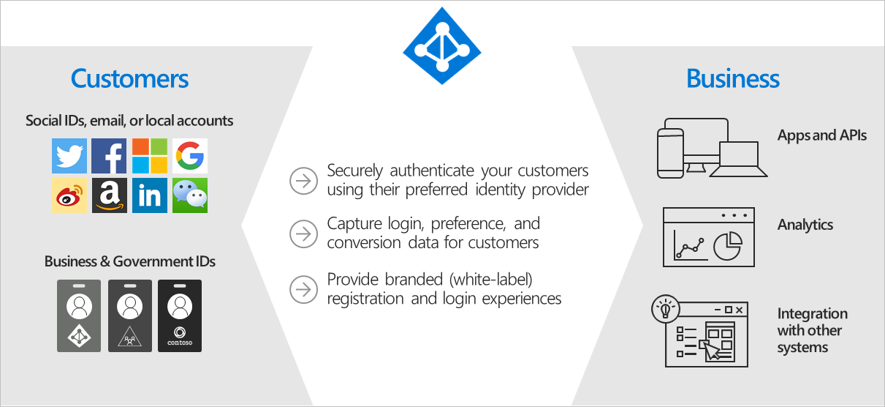
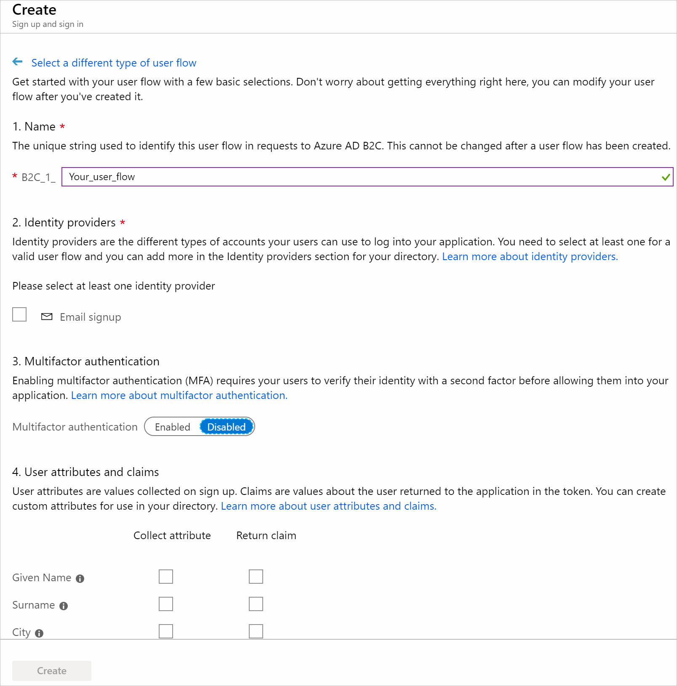
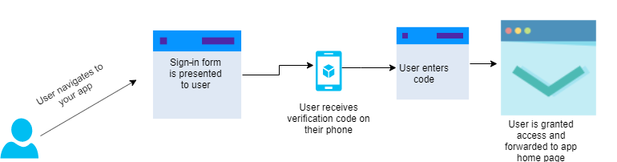
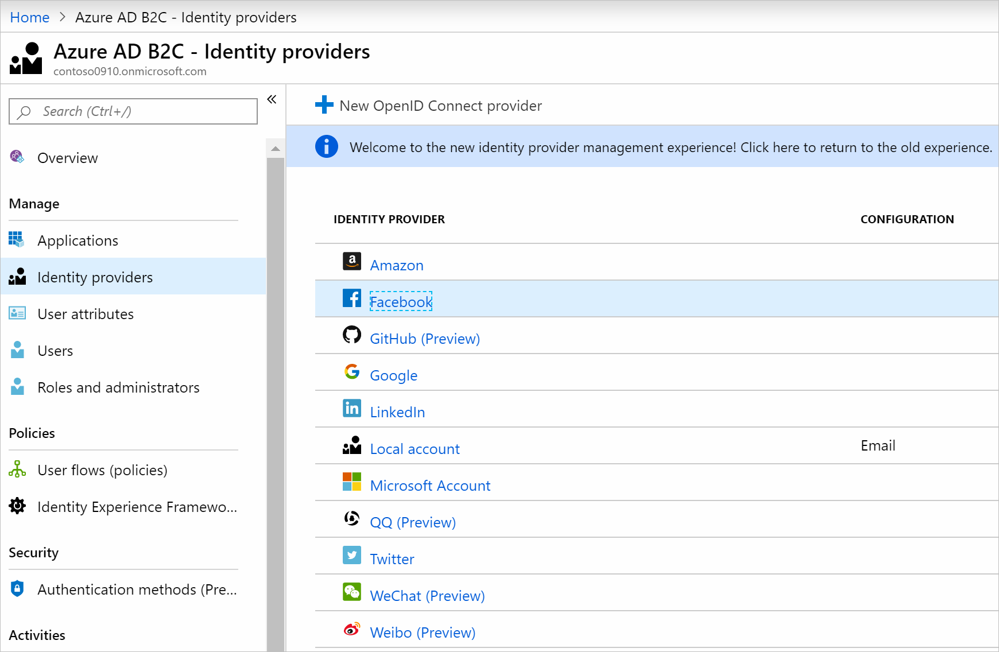
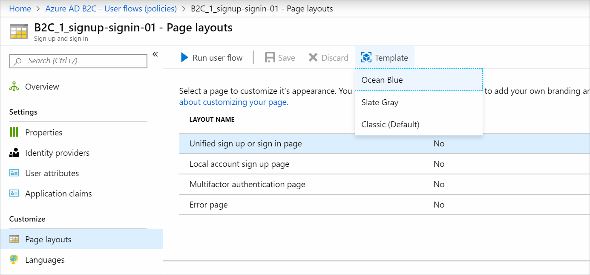

You have a web app that handles patient healthcare data. You've been asked to ensure that patients can securely access the data they need by using the application. Patients will be allowed to use an existing social identity, such as Facebook or Twitter.

Here, you'll discover why you should use Azure Active Directory B2C (Azure AD B2C). You'll also explore the concepts that will help you provide your patients with customized and secure access.

## Why should you use Azure Active Directory B2C?

Azure AD B2C is a service you use to manage customer identities and their access to your applications. The service can support millions of users. You can use Azure AD B2C to securely authenticate your customers by using their preferred identity providers. Azure AD B2C can handle billions of authentications per day. Use the service to monitor for, and automatically take care of, threats like brute-force and denial-of-service attacks. Azure AD B2C integrates with other services, such as Application Insights. You can use this integration to improve your application's security and user experience.

### Configure user journeys by using policies

A user journey is the path that you want people to take in your application to achieve their goal. For example, a user might want to make a new account or update their profile. You use policies in Azure AD B2C to configure user journeys. Policies help you detail journeys like profile creation, sign-in, or account editing for users. Azure AD B2C comes with preconfigured policies called *user flows* that control how people interact with your application.

User flows are used to configure:

- Which account types your application uses, such as social accounts like Twitter or local accounts that you manage.
- What data to collect from your users, like location, age, or clothing size.
- Whether you want to enable multifactor authentication.

You can reuse the same user flows across different applications. Then you'll have consistent user journeys across all applications.

Here's where you create a user flow:

There are different types of user flows, such as for profile editing or password reset. For example, a sign-up and sign-in user flow defines the steps and pages required to access your application. The user flow might have steps like this:

First, the user goes to your application, perhaps on their computer's internet browser or their mobile device. The user is presented with a sign-in form for authentication and enters their account credentials in the form. If you've enabled multifactor authentication for your user flow, the user is then prompted to enter a code that they receive on their mobile device. The code is verified, and if it succeeds, the user is forwarded to your application.

Azure AD B2C also supports industry-standard OAuth 2.0 and OpenID Connect authentication protocols for your user flows. Use these protocols when you're building apps like Web API, or mobile applications. You can outsource signing up and signing in to Azure AD B2C for your applications, whatever languages they're built on.

### Support different identity providers

You can use identity providers to let users sign in by using their social identities, such as a Microsoft account, Facebook, Twitter, or LinkedIn.

You'll need to choose the identity providers that you want for your application. You can create your own identity provider, or choose from the list.

### Customize your user interface

You can change the look of the pages in your user flow. Write your own HTML and CSS or use built-in templates called *page layout templates*.

You can enable different page layout templates in the Azure portal. Go to your user flow and select the template you want, as shown in the following screenshot. The template will be applied automatically.

For example, if you choose **Ocean Blue**, that template will be applied to your user flow. When a user goes to your application, they'll see that the layout has changed as shown in the following example. Take advantage of templates to customize the user experience.

:::image type="content" source="../media/2-customized-ui.png" alt-text="UI customized with Ocean Blue template."  loc-scope="azure-active-directory-b2c":::
