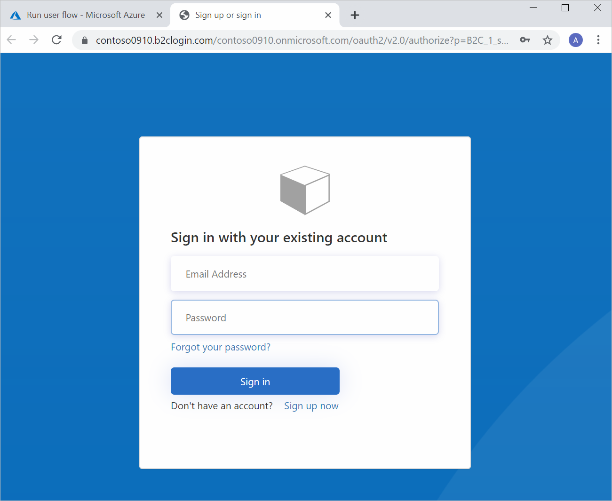

You have a web app that needs to handle patient healthcare data. You've been asked to ensure patients can securely access the data they need through the application. Patients should be allowed to use an existing social identity, such as Facebook or Twitter.

Here, you'll discover why you should use Azure Active Directory business-to-consumer (Azure AD B2C). You'll also explore the concepts that will help you achieve customized and secure access for your patients.

## Why should you use Azure Active Directory B2C?

Azure AD B2C is a service you use to manage customer identities and their access to your applications. The service can support millions of users. Use Azure AD B2C to securely authenticate your customers through their preferred identity providers. Azure AD B2C can handle billions of authentications per day. Use the service to monitor for, and automatically take care of, threats like brute force and denial-of-service attacks. Azure AD B2C integrates with other services, such as Azure Application Insights. Use this integration to improve your application security and user experience.

### Configure user journeys through policies

A user journey is the path you want people to take on your application to achieve their goal. For example, a user might want to make a new account, or update their profile. You use policies in Azure AD B2C to configure user journeys. For example, policies help you detail profile creation, sign-in, or account editing for users. Azure AD B2C comes with preconfigured policies called user flows that control how people interact with your application. 

User flows are used to configure:

- Which account types are used on your application; for example, social accounts like Twitter, or local accounts that you manage
- What data to collect from your users, like location, age or clothing size
- Whether you want to enable multi-factor authentication

You can reuse the same user flows across different applications. Then you'll have consistent user journeys across all applications.

There are different types of user flows, such as for profile editing, or password reset. For example, a sign-up and sign-in user flow defines the steps and pages required to access your application. The user flow might have steps like this:

First, the user goes to your application, perhaps on their computer's internet browser or mobile device. The user is presented with a sign-in form so they can be authenticated. Account credentials are entered in the sign-in form. If you've enabled multi-factor authentication for your user flow, the user is then prompted to enter a code they receive on their mobile device. The user's code is verified, and if successful, they'll be forwarded to your application.

Azure AD B2C also supports industry standard OAuth 2.0 and OpenID Connect authentication protocols for your user flows. Use these protocols when you're building apps like Web API, or mobile applications. Sign-up and sign-in can be outsourced to Azure AD B2C for your applications, whatever languages they're built on.

### Allow users to use different identity providers

Use identity providers to let users sign in with their social identities, such as a Microsoft account, Facebook, Twitter, or LinkedIn.

You'll need to choose the identity providers you want for your application. You can create your own identity provider, or choose from the list.

### Customize your user interface

You can change the look of the pages that form part of your user flow. You write your own HTML and CSS, or use built-in templates called *page layout templates*.

You enable different page layout templates in the Azure portal. Go to your user flow, and select the template you want. The template will be applied automatically.

For example, if you choose the **Ocean Blue** template, it would be applied to your user flow. When a user goes to your application, they'll see the layout has changed, as shown below. Take advantage of templates to customize the user experience.

