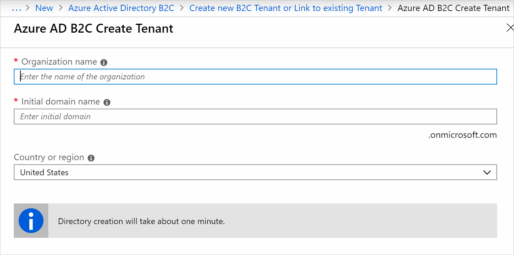
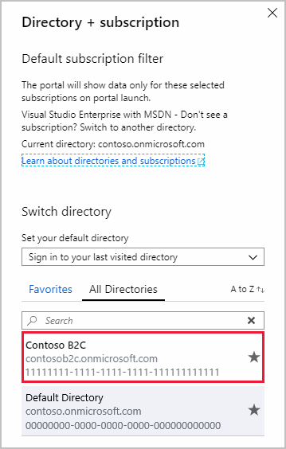
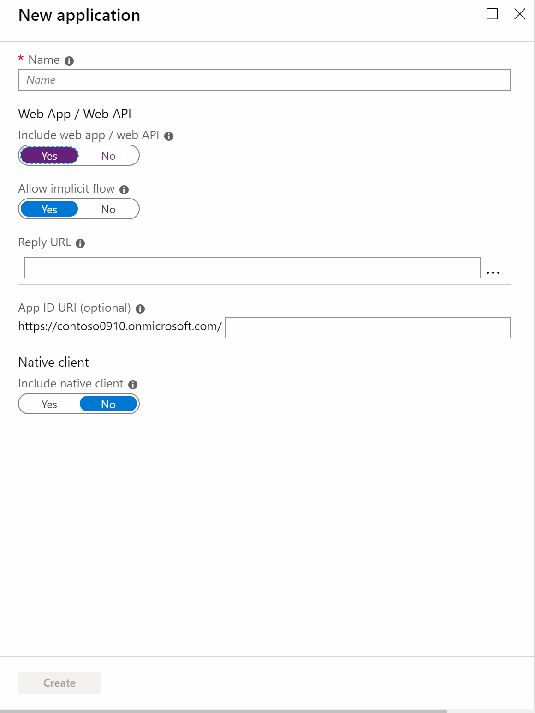
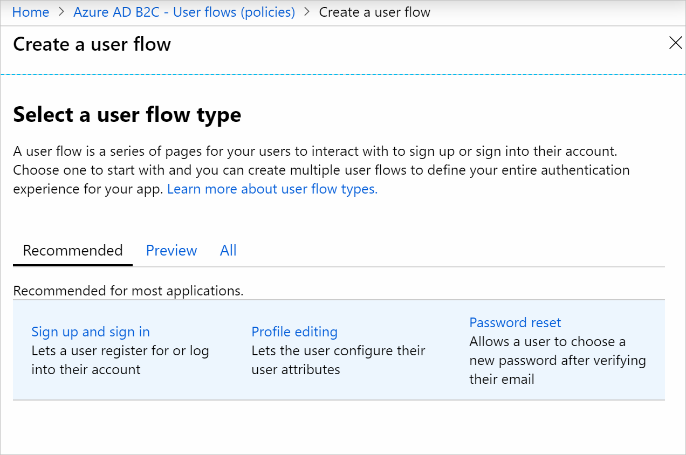
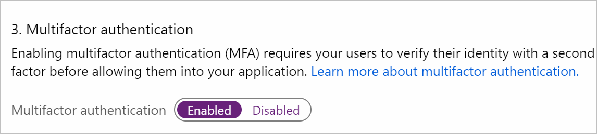
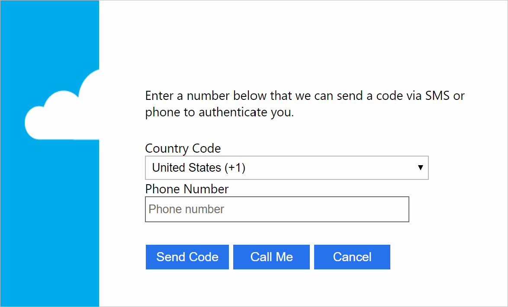
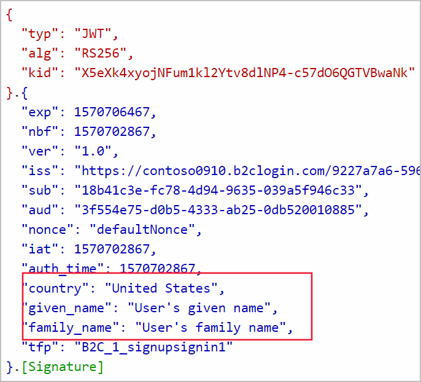

You have a healthcare web application that handles sensitive patient data. The app must remain secure, even if a patient's user name or password is compromised. You'll need to configure Azure Active Directory B2C (Azure AD B2C) with multi-factor authentication to protect patients' access to the application. 

You'll configure components for your healthcare application to take advantage of the combined benefits of Azure AD B2C and multi-factor authentication. You'll need to configure a tenant, register your application, and create a user flow.

## Configure Azure AD B2C and multi-factor authentication for your application

This section explains the main configuration steps.

### Create a tenant

First, you must register your app with an Azure AD B2C tenant before it can work with Azure AD B2C. To do this, you'll need to create a new Azure AD B2C tenant.

Use the Azure portal to create an Azure AD B2C tenant as a resource. Specify a name, domain, and region for your tenant.

An Azure AD B2C tenant isn't the same as an Azure Active Directory (Azure AD) tenant. You use an Azure AD tenant to represent an organization. Your Azure AD B2C tenant represents the identities that are used for customer applications.

When you create a new Azure AD B2C tenant, you'll see it in your list of directories in the portal.

You need to switch to your new Azure AD B2C tenant to register it with your application.

### Register your application

When you've switched to the new Azure AD B2C tenant, you can register the application. Go to the Azure AD B2C resource you've created.

There's a form to register your application. Provide the name of your application and select a platform.

Your health application is a web app, so you'll need to provide a *redirect URI*, which is the endpoint where your Azure AD B2C will send tokens for the application requests. You can also use a local URL like `https://localhost:{port}`. Your redirect URI, which is case sensitive, is valid only if it begins with `https`.

### Create user flows

You use user flows to manage things like sign-ins and sign-ups. Your Azure AD B2C tenant lets you create multiple types of user flows.

Create a user flow for sign-ups and sign-ins for your users. You can use the **Sign up and sign in** user flow to guide users through the several pages to create an account for the app (sign up), and to access the app (sign in).

Use the following form to create the user flow.

When you create a **Sign up and sign in** user flow, you'll specify a name for it. You'll need to enable **Email sign-up** to successfully create your user flow. In the **Multifactor authentication** section, set the method for multifactor authentication. You can also enable multifactor authentication or leave it disabled and return to it later. In the **User attributes and claims** section, specify which information to collect from the user. You'll also choose which claims about the user to return to the application. Claims are the same attributes about the user that the application collected earlier during sign-up. You're then ready to create your sign-up and sign-in user flow.

### Enable multifactor authentication

As you've already learned, you can enable multi-factor authentication for a user flow when you create one. You can also return to previously created user flows and retroactively enable or disable multi-factor authentication. To do that, go to your existing user flow and use the **Multifactor authentication** radio buttons:

## User experience

After your user flow and multi-factor authentication have been configured, the application is ready to use.

Because your healthcare application is a web app, the user accesses it through their browser. Users must sign up in your application if they don't already have an account. On the sign-up page, they're asked to provide the information you configured your user flow to collect. The sign-up form might look like this.

:::image type="content" source="../media/4-sign-up-form.png" alt-text="Screenshot of a sign-up form." loc-scope="azure-active-directory-b2c":::

You'll notice that this form collects attributes like **Country/Region**, **Given Name**, and **Surname** from the user. The **Send verification code** button sends a verification code via email. The code is then used to complete registration.

When your user has registered an account, they sign in. The sign-in form might look like this:

:::image type="content" source="../media/4-sign-in-form.png" alt-text="Screenshot of a sign-in form." loc-scope="azure-active-directory-b2c":::

After their credentials have been verified, the user then completes a multifactor authentication challenge. The user enters their phone number and chooses to receive a code via either text message or phone call.

When the user completes the challenge, they're successfully signed in. The claims that you selected about the user are returned to the application as shown in the following example. Your application uses these claims to understand the user who is interacting with it.

