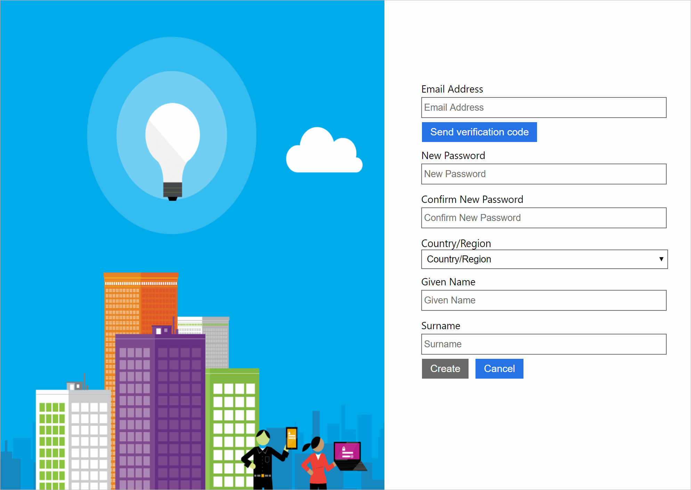
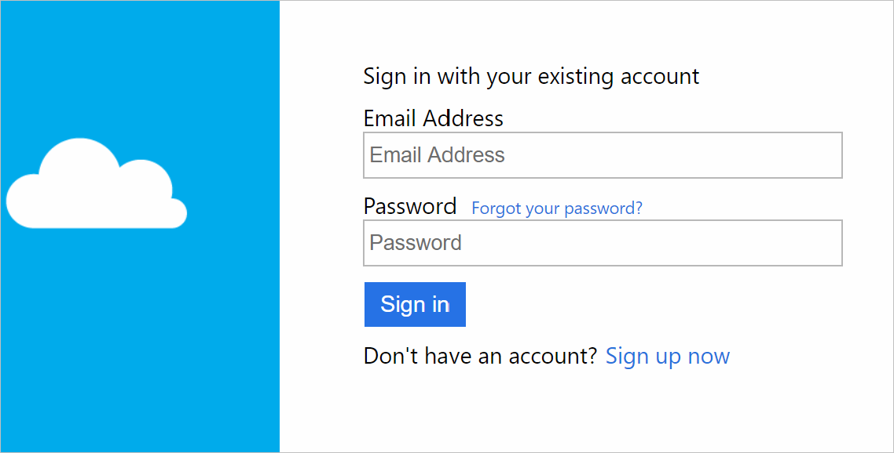

Your healthcare application is a web application that handles sensitive patient data.  The app must remain secure, even if a patient's username or password is compromised. You'll need to configure Azure AD B2C with multi-factor authentication to protect the patients' access to the application. 

You'll configure a few components for your healthcare application to take advantage of the combined benefits of Azure AD B2C and multi-factor authentication (MFA). You'll need to configure a tenant, register your application, and create a user flow.

## Configure Azure AD B2C and MFA for your application

### Create a tenant

First, you must register your app with an Azure Active Directory B2C tenant before it can work with Azure AD B2C. You'll need to create a new Azure AD B2C tenant.

You create an Azure AD B2C tenant as a resource using the Azure portal. You'll need to specify a name for your tenant, a domain for your tenant, and a region.

An Azure Active Directory B2C tenant isn't the same as an Azure Active Directory tenant. You use an Azure Active Directory tenant to represent an organization. Your Azure AD B2C tenant represents the identities that are used for your customer applications.

When you create a new Azure AD B2C tenant, you'll see it in your list of directories in the portal.

You would switch to your new Azure AD B2C tenant to register it with your application.

### Register your application

When you've switched to the new Azure AD B2C tenant, you'll be able to register the application. You'll go to the Azure AD B2C resource you've created.

You'll use a form to register your application. You provide the name of your application and specify whether it's a web application or API. Also, you'll need to say whether it's a native application, such as for desktops, or a mobile app.

Your health application is a web app, so you'll need to provide a reply URL. The reply URL is the endpoint where your Azure AD B2C should send tokens for the application requests. You can also use a local URL like `https://localhost:{port}`. Your reply URL, which is also case-sensitive, is only valid if it begins with `https`.

### Create user flows

You use user flows to manage things like your user sign-ins and sign-ups. Your Azure AD B2C tenant lets you create multiple types of user flows.

You'll create a user flow for sign-ups and sign-ins for your users. You use the sign-up and sign-in user flow to handle the steps necessary for your users to create an account for the app and access the application. This user flow will guide the users through several pages that help them to sign in or sign up.

When you create a sign-up or sign-in user flow, you'll specify a name for it. You'll need to enable **Email signup** to successfully create your user flow. In the multi-factor authentication section, you choose whether to enable MFA, or keep it disabled and return to it later. Specify which information to collect from the user in the user attributes and claims section. You'll also choose which claims about the user to return to the application. Claims are the same attributes collected earlier by the application, about the user, during sign-up. You're then ready to create your sign-up and sign-in user flow.

### Enable multi-factor authentication

As you've already seen, you enable multi-factor authentication for a user flow when you create one. You can also return to previously created user flows, and retroactively enable or disable multi-factor authentication. You'd go to your existing user flow and use the **Multifactor authentication** toggle.

## End-user experience

After your user's flow and multi-factor authentication has been configured, the application is ready to use.

Because your healthcare application is a web app, the user accesses it through their browser. Your user has to sign up to your application if they don't already have an account. In the sign-up page, they're expected to provide the information you wanted to collect in your user flow. The sign-up form might look like this:

You'll see that this form collects attributes like **Country/Region**, **Given Name**, and **Surname** from the user. The **Send verification code** button sends a verification code via email. The code is then used to complete registration.

When your user has registered an account, they sign in. The sign-in form might look like this:

After a user's credentials are verified, they'll complete a multi-factor authentication challenge. The user enters their phone number, and chooses to receive a code, either sent via text message or in a call. 

When the user has completed the challenge, they sign in successfully. The claims about the user you've selected will be returned to the application as shown below. Your application uses these claims to understand the user who is interacting with it.

