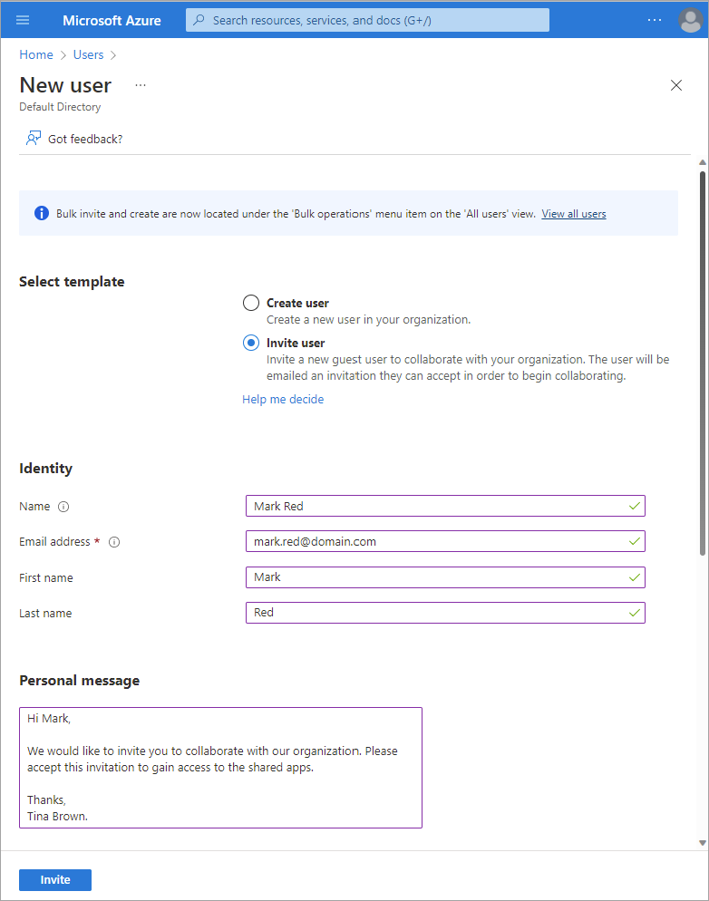
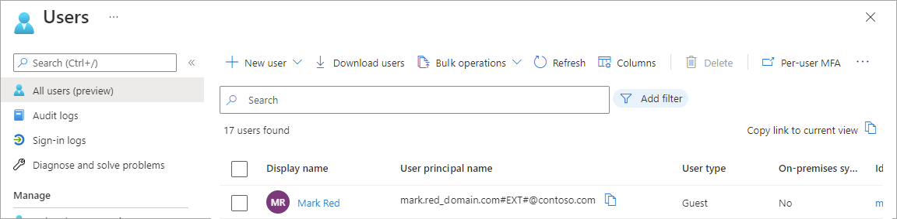
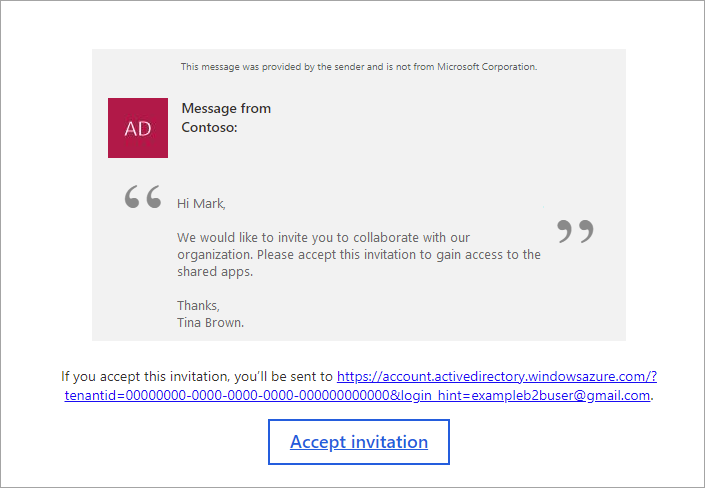
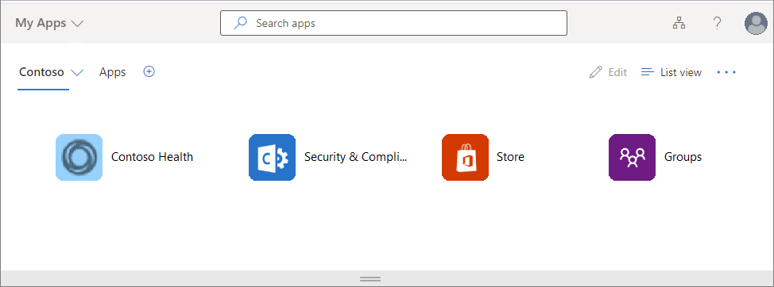

You're going to use Azure Active Directory B2B (Azure AD B2B) to give clinicians access to your organization's healthcare application. 

Here, you'll get a brief overview of the concepts you must understand to use Azure AD B2B effectively.

## Azure AD B2B overview

Your organization needs to work with external users. To collaborate, these users will need a required level of access to the applications. Azure Active Directory B2B is a service that enables you to securely collaborate with external partners. Your partner users are invited as guest users. You remain in control of what they have access to, and for how long.

Azure AD B2B lets you collaborate with external partner users through the process below. The numbers in the diagram are explained in the subsequent sections.

1. **Invite a guest user**

    At step one in the diagram, you invite external users as guest users to your directory. There are different ways you can invite a guest user, such as through Azure PowerShell or the Azure portal. You could invite users as individuals one at a time, or in bulk. For example, to invite an individual using the Azure portal, you fill in a form with your guest user's details and a custom invitation message.

    

    Guest users will show up in your directory, in the list of users. From here, you can manage users by making changes, removing users, or adding new ones.

    

1. **Guest user accepts invitation and reviews permissions**

    At the second stage in the diagram, the guest user receives an invitation via email then uses the **Get started** link to access the services you want to share with them.

    

    The user is asked for their consent the first time they use the link. In this way, Azure AD B2B helps to provide transparency for partner users. Your external users will always know what information they're sharing. The user must accept the permissions needed by Azure AD B2B before they can gain access.

    

1. **Multi-factor authentication**

    At this point, if you've enabled multi-factor authentication, the user provides these extra details for their account. When multi-factor authentication is configured, the user must enter a verification code sent to their mobile device, before they're granted access.

    

1. **User is forwarded to the access panel**

    Your guest user is then forwarded to the access panel page, where they can access all the applications and services you've shared with them. These applications and services can be cloud-based, or on-premises.

    
