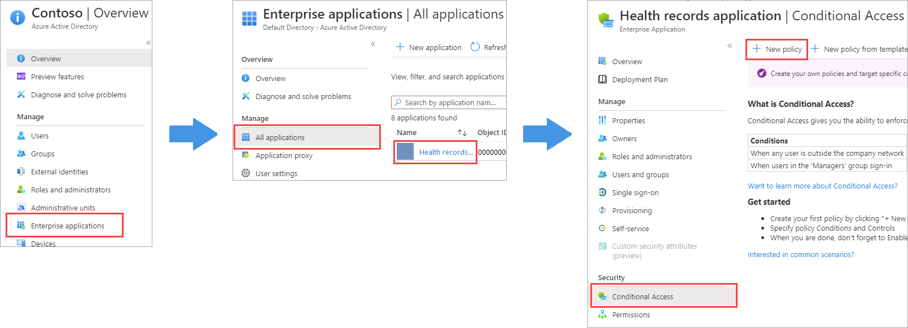
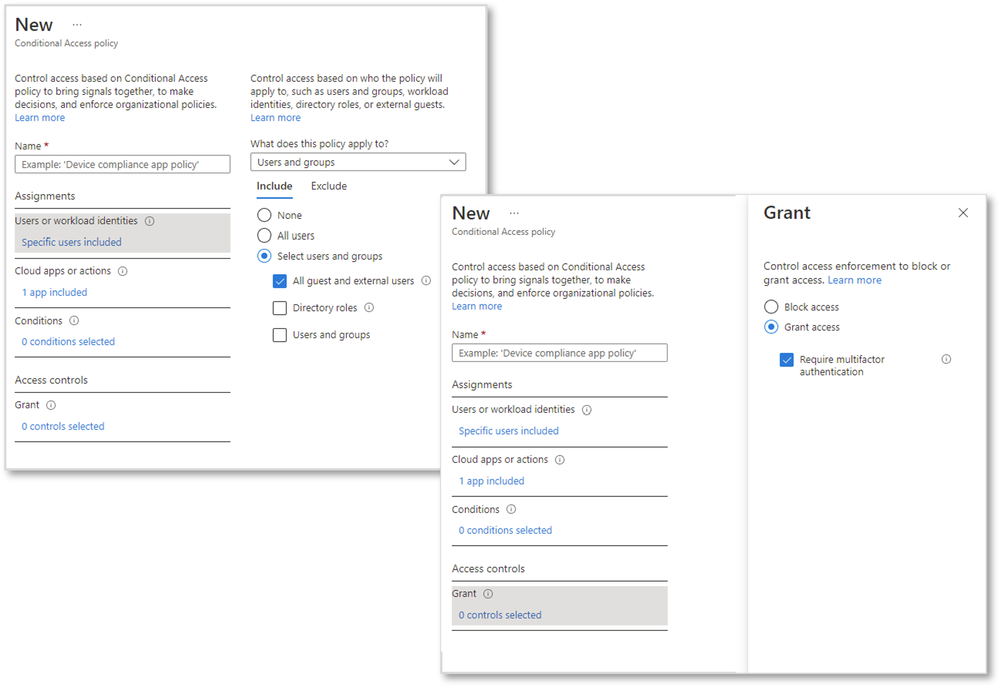

It's important for your organization to secure your health records application as much as possible, so you want to add another layer of security to your application by enforcing multi-factor authentication.

## Adding protection through multi-factor authentication

Multi-factor authentication adds an extra layer of security to your application. You can enforce multi-factor authentication by adding a new Conditional Access policy to your application's Azure AD settings in the portal. Then you can select the users that should be affected by the policy (in this case, guests and external users). Then, even if a B2B collaboration user authenticates through their identity provider, they'll still need to meet another authentication challenge before they can access your application.

Multi-factor authentication asks the user to complete challenges that can be put into three general categories:

- Something the user knows
- Something the user has
- Something the user is

Azure supports different forms of second factor methods, including:

- A mobile application, such as Microsoft Authenticator, where users receive a uniquely generated, one-time code.
- A phone call, where the user receives a one-time code.
- A text message, where the user receives a one-time code.

A secret password or answer to a security question should be something that only the user knows. Users also have devices that can be classified as something they have. For example, a user might have a cell phone and be able to receive a text message with a secret, one-time-use code. You might also make successful authentication contingent on the user, through biometrics collected from them. This biometric information is classified as something the user is. For example, you might make authentication rely on the user's fingerprints or voice as another step.

## Creating Conditional Access policies

You configure enforcement of multi-factor authentication by creating a Conditional Access policy in the Azure portal and assigning it to your application. To create a Conditional Access policy, you must be either a Conditional Access administrator or a security administrator.

Conditional Access policies have two key parts:

- **Assignments**, which specify the users or groups, applications, and conditions the policy applies to.
- **Access controls**, which determine whether to block access or grant access, with or without multi-factor authentication, if the specified assignments are met.

In our health records application example, you create a Conditional Access policy specifically for your application. In the Azure portal, you navigate to the application's properties (**Enterprise applications** > *your application*), and select the **Security** > **Conditional Access** > **New policy** option to create a policy for guest and external users.

   

When configuring this policy's **Assignments**, you specify **All guest and external users**.
For **Access controls**, you select both **Grant access** and **Require multifactor authentication**.

   

After you configure your policy and enable it, you can test it by using the **What If** tool in the Azure portal. This tool helps simulate a user signing in, and shows you which policies are applied, based on your test simulation. If successful, the test shows your policy in the list that will apply, based on your simulation.

