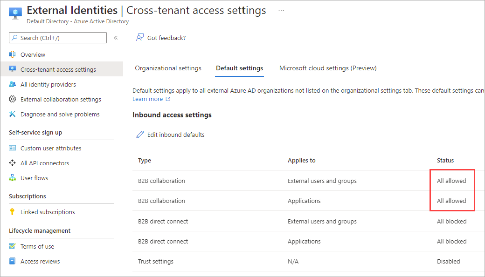
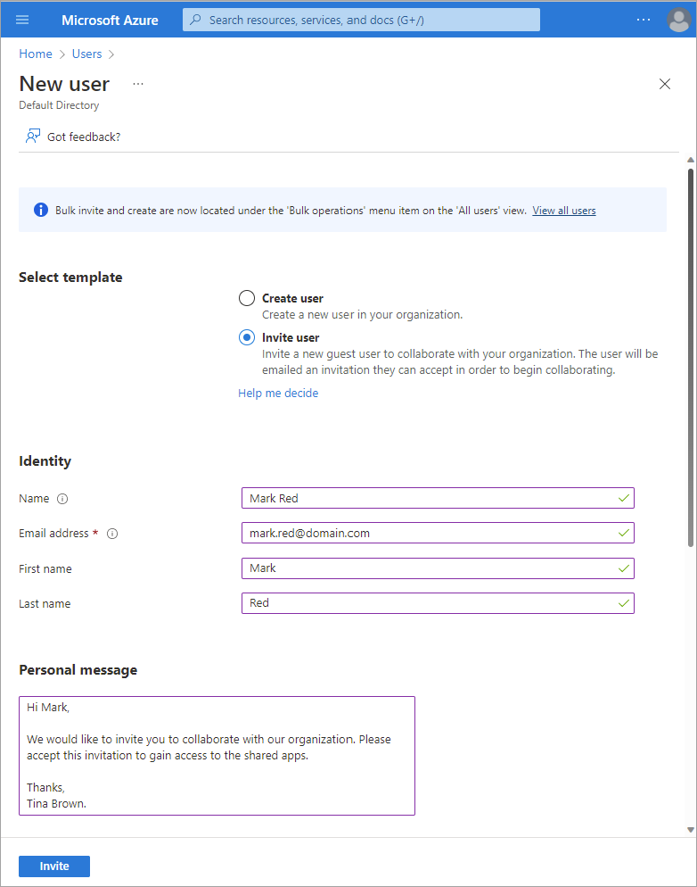
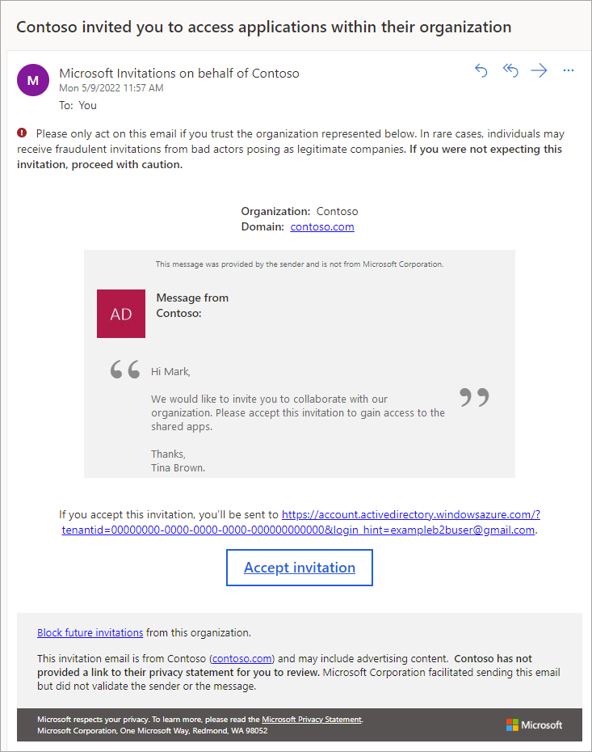
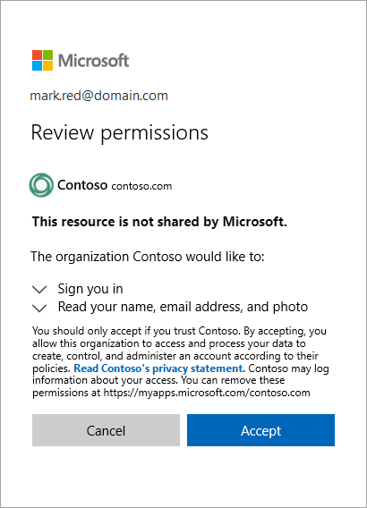

In our example scenario, you need to invite external clinicians to access your health records application using B2B collaboration. In our example, some of the clinicians will use their work accounts from an Azure AD organization, and some will need to use their personal social identities.

In this exercise, you first make sure your settings are configured to enable B2B collaboration. Then you go through the steps for sending an invitation to an external user and see the experience from the B2B collaboration user's perspective.

To try this exercise yourself, you need an Azure subscription. If you don't have an Azure subscription, create a [free account](https://azure.microsoft.com/free/?azure-portal=true) and add a subscription before you begin. If you're a student, you can take advantage of the [Azure for students](https://azure.microsoft.com/free/students/?azure-portal=true) offer.

### Make sure B2B collaboration is enabled

First, make sure that your External Identities settings and external collaboration settings allow for B2B collaboration.

1. Sign in to the [Azure portal](https://portal.azure.com?azure-portal=true).
1. Search for and select the **Azure Active Directory** service.
1. Select **External Identities** in the left menu.
1. Select **Cross-tenant access settings**. These settings manage whether you can use B2B collaboration with other Azure AD organizations.
1. Select **Default settings**. Because some of the clinicians have Azure AD accounts with their own clinics, you'll want to make sure that Azure AD organizations are able to use B2B collaboration to access your app. Under **Inbound access settings**, on the **B2B collaboration** rows, look for a status of **All allowed**:

   

1. Now, select **External collaboration settings** in the left menu. These settings determine other B2B collaboration capabilities and restrictions. Again, you'll want to make sure that you're allowed to invite external users, and that the clinicians' domains are allowed for collaboration. Check the following sections:

   - Under **Guest invite settings**, make sure any option other than **No on in the organization can invite guest users including admins (most restrictive)** is selected.
   - Under **Collaboration restrictions**, make sure the domains for the clinicians you want to invite are allowed.

   

## Send a B2B collaboration invitation to an external user

To add guest users, you can invite them using a form that lets you enter the guest user's email address, name, and any customized message you want to include in the body of the invitation.

1. In the upper left of the page, select **Home**.
1. Search for and select the **Azure Active Directory** service.
1. Select **Users** in the left menu.
1. Select **New user**, and then select **Invite external user**.
1. Fill in the form, using the external clinician's email address in the **Email address** box. It's best to add a **Personal message** that helps the clinician recognize who's sending the invitation. This way they can make an informed decision about its authenticity and whether they should accept the invitation.

   

1. Select **Invite**.

1. After you send the invitation, the user is listed in your directory as a **User type** of **Guest**.
1. Now you can assign your health records application to the clinician's guest account. In the upper left of the page, select **Home**.
1. Search for and select the **Azure Active Directory** service.
1. In the left menu, select **Enterprise applications**.
1. The **All applications** page appears, showing a list of all the enterprise applications registered in your Azure AD organization. Find your application in the list and select it.
1. An overview of your application's properties appears. In the left menu, select **Users and groups**.
1. The **Users and groups** list shows all the users who are currently assigned to this application. Because you want to add the clinician to this list, select **Add user/group**.
1. On the **Add Assignment** page, under **Users**, select the **None Selected** link.
1. Find the clinician's new guest account in the **Users** list, and select it. Then choose the **Select** button.
1. Back on the **Add Assignment** page, select the **Assign** button.
1. The clinician now appears in the list, which means they're assigned to the application and will be able to access it from their Apps page, as shown in the next section.
 
## What the B2B collaboration user sees

The B2B collaboration user receives an invitation in their email inbox.

   

The user selects the **Accept invitation** link in the email invitation. The first time they use this link, they're asked to accept the privacy statement. In this way, Azure AD B2B helps to provide transparency for partner users. Your external users will always know what information they're sharing. The user must accept the permissions needed by Azure AD B2B before they can gain access. If you have terms of use set up, the user will also need to accept them.

   

After the user provides their consent, they're brought to their Apps access panel.

   

Now the clinician can open your health records application from their Apps access panel.
