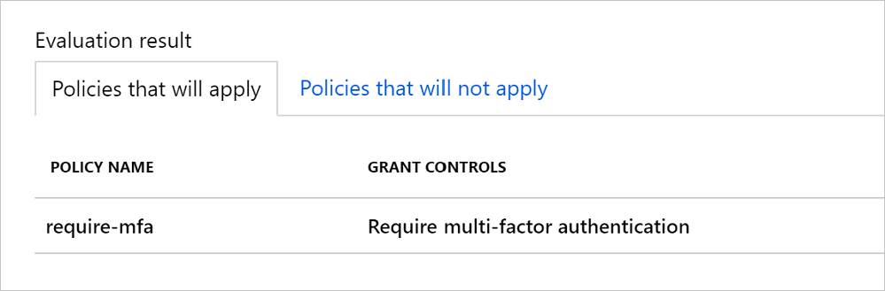

It's important for your organization to secure your healthcare application as much as possible, so you want to add another layer of security to your app. You'll add a policy to your app that requires any external users to pass a multi-factor authentication challenge before they can access your app.

You can enforce multi-factor authentication at the application level by creating a Conditional Access policy for the app in Azure AD. This action ensures that everyone who uses the application must pass an additional authentication challenge before accessing it.

## Enforcing multi-factor authentication

Before allowing access to your healthcare app, multi-factor authentication asks the user to complete challenges that can be put into three general categories:

- Something the user knows
- Something the user has
- Something the user is

Azure supports different forms of second factor methods, including:

- A mobile application, such as Microsoft Authenticator, where users receive a uniquely generated, one-time code.
- A phone call, where the user receives a one-time code.
- A text message, where the user receives a one-time code.

A secret password or answer to a security question should be something that only the user knows. Users also have devices that can be classified as something they have. For example, a user might have a cell phone and be able to receive a text message with a secret, one-time-use code. You might also make successful authentication contingent on the user, through biometrics collected from them. This biometric information is classified as something the user is. For example, you might make authentication rely on the user's fingerprints or voice as an additional step.

## Creating Conditional Access policies

You configure enforcement of multi-factor authentication by creating a Conditional Access policy in the Azure portal and applying it to your app. To create a Conditional Access policy, you must be either a Conditional Access administrator or a security administrator.

Conditional Access policies have two key parts:

- **Assignments** - specified users or groups, applications, or conditions the policy should apply to
- **Access controls** – if the specified assignments are met, whether to block access or grant access with or without multi-factor authentication

For your healthcare app, you can create a Conditional Access policy specifically for you healthcare app. When configuring this policy's Assignments, you'll specify **All guest and external users**, and for Access controls, you'll select both Grant access and Require multifactor authentication.

When your policy is configured and enabled, you test it by using the **What If** tool in the Azure portal. 

This tool helps simulate a user signing in, and shows you which policies are applied, based on your test simulation. If successful, the test shows your policy in the list that will apply, based on your simulation.

You then do a final test by attempting to sign in as the user for the application. Test the Conditional Access policy by verifying whether multi-factor authentication is enforced correctly. If you're happy with the configuration, you then enable the policy.

## Knowledge Check
