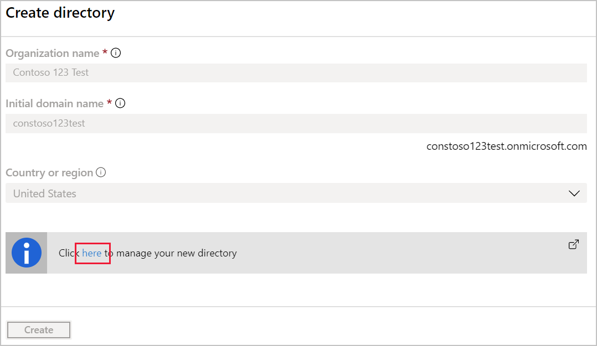
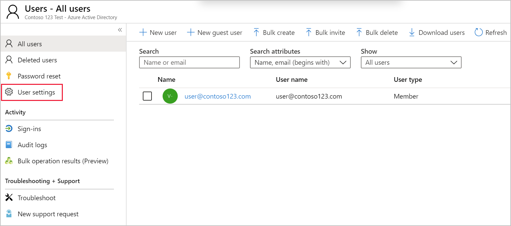
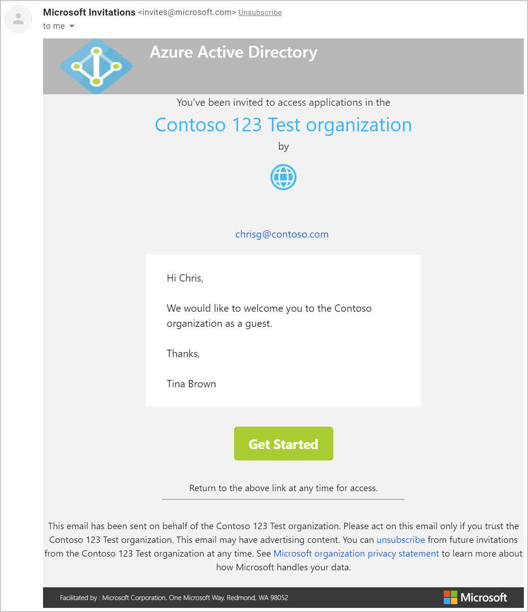
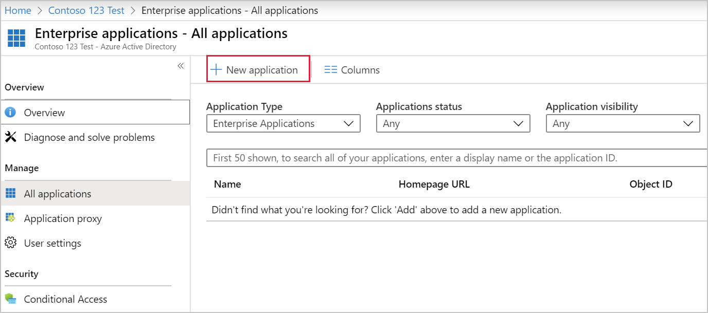

You need to make it possible for the clinicians to access the application so that they can access health records for patients at your facilities in a secure way. You'll need to invite them as guest users.

Here, you'll create a tenant. You'll configure appropriate external collaboration settings for Azure AD B2B. You'll invite guest users, add them to a user group, and give them access to an application.

## Create a new tenant

1. [Sign in](https://portal.azure.com/learn.docs.microsoft.com?azure-portal=true) to the Azure portal as a global administrator account. If you're the person who signed up for an Azure subscription, you're automatically the global administrator.
1. Select **Create a resource > Identity**, then select **Azure Active Directory**.
1. Fill in the Create directory form as appropriate. You can use your own values for the **Organization name** and **Initial domain name** fields. For the **Country or region field**, select United States.

    

1. Select **Create**.
1. After your directory has been created, select the new directory in the confirmation dialog.

    

## Configure external collaboration settings

By default, all users and guest users can invite external users. Make sure that guest invitations can only be sent by administrators and users in the guest inviter role.

1. On the left, select **Users**, then select **User settings**.

    

1. Select **Manage external collaboration settings**.
1. Select **No** for the **Members can invite** and **Guests can invite** fields.

    

1. Select **Save**.

## Add a guest user to your directory

Invite a guest user to add them to your directory.

1. Select **Azure Active Directory > Users > New Guest user**. 

    

1. Use your guest user's email address for the **Email address** field. For the purpose of this exercise, enter an email address that you can access, but don't use the same email address you use for your Azure account.

1. For the personal message text area, you can write your own customized invitation message.

1. Select **Invite** to send your invitation.

1. An invitation email will be sent to the email address you've specified. Go to the email inbox. Open the email. Select **Get started**.

    

1. The guest will login with their Microsoft account.

    

## Add a guest user to a group

Your guest user can also be made a member of a particular group.

1. Select **Azure Active Directory > Groups**.
1. Select **New group** in the groups pane.
1. Fill in the form as appropriate. For **Group type**, select Security.
1. Select **Members**.

    

1. In the search field, look for and select your guest user. Then select **Select**.
1. Select **Create**.

## Add a guest user to an application

Now give your guest user access to an application.

1. Select **Azure Active Directory**, select **Enterprise applications**, then select **All applications > New application**.

    

1. In the search box look for Twitter, then select **Twitter** in the returned list, then select **Add**.

    

1. Go to your newly added application. Select **Azure Active Directory > Enterprise applications > All applications**, then select **Twitter**.

1. On the overview page, select **Assign users and groups**, then select **Add user**.

1. In the Add Assignment form, select **Users**.

    

1. Select your user in the list of users, then select **Select**.

1. Select **Assign** at the bottom of the form.

## Guest user experience

1. Once you've added your guest user to your application, go back to your guest email inbox and select the **Get Started** link in the invitation email.

1. You'll be forwarded to the access panel.

    

1. The access panel lists the applications the guest user has been allowed to access. To access an application, you select the application you want.
