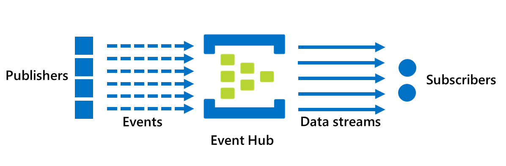

## Motivation

An Event Hub is an Azure resource, so your first step is to create a new hub in Azure and configure it to meet the specific requirements of your apps.

Suppose you work at a sports equipment retailer that has chosen to use Azure Event Hubs as part of their sales monitoring solution. This solution includes sender applications that collect a range of sales data, and receiver applications that process this data and present in a set of dashboards. Some of the data is high volume, such as stock status information which will typically be subject to periodic spikes in the few days before a major holiday (requiring information to be retained for at least 4 days to ensure no loss over holiday periods), and other data is more intermittent, such as sales terminal maintenance logs.

You are going to use Event Hubs to connect these applications, using a durable messaging system that allows for queueing, interruptions, replaying, and starting/stopping without any data loss. As a first step, you'll be using a small dataset as part of an evaluation of Azure Event Hubs.

This unit shows you what you need to do to create an Event Hub ready to be used by your company's applications. Your team has Azure CLI experience from previous Azure projects, so you will be using these tools to set up and configure your Event Hub.

## What is an Azure Event Hub?

Azure Event Hubs is a cloud-based event-processing service. Data producers, or **publishers**, send messages to Event Hubs where they are stored and/or forwarded to consumers, or **subscribers**.



In big data scenarios, devices and applications may be generating very large amounts of data to be streamed for processing. Azure Event Hubs decouple the entities that are producing the data (events) from those entities that are consuming the events. Without such decoupling, producer performance may be throttled if consumers are in a busy state. For example, in a network intrusion system, the data publishers are sensor apps or devices that collect incoming network packets; the consumers are the receiver applications that verify the validity each packet.

### Events

An **event** is a simple notification that a condition or a state has changed; events are small packets that do not typically contain actual information about what exactly has changed, simply that there has been a change. The consuming application could be configured to initiate some form of query to find this out, but this is not a requirement and would not be handled by the Event Hub. Events can be published individually, or in batches, but a single publication (individual or batch) cannot exceed 256 KB.

By contrast, in message queuing (as in Azure Service Bus), the **message** contains data as well as the event, and the publisher of the message expects the consumer to process the message in a particular way.

### Publishers and subscribers

Event publishers can use either HTTPS or AMQP (Advanced Message Queuing Protocol) 1.0 to send events to the Event Hub. For publishers that send data frequently, AMQP has the better performance, but does have a higher initial session overhead, because a persistent bidirectional socket, as well as transport level security (TLS) or SSL/TLS, has to be set up first. For more intermittent publishing, HTTPS is the better option, because although HTTPS requires additional SSL overhead for every request, there isn’t the session initialization overhead. Event publishers are any application or device that can send out event data using either HTTPS or AQMP.
Note. Existing Kafka-based applications, using Apache Kafka 1.0 and newer client versions, can also act as Event Hub publishers.

Event subscribers are applications that use one of two supported programmatic methods to receive and process events from an Event hub. There is a simple method, called **EventHubReceiver**, which provides limited management options, and a more efficient method, called **EventProcessorHost**, that we’ll be using later in this module.

### Consumer groups

An Event Hub **consumer group** represents a specific view of an event hub data stream. By using separate consumer groups, multiple subscriber applications can process an event stream independently, and without affecting other applications. However, the use of multiple consumer groups is not a requirement, and for many applications, the single default consumer group is sufficient.

### Pricing

There are three pricing tiers for Azure Event Hubs; Basic, Standard, and Dedicated, and these tiers differ in terms of supported connections, number of available Consumer groups, and throughput. When using Azure CLI to create an Event Hub Namespace, if you do not specify a pricing tier, the default of **Standard** (20 Consumer groups, 1000 Brokered connections) is assigned.

## Creating and configuring a new Azure Event Hub

There are two main steps when creating and configuring a new Azure Event Hub. The first step is to define an Event Hub **namespace**. The second step is to create an Event Hub in that namespace.

### Defining an Event Hub namespace

An Event Hub namespace is a containing entity for managing one or more Event Hubs. Some configuration settings apply at the namespace level, for example, capacity configuration applies across all the Event Hubs within an Event Hubs namespace. This capacity is configured using Event Hub **throughput units**. You need to balance your throughput configuration against your Azure budget expectations. The number of throughout units cannot be changed after the hub namespace has been created. The pricing tier is defined at the namespace level, and performance metrics are also collected at this level.

Note that when using Azure CLI to create an Event Hub namespace, if you do not specify otherwise, the namespace will be automatically configured with **1** throughput unit, and be assigned to the **Standard** pricing tier.

So, if you need multiple Event Hubs, you'll need to consider whether more than one namespace will be needed. For example, if have a sales data application and you are planning for two Event Hubs, one for high throughput collection of real-time sales data telemetry, and one for infrequent event log collection, it would make sense to use a separate namespace for each hub so that you only need configure (and pay for) high throughput capacity on the telemetry hub.

The Event Hub namespace name must be globally unique, because it will be accessible through this URL: **_namespace_.servicebus.windows.net**. The namespace name must also be between 6 and 50 characters long, and can contain only letters, numbers, and hyphens. The namespace must also start with a letter, and it must end with a letter or number.

There are several optional properties available when creating a new Event Hub namespace:

-   Enable Kafka. This option enables Kafka applications to publish events to the Event Hub.
-   Make this namespace zone redundant. Zone-redundancy replicates data across separate data centers with their own independent power, networking, and cooling infrastructures.
-   Enable Auto-Inflate, and Auto-Inflate Maximum Throughput Units. Auto-Inflate provides an automatic scale up option, by increasing the number of throughput units up to a maximum value; this is useful when trying to avoid throttling, such as when incoming or outgoing data rates exceed the currently set number of throughput units.

### Azure CLI commands for creating an Event Hub namespace

To create a new Event Hub namespace, you use the following commands:

1. In Azure, a Resource Group is a container that holds related Azure resources for ease of management. If required, create a new resource group for your Event Hub.

    ```azurecli
    az group create --name <resource group name> --location <location>
    ```

2. Create the Event Hub Namespace, using the same resource group and location as in the previous step.

    ```azurecli
    az eventhubs namespace create --name <Event Hub namespace name> --resource-group <resource group name> -l <location>
    ```

3. All Event Hubs within the same Event Hub namespace share common connection credentials. You will need these credentials when you configure applications to send and receive messages using the Event Hub. Use the following command to return the connection string for your Event Hub namespace, using the same resource group and Event Hub namespace name as before.

    ```azurecli
    az eventhubs namespace authorization-rule keys list --resource-group <resource group name> --namespace-name <EventHub namespace name> --name RootManageSharedAccessKey
    ```

### Configuring a new Event Hub

After the Event Hub namespace has been created, you can create an Event Hub. When creating a new Event Hub, there are several mandatory parameters.

The **Event Hub name** must be between 1 and 50 characters long, and contain only letters, numbers, periods, hyphens and underscores. The name must start and end with a letter or number. The Event Hub name only needs to be unique within your subscription.

An Event Hub **partition** is a way to separate a message stream, so that consumer or receiver applications only need to read a specific subset of the data stream. The number of partitions in an event hub (between 2 and 32) should be directly related to the expected number of concurrent consumers. The **Partition Count** is the number of separate partitions supported by the event hub; this number cannot be changed after the hub has been created.

The **Message Retention** is the number of days (between 1 and 7) that messages will remain available, if the data stream needs to be replayed for any reason.

Note that when using Azure CLI to create an Event Hub, if you do not specify the Partition Count, your new Event Hub will be automatically configured with **4** partitions; if you do not specify a Message Retention duration, the Event Hub will be configured to retain messages for **7** days.

You can also optionally configure an Event Hub to stream data to an Azure Blob storage or Azure Data Lake Store account.

### Azure CLI commands for creating an Event Hub

To create a new Event Hub , you use the following commands:

1. Create the Event Hub, using the same resource group and location as you used when creating the namespace.

    ```azurecli
    az eventhubs eventhub create --name <Event Hub name> --resource-group <Resource Group name> --namespace-name <Event Hub namespace name>
    ```

2. View the details of your Event Hub in the namespace, using the same resource group and Event Hub name and namespace name as before.

    ```azurecli
    az eventhubs eventhub show --resource-group <Resource Group name> --namespace-name <Event Hub namespace name> --name <Event Hub name>

## Summary

To deploy an Azure Event Hub you must configure an Event Hub namespace, and then configure the Event Hub itself. In the next section, you will go through the detailed configuration steps for a new namespace and Event Hub.