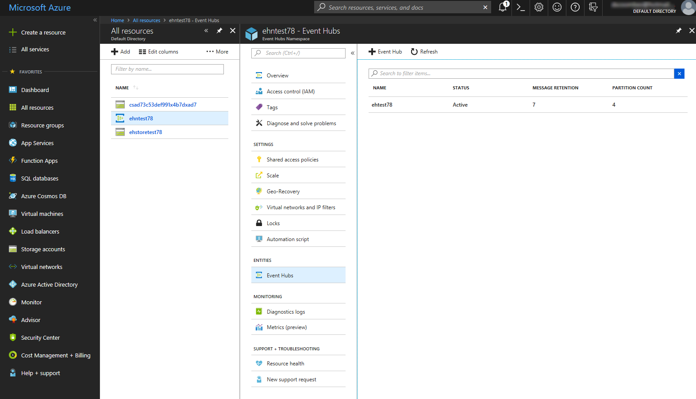

## Exercise: Use Azure CLI to Create an Event Hub

Suppose you need to create an Event Hub to test out the collection of performance metrics from a vehicle tracking application used by a delivery company. Data will be collected from apps that run in each vehicle, and be used by dashboard apps used by the company's managers.

In this exercise, you will use Azure CLI commands to create an Event Hub namespace, and then to create an Event Hub in that namespace. You will then use the Azure Portal to view your new Event Hub.

## Create an Event Hubs namespace

You'll start by working in the Azure Cloud Shell; the Cloud Shell is an interactive, browser-accessible shell for managing Azure resources. The shell supports Linux Bash, and Windows PowerShell. In this exercise, you'll use the Bash shell.

1. Log in to the Cloud Shell (Bash), by selecting the **Enter focus mode** button. This button is at the top right or the bottom of the page, depending on how wide your browser window is. Focus mode docks a Cloud Shell window on the right side of your browser window, so you can easily execute commands that are shown in the tutorial. You will be using Azure CLI 2.0 in this module, to find out more about using Azure CLI with Event Hubs, see [az eventhubs](https://docs.microsoft.com/en-us/cli/azure/eventhubs?view=azure-cli-latest).

1. Before you create your Event Hub Namespace, you'll need a new resource group. In Azure, a Resource Group is a container that holds related Azure resources for ease of management. You'll use this resource group for all the Event Hub resources in this module. In the following command, replace `vehicleTrackerRG` with the name you'd like to use for your resource group, and (if necessary) replace `westus` with the location of your nearest Azure datacenter.

    ```azurecli
    az group create --name vehicleTrackerRG --location westus
    ```

1. Now create the Event Hub Namespace. In the following command, replace `vehicleTrackerNS` with a unique name, such as your name + date (for example, nina20180909), replace `vehicleTrackerRG` with the name you used when creating your resource group, and (if necessary) replace `westus` with the same Azure datacenter location that you used when creating the resource group:

    ```azurecli
    az eventhubs namespace create --name vehicleTrackerNS --resource-group vehicleTrackerRG -l westus
    ```

1. All Event Hubs within the same Event Hub namespace share common connection credentials. You will need these credentials later in this module, when you configure applications to send and receive messages using the Event Hub. Use the following command to return the connection string for your Event Hub namespace; replacing `vehicleTrackerRG` with the name you used when creating your resource group, and replacing `vehicleTrackerNS` with the name that you used when creating the Event Hub namespace:

    ```azurecli
    az eventhubs namespace authorization-rule keys list --resource-group vehicleTrackerRG --namespace-name vehicleTrackerNS --name RootManageSharedAccessKey
    ```

1. Select the value associated with the **primaryConnectionString** key, and copy this value to the clipboard. Then use Notepad to save the key in a text file.

1. Select the value associated with the **primaryKey** key, and copy this value to the clipboard. Then use Notepad to add this key to the text file.


## Create an Event Hub

1. Now create the Event Hub. In the following command, replace `vehicleTrackerHub` with a name for your Event Hub, such as your name + Hub (for example, ninaHub), replace `vehicleTrackerRG` with the name you used when creating your resource group, and replace `vehicleTrackerNS` with the name that you used when creating the Event Hub namespace:

    ```azurecli
    az eventhubs eventhub create --name vehicleTrackerHub --resource-group vehicleTrackerRG --namespace-name vehicleTrackerNS
    ```

1. Use the following command, to view the details of your Event Hub in the namespace, replacing `vehicleTrackerRG` with the name of your resource group, replacing `vehicleTrackerNS` with the name of your Event Hub namespace, and replacing `vehicleTrackerHub` with the name of your Event Hub:

    ```azurecli
    az eventhubs eventhub show --resource-group vehicleTrackerRG --namespace-name vehicleTrackerNS --name vehicleTrackerHub
    ```


## View the Event Hub in the Azure Portal

1. Now to check your work, view the newly-created Event Hub in the Azure portal. Using the Search bar at the top of the [Azure portal](https://portal.azure.com), find your Event Hub namespace and open it.

1. On the **Event Hubs Namespace** blade, in the **ENTITIES** section, click **Event Hubs**.

1. You should see your Event Hub listed, with a status of **Active**, with Message Retention set to **7**, and a Partition Count of **4**.

    

## Summary

You now have a deployed Event Hub, and you have all the necessary information ready to configure your publisher and consumer applications.
