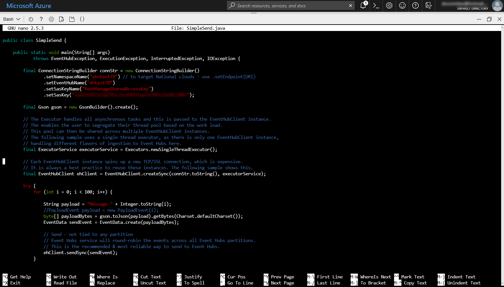
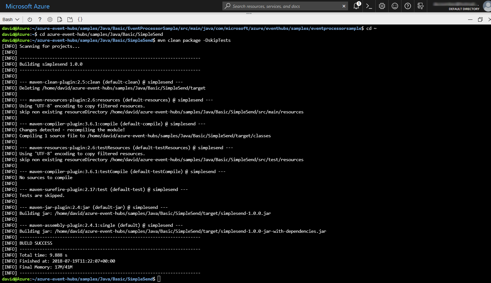
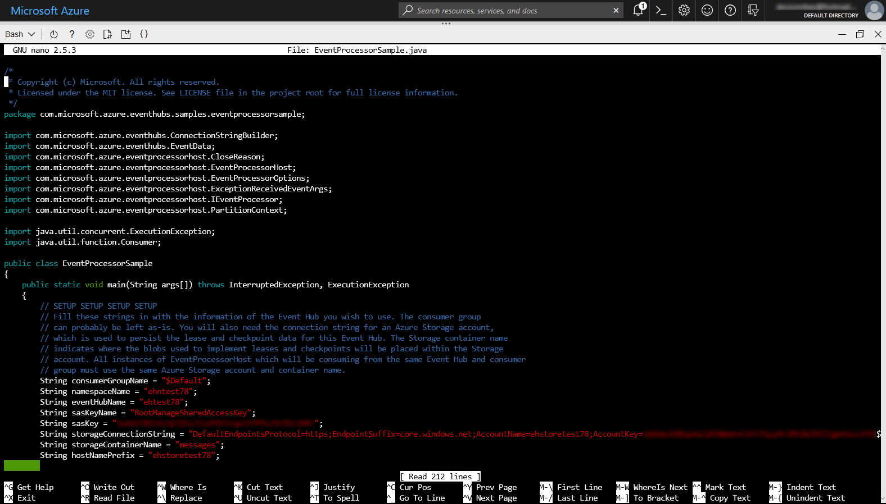
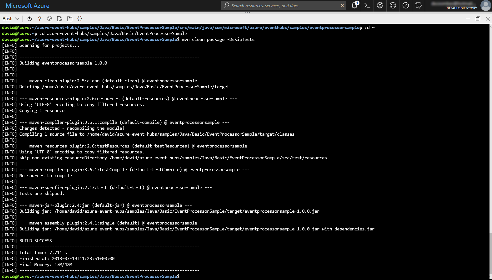
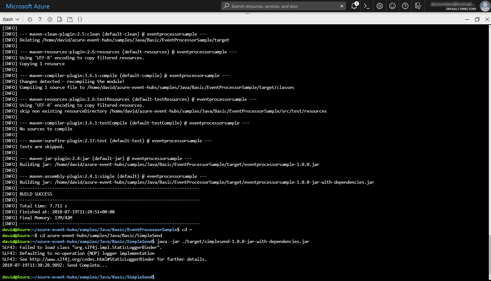
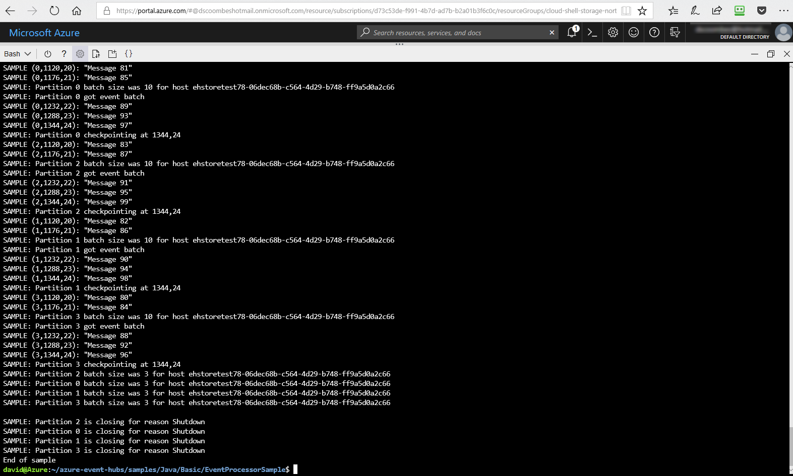

## Exercise: Configure applications to send or receive messages through an Event Hub

You now need to configure the applications. Taking the example of an Event Hub, used test out the collection of performance metrics from a vehicle tracking application, the publishers are the apps that run in each vehicle, and that collect the performance data. The consumers of this data are a set of dashboard apps used by the company's managers.

In this exercise, you will configure sender and receiver applications, ready to send or receive messages through an Event Hub. These applications are stored in a GitHub repository.

You will configure two separate applications; one acts as the message sender (**SimpleSend**), the other as the message receiver (**EventProcessorSample**). These are Java applications, which enables everything to be done within the browser. However, the same configuration is needed for any platform, such as .NET.

## Create a general purpose standard storage account

The Java receiver application, that you'll configure in this unit, stores messages in Blob Storage. Blob Storage requires a Storage account.

1. Create a Storage account (general purpose V2) in the resource group. Replace `vehicleTrackerSA` with a unique name, replace `vehicleTrackerRG` with the name of your resource group, and (if necessary) replace `westus` with the same Azure datacenter location that you used when creating the resource group:

    ```azurecli
    az storage account create --name vehicleTrackerSA --resource-group vehicleTrackerRG --location westus --sku Standard_RAGRS --encryption blob
    ```

1. Use the following command to list all the access keys that are associated with the storage account, replacing `vehicleTrackerSA` with the name you used for your storage account, and replacing `vehicleTrackerRG` with the name of your resource group:

    ```azurecli
    az storage account keys list --account-name vehicleTrackerSA --resource-group vehicleTrackerRG
    ```

1. Select the value associated with the **key1**, and copy this value to the clipboard. Then use Notepad to add this key to your text file.

1. Use the following command to show the connection string for the storage account, replacing `vehicleTrackerSA` with the name you used for your storage account, and replacing `vehicleTrackerRG` with the name of your resource group:

    ```azurecli
    az storage account show-connection-string -n storageAccountName -g vehicleTrackerRG
    ```

1. Select the value associated with the **connectionString**, and copy this value to the clipboard. Then use Notepad to add this key to your text file.

1. Use the following command to create a container called **messages** in your storage account, replacing `<connection string>` with the connection string you just copied:

    ```azurecli
    az storage container create -n messages --connection-string "<connection string>"
    ```

## Clone the Event Hubs GitHub repository

Git is a collaboration tool that uses a distributed version control model, and is specifically designed for collaborative working on software and documentation projects. Git clients are available for multiple platforms, including Windows, and the git command-line is included in the Azure Bash cloud shell. GitHub is a web-based hosting service for Git repositories. You can make a local copy of a project, by cloning its repository using the **git clone** command.

1. Log in to the Cloud Shell (Bash), by selecting the **Enter focus mode** button. This button is at the top right or the bottom of the page, depending on how wide your browser window is. Focus mode docks a Cloud Shell window on the right side of your browser window, so you can easily execute commands that are shown in the tutorial.

1. The source files for the applications that you'll build in this exercise are located in a [GitHub repository](https://github.com/Azure/azure-event-hubs). Use the following commands to make sure that you are in your home directory in Cloud Shell, and then to clone this repository:

    ```azurecli
    cd ~
    git clone https://github.com/Azure/azure-event-hubs.git
    ```
    The repository is cloned to `/home/<username>/azure-event-hubs`.

## Use nano to edit SimpleSend.java

You'll now use the **nano** editor to edit the SimpleSend application and add your Event Hub namespace, Event Hub name, shared access policy name and primary key. The main commands are displayed at the bottom of the editor window; in this unit, you'll need to write out your edits using CTRL +O, and then ENTER to confirm the output file name, and exit the editor using CTRL +X.

1. Use the following command to change to the **SimpleSend** folder:

    ```azurecli
    cd azure-event-hubs/samples/Java/Basic/SimpleSend/src/main/java/com/microsoft/azure/eventhubs/samples/SimpleSend
    ```

1. Use the following command to open the **SimpleSend.java** file in the **nano** editor:

    ```azurecli
    nano SimpleSend.java
    ```

1. In the nano editor, use your keyboard cursor keys to locate `"Your Event Hubs namespace name"`, and then replace this string with name of your the Event Hub namespace.

1. Similarly, replace `"Your event hub"` with the name of your Event Hub, and  replace `"Your primary SAS key"` with the value of the **primaryKey** key for your Event Hub namespace that you saved to Notepad. When you create an Event Hubs namespace, a 256-bit SAS key called **RootManageSharedAccessKey** is created that has an associated pair of primary and secondary keys that grant send, listen, and manage rights to the namespace. In the previous unit, you displayed the key using an Azure CLI command, and you can also find this key by opening the **Shared access policies** page for your Event Hub namespace in the Azure Portal.

1. Finally, replace `"Your policy name"` with **RootManageSharedAccessKey**.

    

1. Use the following commands to save **SimpleSend.java**, and exit nano:

    ```azurecli
    CTRL +O
    ENTER
    CTRL +X
    ```

## Use Maven to build SimpleSend.java

You'll now build the Java application using **mvn** commands.

1. Use the following commands to change to the main **SimpleSend** folder:

    ```azurecli
    cd ~
    cd azure-event-hubs/samples/Java/Basic/SimpleSend
    ```
1. Use the following mvn command to build the Java SimpleSend application, so that it now uses the connection details for your Event Hub:

    ```azurecli
    mvn clean package -DskipTests
    ```

    The build process may take several minutes to complete. Ensure that you see a **[INFO] BUILD SUCCESS** message before continuing.

    

## Use nano to edit EventProcessorSample.java

You will now configure a **receiver** application to ingest data from the Event Hub; receivers can also be referred to as **subscribers** or **consumers**. For the receiver application, there are two available methods; **EventHubReceiver** and **EventProcessorHost**. EventProcessorHost is built on top of EventHubReceiver, but provides simpler programmatic interface than EventHubReceiver. EventProcessorHost can automatically distribute message partitions across multiple instances of EventProcessorHost using the same storage account. In this unit, you’ll use the EventProcessorHost method. You'll again use nano, and edit the EventProcessorSample application to add your Event Hub namespace, Event Hub name, shared access policy name and primary key, storage account name, connection string and container name.

1. Use the following commands to change to the **EventProcessorSample** folder:

    ```azurecli
    cd ~
    cd azure-event-hubs/samples/Java/Basic/EventProcessorSample/src/main/java/com/microsoft/azure/eventhubs/samples/eventprocessorsample
    ```

1. Use the following command to open the **EventProcessorSample.java** file in the **nano** editor:

    ```azurecli
    nano EventProcessorSample.java
    ```
1. In the nano editor, use your keyboard cursor keys to locate `----ServiceBusNamespaceName----`, replace this string with the name of your Event Hub namespace, and then replace `----EventHubName----` with the name of your Event Hub.

1. Replace `----SharedAccessSignatureKeyName----` with **RootManageSharedAccessKey**, and then replace`----SharedAccessSignatureKey----` with the value of the **primaryKey** key for your Event Hub namespace that you saved to Notepad.

1. Replace `----AzureStorageConnectionString----` with your storage account connection string from Notepad, replace `----StorageContainerName----` with **messages**, and replace `----HostNamePrefix----` with the name of your storage account.

    

1. Use the following commands to save **EventProcessorSample.java**, and exit nano:

    ```azurecli
    CTRL +O
    ENTER
    CTRL +X
    ```

## Use Maven to build EventProcessorSample.java

1. Use the following commands to change to the main **EventProcessorSample** folder:

    ```azurecli
    cd ~
    cd azure-event-hubs/samples/Java/Basic/EventProcessorSample
    ```

1. Maven to build the application. Use the following command to build the Java SimpleSend application, so that it now uses the connection details for your Event Hub:

    ```azurecli
    mvn clean package -DskipTests
    ```

    The build process may take several minutes to complete. Ensure that you see a **[INFO] BUILD SUCCESS** message before continuing.

    

## Start the sender and receiver apps

1. You can run a Java application from the command-line by using the **java** command, and specifying a .jar package. Use the following commands to start the SimpleSend application:

    ```azurecli
    cd ~
    cd azure-event-hubs/samples/Java/Basic/SimpleSend
    java -jar ./target/simplesend-1.0.0-jar-with-dependencies.jar
    ENTER
    ```

1. When you see **Send Complete...**, press ENTER.

    

1. Use the following commands to start the EventProcessorSample application.

    ```azurecli
    cd ~
    cd azure-event-hubs/samples/Java/Basic/EventProcessorSample
    java -jar ./target/eventprocessorsample-1.0.0-jar-with-dependencies.jar
    ENTER
    ```

1. When messages stop being displayed to the console, press ENTER.

    

## Summary

You have now used your knowledge of Event Hub publishing requirements to configure a sender application, ready to send messages to your Event Hub, and to configure a receiver application, ready to receive messages from your Event Hub.
