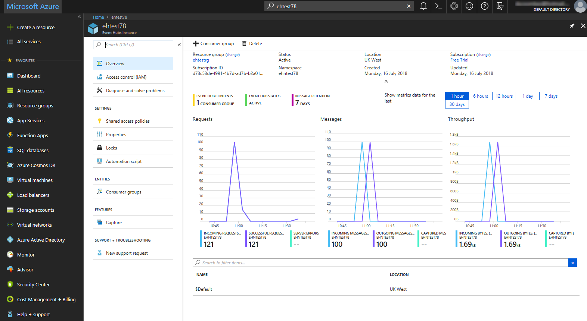
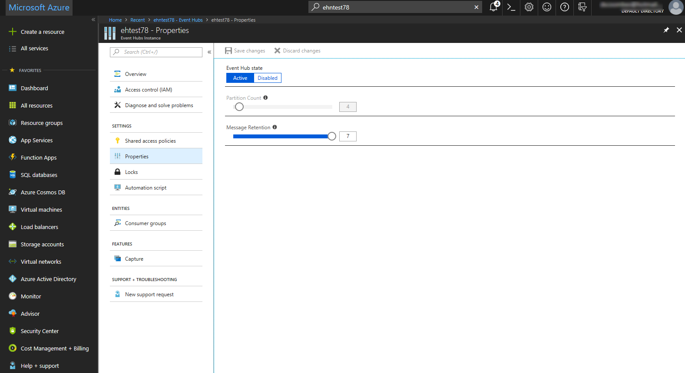
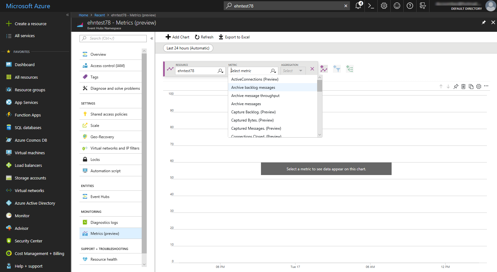

## Exercise: Evaluate the performance of the deployed Event Hub using the Azure Portal

Continuing with the example of an Event Hub being used test out the collection of performance metrics from a vehicle tracking application, your final step is to verify that is being sent from the publisher apps in each vehicle to the hub, and that the consumer apps are receiving this data.You also want to be sure that, in the event of any temporary interruptions to the publishing of data, such as when a vehicle is out of range of the cellular network, the Event Hub is capable of resuming data flow without any loss of events.

In this exercise, you will use the Azure Portal to verify that your Event Hub is up and running and to view basic performance details. You will then test how Event Hub messaging works when the Event Hub is temporarily unavailable, and then use Event Hub Metrics to check that your Event Hub is working in the way you want.

## View Event Hub activity

1. Using the Search bar at the top of the [Azure portal](https://portal.azure.com), find your Event Hub and open it.

1. On the Overview page, view the message counts.

    

1. The SimpleSend and EventProcessorSample applications are preconfigured to send/receive 100 messages. Note that the Event Hub has processed 100 messages from the SimpleSend application, and has transmitted 100 messages to the EventProcessorSample application.

## Test Event Hub resilience

1. You'll now take a look at what happens when an application sends messages to an Event Hub, and then the Event Hub is temporarily unavailable to any consuming applications. Start by resending messages to the Event Hub using the SimpleSend application:

    ```azurecli
    cd ~
    cd azure-event-hubs/samples/Java/Basic/SimpleSend
    java -jar ./target/simplesend-1.0.0-jar-with-dependencies.jar
    ENTER
    ```

1. When you see **Send Complete...**, press ENTER.

1. You'll now disable the Event Hub. In the Azure Portal, on the **Event Hubs Instance** blade, in the **SETTINGS** section, click **Properties**, then click **Disabled** and save your changes.

    

1. Wait for at least 5 minutes, and then re-enable the Event Hub. On the **Properties** page, click **Active** and save your changes.

1. Now attempt to receive messages, by re-running the EventProcessorSample application:

    ```azurecli
    cd ~
    cd azure-event-hubs/samples/Java/Basic/EventProcessorSample
    java -jar ./target/eventprocessorsample-1.0.0-jar-with-dependencies.jar
    ENTER
    ```

1. When messages stop being displayed to the console, press ENTER.

1. Switch back to the Azure Portal, and using the Search bar, find your Event Hub **_namespace_** and open it.

1. On the **Event Hubs Namespace** blade, in the **MONITORING** section, click **Metrics (preview)**.

    

1. In the **Metric** list, select **Incoming Messages**, then click **Add Metric**, and this time, in the **Metric** list, select **Outgoing Messages**.

1. At the top of the chart, change the time period by clicking **Last 24 hours (Automatic)**, then select **Last 30 minutes**, and then click **Apply**.

1. Note that although the messages were sent before the Event Hub was taken offline for a period, all 100 messages were successfully transmitted.

1. As well as Incoming and Outgoing messages, other useful metrics include:

- Throttled Requests: The number of requests that were throttled because the throughput unit usage was exceeded.
- ActiveConnections: The number of active connections on a namespace, or Event Hub.
- Incoming/Outgoing Bytes: The number of bytes sent to/received from the Azure Event Hubs service over a specified period.

## Summary

You have now used your knowledge of Event Hub metrics to confirm when applications are successfully sending and receiving messages through an Event Hub. You can now apply your knowledge to your our Event Hub deployments.
