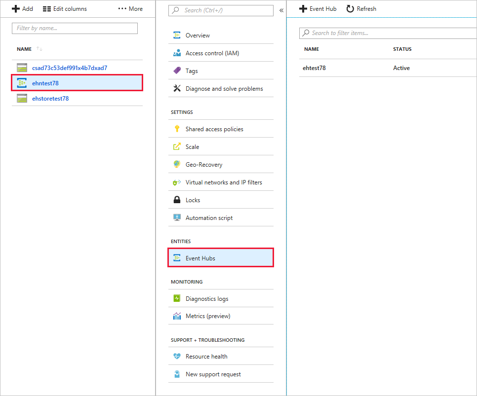

You're now ready to create a new event hub. After creating it, you'll use the Azure portal to view your new hub.

## Create an Event Hubs namespace

Let's create an Event Hubs namespace using Azure CLI and Bash in Azure Cloud Shell to the right.

1. First, let's assign default values that can be reused so that you won't have to enter these values with every command. In particular, let's set the _resource group_ and _location_. Enter the following command in Cloud Shell, and feel free to replace the location value with a region close to you.
  
    ```azurecli
    az configure --defaults group=<rgn>[sandbox Resource Group]</rgn> location=westus2  
    ```

    [!include[](../../../includes/azure-sandbox-regions-first-mention-note.md)]

    [!include[](../../../includes/azure-cloudshell-copy-paste-tip.md)]
  
1. Create the Event Hubs namespace by running the following Azure CLI command, which takes these parameters:

     |Parameter  |Description |
     | --------- | ---------- |
     |--name (required) | A unique name for your Event Hubs namespace. The name must be 6-50 characters long, start with a letter, end with a letter or number, and contain only letters, numbers, and hyphens.|
     |--resource-group (required) | This parameter can be omitted because it defaults to the sandbox resource group supplied from the previous command. |
     |--location (optional) | This parameter can be omitted because it defaults to the location (region) supplied from the previous command. |
     |--sku (optional) | The default value for this parameter, if omitted, is _Standard_, and this is the sku we want. The sku determines the connections and consumer thresholds. |

1. Before running the command, though, let's set the namespace name as an environment variable so we can reuse it.

    ```bash
    NS_NAME=ehubns-$RANDOM
    ````

1. Now, when you run this command, the namespace name has been defined for you, and the CLI command creates it.

    ```azurecli
    az eventhubs namespace create --name $NS_NAME
    ```

    > [!NOTE]
    > It may take some time for the namespace to be created. Azure will validate the namespace name, and if the name exists or is invalid, the CLI returns **Bad Request**. In this case, try a different name by rerunning the Bash command to set the environment variable and then reissue the Azure CLI command.

1. Fetch the connection string and primary key for your namespace by running the following command. 

    ```azurecli
    az eventhubs namespace authorization-rule keys list \
        --name RootManageSharedAccessKey \
        --namespace-name $NS_NAME
    ```

    The return output is in JSON format and contains details that you'll need to configure your publisher and consumer applications. Save the following values for later use.

    - **primaryConnectionString**
    - **primaryKey**

## Create an event hub

Now let's create your event hub.

1. First, let's define the event hub name as an environment variable by running the following in Cloud Shell.

    ```Bash
    HUB_NAME=hubname-$RANDOM
    ```

1. Now, run the Azure CLI command to create an event hub. This command needs the following parameters.

      | Parameter | Description |
      | --------- | ----------- |
      |--name (required) | Name for your event hub is environment variable $HUB_NAME.|
      |--resource-group (required)  |Resource group owner has already been defined.|
      |--namespace-name (required) |The Event Hubs namespace is environment variable $NS_NAME.|

    ```azurecli
    az eventhubs eventhub create --name $HUB_NAME --namespace-name $NS_NAME
    ```

1. View the details of your event hub by running the following Azure CLI command, which needs the following parameters.

    | Parameter | Description |
    | --------- | ----------- |
    | --resource-group (required) | Resource group owner (an environment variable we already set). |
    | --namespace-name (required) | The namespace you created.|
    | --name  (required) | Name of the event hub.|

    ```azurecli
    az eventhubs eventhub show --namespace-name $NS_NAME --name $HUB_NAME
    ```

## View the event hub in the Azure portal

Next, let's see what our event hub looks like in the Azure portal.

1. Sign in to the [Azure portal](https://portal.azure.com/learn.docs.microsoft.com?azure-portal=true) using the same account you used to activate the sandbox.

1. In the search bar at the top of the portal, enter *Event Hubs*, and press <kbd>Enter</kbd>. The **Event Hubs** pane for your subscription appears.

1. In the list of Event Hubs namespaces, look for your namespace. Because we assigned the namespace as an environment variable ehubns-RANDOM, look for ehubns-NNNNN. Select it. The **Overview** page for your Event Hubs Namespace appears.

1. In the middle menu pane, under **Entities**, select **Event Hubs**. The **Event Hubs** pane appears with list of event hubs in your namespace.

    Your event hub is listed, showing the status (**Active**), and the expected default values for **Message Retention** (*7 days*) and **Partition Count** (*4*).

    

## Summary

You've now created a new event hub, and you've all the necessary information ready to configure your publisher and consumer applications.
