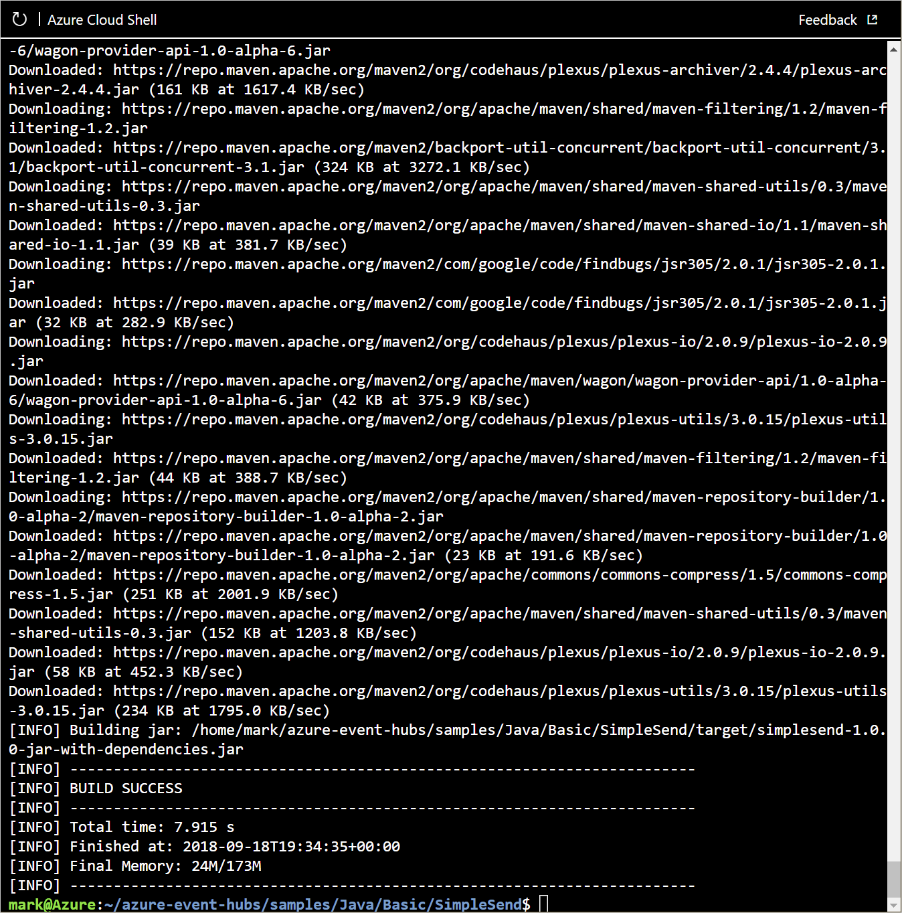

You're now ready to configure your publisher and consumer applications for your event hub.

In this unit, you'll configure applications to send or receive messages through your event hub. One application acts as the message sender (**SimpleSend**), the other as the message receiver (**EventProcessorSample**). Because these applications are written in Java, you can do all developing, test, and management in your browser. However, the same configuration must be used for each platform, such as .NET. The applications are stored in a GitHub repository.

## Create a general-purpose, standard storage account

The Java receiver application stores messages in Azure Blob Storage, which requires a storage account. To create a storage account (general-purpose V2), use the `storage account create` command. We'll define the following parameters for this command: 

| Parameter       | Description |
| --------------- | ----------- |
| name (required) | A name for your storage account. |
| resource-group (required) | The resource group owner is the sandbox resource group, which has already been defined as a default value. |
| location (optional) | Region has already been defined as a default value, but you can include it if you want to set a different region from the default resource group location. |
| sku | The default value SKU of the storage account is 'Standard_RAGRS', but in this exercise, we'll specify that value. |

In the previous exercise, we defined default values for resource group and location, so we can omit those parameters from the command.

1. In Azure Cloud Shell, set the storage account name to a variable. A storage account name must be unique within Azure and must contain 3 to 24 numbers or lower-case letters.

    ```azurecli
    STORAGE_NAME=storagename$RANDOM
    ```

1. Run the following command to create the storage account.

    ```azurecli
    az storage account create --name $STORAGE_NAME --sku Standard_RAGRS --encryption-service blob
    ```

    > [!TIP]
    > It may take a moment to create this storage account. If storage account creation fails, change your environment variable, and try again.

1. Run the following command obtain the access keys associated with your storage account.

    ```azurecli
    az storage account keys list --account-name $STORAGE_NAME
    ```

1. Two keys associated with your storage account are output in JSON format. Copy and save the value of **key1** for future use. You'll need this key to access your storage account.

1. Run the following command to obtain the connection string for your storage account.

    ```azurecli
    az storage account show-connection-string -n $STORAGE_NAME
    ```

1. The output contains the connection details for your storage account. Copy and save the value of **connectionString**. It should look something like this:

    ```output
   "DefaultEndpointsProtocol=https;EndpointSuffix=core.windows.net;AccountName=storage_account_name;AccountKey=VZjXuMeuDqjCkT60xX6L5fmtXixYuY2wiPmsrXwYHIhwo736kSAUAj08XBockRZh7CZwYxuYBPe31hi8XfHlWw=="
    ```

1. Run the following command to create a container called **messages** in your storage account. Use the **connectionString** value you copied in the previous step.

    ```azurecli
    az storage container create --name messages --connection-string "<connection string here>"
    ```

## Clone the event hubs GitHub repository

In Cloud Shell, clone the event hubs GitHub repository with `git`. The source files for the applications that you'll build in this unit are located in a [GitHub repository](https://github.com/Azure/azure-event-hubs). 

1. Run the following commands to make sure that you are in your home directory in Cloud Shell, and then to clone this repository.

    ```bash
    cd ~
    git clone https://github.com/Azure/azure-event-hubs.git
    ```

The repository is cloned to your home folder.

## Edit SimpleSend.java

In this exercise you'll use the built-in Cloud Shell editor to modify the SimpleSend application, adding your Event Hubs namespace, event hub name, shared access policy name, and primary key. 

1. Change to the **SimpleSend** folder.

    ```bash
    cd ~/azure-event-hubs/samples/Java/Basic/SimpleSend/src/main/java/com/microsoft/azure/eventhubs/samples/SimpleSend
    ```

1. Open Cloud Shell editor in the current folder. 

    ```bash
    code .
    ```

    The files in the current folder are listed on the left, and the editor space on the right displays the contents of the filename listed in the title bar.

1. If not already open, open **SimpleSend.java** by selecting it from the file list.

1. In the editor, locate and replace the following strings under ConnectionStringBuilder:

    - `"Your Event Hubs namespace name"` with the name of your Event Hubs namespace.
    - `"Your Event Hub"` with the name of your event hub.
    - `"Your policy name"` with **RootManageSharedAccessKey**.
    - `"Your primary SAS key"` with the value of the **primaryKey** key for your Event Hubs namespace that you saved earlier.

    If you've forgotten these values, you can switch to the terminal window below the editor and run the `echo` command to list the environment variables. For example:

    ```bash
    echo $NS_NAME
    echo $HUB_NAME
    echo $STORAGE_NAME
    ```

     For your primary SAS key, when you create an Event Hubs namespace, a 256-bit SAS key called **RootManageSharedAccessKey** is created and includes primary and secondary keys that grant send, listen, and manage rights to the namespace. Earlier in this exercise, you obtained the key by running an Azure CLI command; however, you can also find the keys and connection strings by selecting your Event Hubs namespace in the Azure portal, and then in the menu under the **Settings**, select **Shared access policies**; now select the policy name **RootManageSharedAccessKey** to display the SAS Policy keys. 

1. Save **SimpleSend.java** file, and then close the editor.

    > [!TIP]
    > To save your edits, use <kbd>Ctrl+S</kbd>. Exit the editor by pressing <kbd>Ctrl+X</kbd> on Windows and Linux, or <kbd>Cmd+S</kbd> on macOS. Unlike the Cloud Shell terminal window, the Cloud Shell editor uses typical copy/paste keyboard accelerator keys for your OS. Alternatively, open the editor menu by selecting the ellipsis (...) in the upper right corner for additional editing commands.

## Use Maven to build SimpleSend.java

You'll now build the Java application by running **mvn** commands.

1. In the Cloud Shell, enter the following command to navigate to the main **SimpleSend** folder.

    ```bash
    cd ~/azure-event-hubs/samples/Java/Basic/SimpleSend
    ```

1. Build the Java SimpleSend application. This command builds your application using the connection details for your event hub.

    ```bash
    mvn clean package -DskipTests
    ```

    The build process may take several minutes to complete. Ensure that you see the **[INFO] BUILD SUCCESS** message before continuing.

    

## Edit EventProcessorSample.java

You'll now configure a **receiver** (also known as **subscribers** or **consumers**) application to ingest data from your event hub.

For the receiver application, two classes are available: **EventHubReceiver** and **EventProcessorHost**. EventProcessorHost is built on top of EventHubReceiver, but provides a simpler programmatic interface than EventHubReceiver. EventProcessorHost can automatically distribute message partitions across multiple instances of EventProcessorHost using the same storage account.

In this procedure, you'll use the EventProcessorHost method. You'll edit the EventProcessorSample application to add your Event Hubs namespace, event hub name, shared access policy name and primary key, storage account name, connection string, and container name.

1. Change to the **EventProcessorSample** folder by running the following command.

    ```bash
    cd ~/azure-event-hubs/samples/Java/Basic/EventProcessorSample/src/main/java/com/microsoft/azure/eventhubs/samples/eventprocessorsample
    ```

1. Open Cloud Shell editor.

    ```bash
    code .
    ```

1. Select the **EventProcessorSample.java** file.

1. Locate and replace the following strings in the editor:

    - `----EventHubNamespaceName----` with the name of your Event Hubs namespace.
    - `----EventHubName----` with the name of your event hub.
    - `----SharedAccessSignatureKeyName----` with **RootManageSharedAccessKey**.
    - `----SharedAccessSignatureKey----` with the value of the **primaryKey** key for your Event Hubs namespace that you saved earlier.
    - `----AzureStorageConnectionString----` with your storage account connection string that you saved earlier.
    - `----StorageContainerName----` with **messages**.
    - `----HostNamePrefix----` with the name of your storage account.

1. Save **EventProcessorSample.java** either with the "..." menu, or the accelerator key (<kbd>Ctrl+S</kbd> on Windows and Linux, <kbd>Cmd+S</kbd> on macOS).

1. Close the editor.

## Use Maven to build EventProcessorSample.java

1. Change to the main **EventProcessorSample** folder by running the following command.

    ```bash
    cd ~/azure-event-hubs/samples/Java/Basic/EventProcessorSample
    ```

1. Build the Java SimpleSend application by running the following command to ensure that your application uses the connection details for your event hub.

    ```bash
    mvn clean package -DskipTests
    ```

    The build process may take several minutes to complete. Ensure that you see a **[INFO] BUILD SUCCESS** message before continuing.

    :::image type="content" source="../media/5-receiver-build.png" alt-text="Build results for receiver application." loc-scope="other"::: <!-- no-loc -->

## Start the sender and receiver apps

1. Run Java application from the command line by running the following `java` command, and specifying a .jar package. Run the following commands to start the SimpleSend application.

    ```bash
    cd ~/azure-event-hubs/samples/Java/Basic/SimpleSend
    java -jar ./target/simplesend-1.0.0-jar-with-dependencies.jar
    ```

1. When you see **Send Complete...**, press <kbd>Enter</kbd>.

    ```output
    jar-with-dependencies.jar
    SLF4J: Failed to load class "org.slf4j.impl.StaticLoggerBinder".
    SLF4J: Defaulting to no-operation (NOP) logger implementation
    SLF4J: See http://www.slf4j.org/codes.html#StaticLoggerBinder for further details.
    2018-09-18T19:42:15.146Z: Send Complete...
    ```

1. Start the EventProcessorSample application by running the following command.

    ```bash
    cd ~/azure-event-hubs/samples/Java/Basic/EventProcessorSample
    java -jar ./target/eventprocessorsample-1.0.0-jar-with-dependencies.jar
    ```

1. When messages stop appearing on the console, press <kbd>Enter</kbd> or press <kbd>CTRL+C</kbd> to end the program.

    ```output
    ...
    SAMPLE: Partition 0 checkpointing at 1064,19
    SAMPLE (3,1120,20): "Message 80"
    SAMPLE (3,1176,21): "Message 84"
    SAMPLE (3,1232,22): "Message 88"
    SAMPLE (3,1288,23): "Message 92"
    SAMPLE (3,1344,24): "Message 96"
    SAMPLE: Partition 3 checkpointing at 1344,24
    SAMPLE (2,1120,20): "Message 83"
    SAMPLE (2,1176,21): "Message 87"
    SAMPLE (2,1232,22): "Message 91"
    SAMPLE (2,1288,23): "Message 95"
    SAMPLE (2,1344,24): "Message 99"
    SAMPLE: Partition 2 checkpointing at 1344,24
    SAMPLE: Partition 1 batch size was 3 for host mystorageacct2018-46d60a17-7060-4b53-b0e0-cca70c970a47
    SAMPLE (0,1120,20): "Message 81"
    SAMPLE (0,1176,21): "Message 85"
    SAMPLE: Partition 0 batch size was 10 for host mystorageacct2018-46d60a17-7060-4b53-b0e0-cca70c970a47
    SAMPLE: Partition 0 got event batch
    SAMPLE (0,1232,22): "Message 89"
    SAMPLE (0,1288,23): "Message 93"
    SAMPLE (0,1344,24): "Message 97"
    SAMPLE: Partition 0 checkpointing at 1344,24
    SAMPLE: Partition 3 batch size was 8 for host mystorageacct2018-46d60a17-7060-4b53-b0e0-cca70c970a47
    SAMPLE: Partition 2 batch size was 9 for host mystorageacct2018-46d60a17-7060-4b53-b0e0-cca70c970a47
    SAMPLE: Partition 0 batch size was 3 for host mystorageacct2018-46d60a17-7060-4b53-b0e0-cca70c970a47
    ```

## Summary

You've now configured a sender application ready to send messages to your event hub. You've also configured a receiver application ready to receive messages from your event hub.
