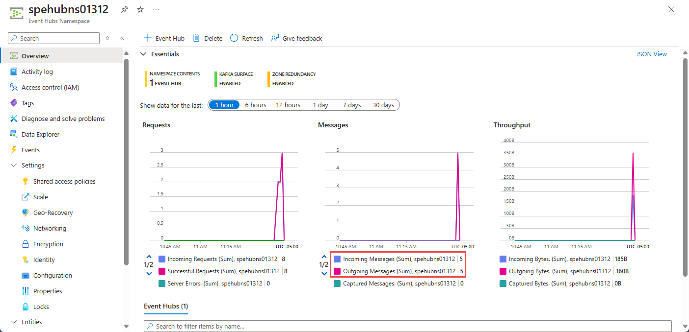

When using Event Hubs, you must monitor your hub to ensure that it's working as expected.

Continuing with the banking example, you deployed Azure Event Hubs service and configured sender and receiver applications. Your applications are ready for testing the payment processing solution. The sender application collects a customer's credit card data, and the receiver application verifies the credit card is valid. Because of the sensitive nature of your employer's business, it's essential your payment processing is robust and reliable, even when it's temporarily unavailable.

Evaluate your Event Hubs service by testing that your event hub is processing data as expected. The metrics available in Event Hubs allow you to ensure that it's working fine.

## How do you use the Azure portal to view your event hub activity?

The Overview pane for your event hub service shows message counts, which represent the data (events) received and sent by the event hub. You can choose the timescale while viewing these events.

## How can you test event hub resilience?

Messages received from your sender application, even when the hub becomes unavailable, are successfully transmitted and processed as soon as the hub becomes available. Transient connectivity issues might occur because of backend service upgrades and restarts. When they do occur, you can view symptoms, which might include:

- A drop in incoming messages/requests.
- The log file might contain error messages.
- The applications might be disconnected from the service for a few seconds.
- Requests might be momentarily throttled.

Client SDKs for Event Hubs have built-in resilience. To test this functionality, you can use the Azure portal to disable your event Hub.

When you re-enable your event hub, you can rerun your receiver application, and use Event Hubs metrics for your namespace to check whether all sender messages are successfully transmitted and received.

Useful metrics available in event hubs include:

- Throttled Requests: The number of throttled requests because the throughput exceeded unit usage.
- ActiveConnections: The number of active connections on a namespace or event hub.
- Incoming/Outgoing Bytes: The number of bytes sent to/received from the Event Hubs service over a specified period.

## Summary

The Azure portal provides message counts and other metrics that you can use as a health check for your Event Hubs.
