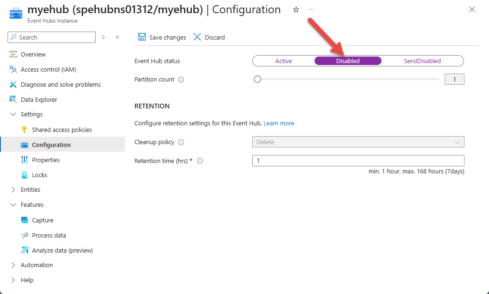
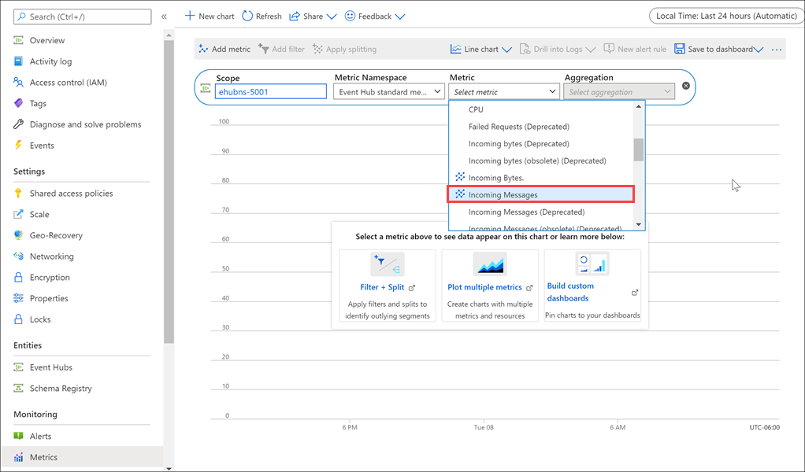

In this unit, you use the Azure portal to verify your Event Hubs instance is working according to expectations. You also test how Event Hubs messaging works when it's temporarily unavailable, and use Event Hubs metrics to check the performance of your Event Hubs instance.

## View Event Hubs activity

1. Sign into the [Azure portal](https://portal.azure.com/learn.docs.microsoft.com?azure-portal=true) using the same account you used to activate the sandbox.

1. Find your Event Hubs instance using the Search bar, and open it as we did in the previous exercise.

1. On the Overview page, view the message counts.

    

1. The SimpleSend and EventProcessorSample applications are configured to send/receive 100 messages. Notice that Event Hubs processed 100 messages from the SimpleSend application and transmitted 100 messages to the EventProcessorSample application.

## Test Event Hubs resilience

Perform the following steps to find out what happens when an application sends messages to Event Hubs while it's temporarily unavailable.

1. Resend messages to the Event Hubs instance using the SimpleSend application. Run the following command in Cloud Shell.

    ```azurecli
    cd ~
    cd azure-event-hubs/samples/Java/Basic/SimpleSend
    java -jar ./target/simplesend-1.0.0-jar-with-dependencies.jar
    ```

1. When you get the **Send Complete** message, press <kbd>Enter</kbd>.

1. Return to the Azure portal. On the **Overview** page of your **Event Hubs Namespace** pane, select your Event Hubs instance from the list at the bottom. This shows details specific to the Event Hubs instance. You can also get to this pane with the **Event Hubs** entry from the namespace page. The **Event Hubs Instance** pane appears.

1. In the left menu pane, under **Settings**, select **Configuration**. The **Configuration** pane appears for your Event Hubs instance.

1. Under **EVENT HUB STATUS**, select **Disabled**, and in the top menu bar, select **Save changes**.

    

    >[!IMPORTANT]
    >Wait for a minimum of five minutes before proceeding.

1. Select **Active** under **EVENT HUB STATUS** to re-enable your Event Hubs instance, and in the top menu bar, select **Save changes**.

1. In Cloud Shell, rerun the EventProcessorSample application to receive messages. Run the following command.

    ```azurecli
    cd ~
    cd azure-event-hubs/samples/Java/Basic/EventProcessorSample
    java -jar ./target/eventprocessorsample-1.0.0-jar-with-dependencies.jar
    ```

1. When messages stop appearing on the console, press <kbd>Enter</kbd>.

1. Back in the Azure portal, go back to your Event Hubs Namespace. If you're still on the Event Hubs page, you can use the breadcrumb on the top of the screen to go backwards. Or you can search for the namespace, and select it.

1. In the middle menu pane, under **Monitoring**, select **Metrics**.

    

1. From the **Metric** dropdown list, select **Incoming Messages**, and in the taskbar, select **Add metric**.

1. From the **Metric** dropdown list, select **Outgoing Messages**, and in the taskbar, select **Add metric**.

1. At the top right of the chart, select **Last 24 hours (Automatic)**, and in the dialog box that appears, change the time period to **Last 30 minutes** to expand the data graph. Select **Apply**.

Notice that even though the messages were sent before the Event Hubs instance was taken offline for a period, all 100 messages were successfully transmitted.

## Summary

In this unit, you used the Event Hubs metrics to test that your Event Hubs instance is successfully processing the sending and receiving messages.
