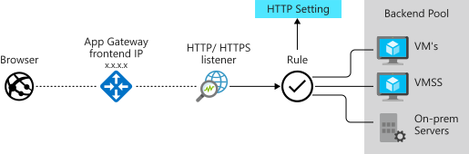
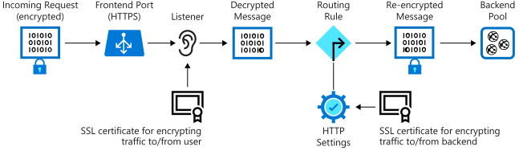

Encrypting your data while it's in transit is an important step toward securing your applications. You can purchase certificates from a certificate authority and use them to encrypt the messages that pass in and out of your servers. This encryption prevents unauthorized users from intercepting and examining the information in these messages while they're being transmitted.

In the shipping portal, encryption is important because we're dealing with shipping customer orders. If someone can access the transmitted data, they can view sensitive information such as customer details or financial account data.

To help secure this data, you can use Azure Application Gateway. It encrypts data that's traversing the network from users to application servers.

## Application Gateway and its benefits

Azure Application Gateway is an application delivery controller. It provides features like load balancing HTTP traffic, web application firewall, and support for SSL encryption of your data. Application Gateway supports encrypting traffic between users and an application gateway and between application servers and an application gateway.

When you terminate the SSL connection at the application gateway, it offloads the CPU-intensive SSL termination workload from your servers. Also, you don’t need to install certificates and configure SSL on your servers.

If you need end-to-end encryption, Application Gateway can decrypt the traffic on the gateway by using your private key. It then re-encrypts the traffic with the public key of the service running in the backend pool.

Exposing your website or web application through the application gateway also means you don't directly connect your servers to the web. You're exposing only port 80 or port 443 on the application gateway. Your web servers aren't directly accessible from the internet, reducing your infrastructure's attack surface.

## Application Gateway components

Application Gateway has several components. The main parts for encryption are the frontend port, the listener, and the backend pool.

The following image shows how incoming traffic from a client to Application Gateway over SSL is decrypted and then re-encrypted when it's sent to a server in the backend pool.

### Frontend port and listener

Traffic enters the gateway through a frontend port. You can open many ports, and Application Gateway can receive messages on any of these ports. A listener is the first thing your traffic meets when entering the gateway through a port. It's set up to listen for a specific host name and a specific port on a specific IP address. The listener can use an SSL certificate to decrypt the traffic that enters the gateway. The listener then uses a rule that you define to direct the incoming requests to a backend pool.

### Backend pool

The backend pool contains your application servers. These servers might be virtual machines, a virtual machine scale set, or applications running on Azure App Service. Incoming requests can be load balanced across the servers in this pool. The backend pool has an HTTP setting that references a certificate used to authenticate the backend servers. The gateway re-encrypts the traffic by using this certificate before sending it to one of your servers in the backend pool.

If you're using Azure App Service to host the backend application, you don't need to install any certificates in Application Gateway to connect to the back-end pool. All communications are automatically encrypted. Application Gateway trusts the servers because Azure manages them.
