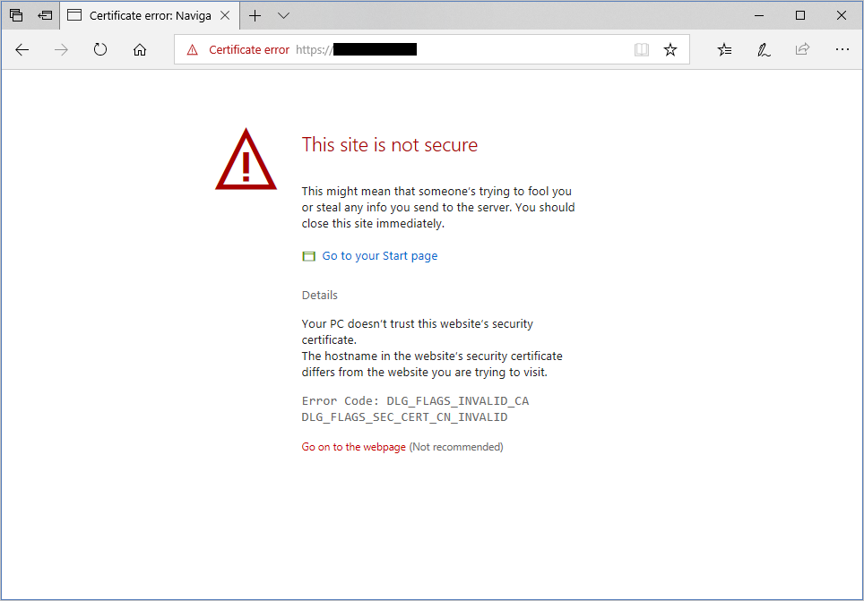

You want to implement end-to-end encryption for the shipping portal application. Encrypting all data between users and servers help ensure that no unauthorized user can intercept and read the data.

In this unit, you set up the web application and the application gateway. Next, you create some self-signed SSL certificates and enable encryption in your backend pool to help secure the traffic from the application gateway to your servers.

The following image highlights the elements you configure in this exercise. You're setting up an application gateway by using Azure Application Gateway v2.

:::image type="content" source="../media/4-exercise-elements.svg" alt-text="Diagram that highlights the elements (backend pool, SSL certificate, and HTTP settings) created in this exercise.":::

## Deploy a virtual machine and an application gateway

1. Open the [Azure Cloud Shell](https://shell.azure.com/?azure-portal=true) in your browser, and sign in to the directory with access to the subscription in which you want to create resources. We use the Bash shell environment for this exercise.

1. Run the following command in the Cloud Shell to create a resource group for your resources. Replace `<resource group name>` with a name for your resource group, and `<location>` with the Azure region in which you'd like to deploy your resources.

    ```bash
    az group create --resource-group <resource group name> --location <location>
    ```

1. Run the following command in the Cloud Shell to create a variable to store your resource group name.

    ```bash
    export rgName=<resource group name>

    ```

1. In Azure Cloud Shell, run the following command to download the source code for the shipping portal.

    ```bash
    git clone https://github.com/MicrosoftDocs/mslearn-end-to-end-encryption-with-app-gateway shippingportal
    ```

1. Move to the *shippingportal* folder.

    ```bash
    cd shippingportal
    ```

1. Run the following setup script to create the virtual machine, certificates, and application gateway.

    ```bash
    bash setup-infra.sh
    ```

    > [!NOTE]
    > This script takes several minutes to finish. Allow it to work through multiple processes to unpack and configure the gateway and resources. You should see that the process succeeded with zero warnings and zero errors.

## Verify that the web server is configured correctly

1. Run the following command to display the URL of the web server that the setup script created.

    ```bash
    echo https://"$(az vm show \
      --name webservervm1 \
      --resource-group $rgName \
      --show-details \
      --query [publicIps] \
      --output tsv)"
    ```

1. Copy and paste the URL into your web browser, and go to the URL.
  
   Your browser will most likely display a warning message similar to the following image. The exact content in the warning message can vary, depending on your browser. The example image is from Microsoft Edge.

   

    This warning occurs because the web server is configured through a self-signed certificate that can't be authenticated. On this warning page, look for and select the link to proceed to the website; for example select **Go on to the webpage** or  select **Advanced** and then **Proceed**, or the equivalent. The result takes you to the home page for the shipping portal, as shown below. It's a sample app to test that the server is configured correctly.

    :::image type="content" source="../media/4-shippingportal.png" alt-text="Home page for the shipping portal in Microsoft Edge." loc-scope="other"::: <!-- no-loc -->

## Configure the backend pool for encryption

1. Run the following command to get the private IP address of the virtual machine that's acting as the web server.

    ```bash
    echo privateip="$(az vm list-ip-addresses \
      --resource-group $rgName \
      --name webservervm1 \
      --query "[0].virtualMachine.network.privateIpAddresses[0]" \
      --output tsv)"
    ```

1. Create a variable to store your private IP address.

    ```bash
    export privateip=<privateIP>

    ```

1. Set up the backend pool for Application Gateway by using the private IP address of the virtual machine.

    ```azurecli
    az network application-gateway address-pool create \
      --resource-group $rgName \
      --gateway-name gw-shipping \
      --name ap-backend \
      --servers $privateip
    ```

1. Upload the certificate for the VM in the backend pool to Application Gateway, as a trusted root certificate. This certificate was generated by the setup script and is stored in the *shipping-ssl.crt* file.

    ```azurecli
    az network application-gateway root-cert create \
      --resource-group $rgName \
      --gateway-name gw-shipping \
      --name shipping-root-cert \
      --cert-file server-config/shipping-ssl.crt
    ```

1. Configure the HTTP settings to use the certificate.

    ```azurecli
    az network application-gateway http-settings create \
      --resource-group $rgName \
      --gateway-name gw-shipping \
      --name https-settings \
      --port 443 \
      --protocol Https \
      --host-name $privateip
    ```

1. Run the following commands to set the trusted certificate for the backend pool to the certificate installed on the backend VM.

    ```azurecli
    export rgID="$(az group show --name $rgName --query id --output tsv)"

    az network application-gateway http-settings update \
        --resource-group $rgName \
        --gateway-name gw-shipping \
        --name https-settings \
        --set trustedRootCertificates='[{"id": "'$rgID'/providers/Microsoft.Network/applicationGateways/gw-shipping/trustedRootCertificates/shipping-root-cert"}]'
    ```

You now have a virtual machine running the shipping portal site, and an application gateway. You've configured SSL encryption between Application Gateway and your application server.
