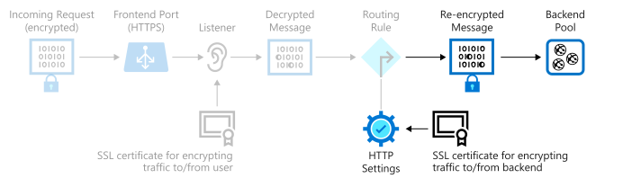
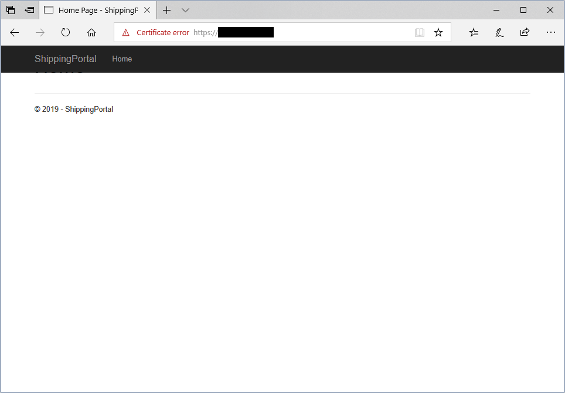

You want to implement end-to-end encryption for the shipping portal application. Encrypting all data between users and servers will help ensure that no unauthorized user can intercept and read the data.

In this unit, you'll set up the web application and the application gateway. Next, you'll create some self-signed SSL certificates and enable encryption in your backend pool to help secure the traffic from the application gateway to your servers.

The following image highlights the elements you'll configure in this exercise. You'll be setting up an application gateway by using Azure Application Gateway v2.



## Deploy a virtual machine and an application gateway

[!include[](../../../includes/azure-sandbox-activate.md)]

1. In Azure Cloud Shell, run the following command to download the source code for the shipping portal.

    ```bash
    git clone https://github.com/MicrosoftDocs/mslearn-end-to-end-encryption-with-app-gateway shippingportal
    ```

1. Move to the *shippingportal* folder.

    ```bash
    cd shippingportal
    ```

1. Run the following commands to create a variable named `rgName` that references the sandbox resource group. Execute the setup script to create the virtual machine, certificates, and application gateway.

    ```bash
    export rgName=<rgn>[Sandbox resource group]</rgn>
    bash setup-infra.sh
    ```

    > [!NOTE]
    > This script will take several minutes to finish.

## Verify that the web server is configured correctly

1. Run the following command to display the URL of the web server that the setup script created.

    ```bash
    echo https://"$(az vm show \
      --name webservervm1 \
      --resource-group <rgn>[Sandbox resource group]</rgn> \
      --show-details \
      --query [publicIps] \
      --output tsv)"
    ```

1. In your web browser, go to the URL.
  
   You'll likely receive a warning message from your browser, similar to the example in the following image. This warning occurs because the web server is configured through a self-signed certificate that can't be authenticated.

   

  The warning message can vary, depending on your browser. The example image shows Microsoft Edge. Proceed to the website by selecting **Go on to the webpage** or the equivalent. You should see the home page for the shipping portal. This is a sample app to test that the server is configured correctly.

   

## Configure the backend pool for encryption

1. Run the following command to get the private IP address of the virtual machine that's acting as the web server.

    ```bash
    privateip="$(az vm list-ip-addresses \
      --resource-group <rgn>[Sandbox resource group]</rgn> \
      --name webservervm1 \
      --query "[0].virtualMachine.network.privateIpAddresses[0]" \
      --output tsv)"
    ```

1. Set up the backend pool for Application Gateway by using the private IP address of the virtual machine.

    ```azurecli
    az network application-gateway address-pool create \
      --resource-group <rgn>[Sandbox resource group]</rgn> \
      --gateway-name gw-shipping \
      --name ap-backend \
      --servers $privateip
    ```

1. Upload the certificate for the VM in the backend pool to Application Gateway, as a trusted root certificate. This certificate was generated by the setup script and is stored in the *shipping-ssl.crt* file.

    ```azurecli
    az network application-gateway root-cert create \
      --resource-group <rgn>[Sandbox resource group]</rgn> \
      --gateway-name gw-shipping \
      --name shipping-root-cert \
      --cert-file server-config/shipping-ssl.crt
    ```

1. Configure the HTTP settings to use the certificate.

    ```azurecli
    az network application-gateway http-settings create \
      --resource-group <rgn>[Sandbox resource group]</rgn> \
      --gateway-name gw-shipping \
      --name https-settings \
      --port 443 \
      --protocol Https \
      --host-name $privateip
    ```

1. Run the following commands to set the trusted certificate for the backend pool to the certificate installed on the backend VM.

    ```azurecli
    export rgID="$(az group show --name <rgn>[Sandbox resource group]</rgn> --query id --output tsv)"

    az network application-gateway http-settings update \
        --resource-group <rgn>[Sandbox resource group]</rgn> \
        --gateway-name gw-shipping \
        --name https-settings \
        --set trustedRootCertificates='[{"id": "'$rgID'/providers/Microsoft.Network/applicationGateways/gw-shipping/trustedRootCertificates/shipping-root-cert"}]'
    ```

You now have a virtual machine running the shipping portal site, and an application gateway. You've configured SSL encryption between Application Gateway and your application server.
