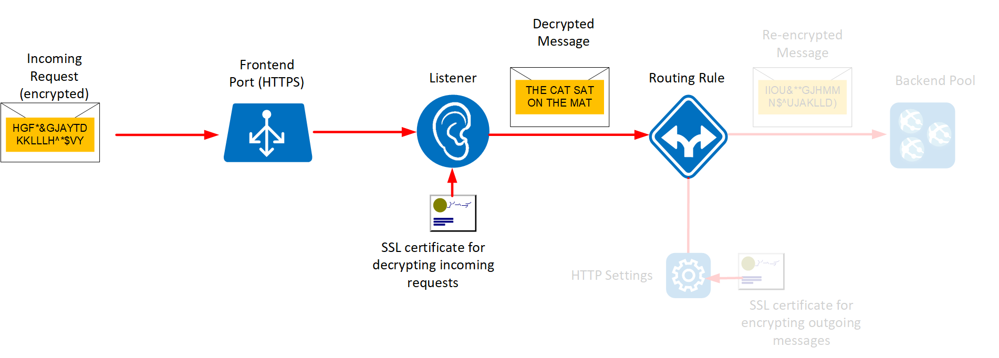

Having configured the certificates for Application Gateway and the backend pool, you can create a listener to handle incoming requests. The listener will wait for messages, decrypt them using the private certificate, and then route theses messages to the backend pool.

In this unit, you'll set up the listener with port 443 and with the SSL certificate you created in the first exercise. The image below highlights the elements you'll set up in this exercise.



## Configure listener

[!include[](../../../includes/azure-sandbox-activate.md)]

1. In the Cloud Shell window on the right, create a variable named *rgName* that references the sandbox resource group:

    ```bash
    export rgName=<rgn>[Sandbox resource group]</rgn>
    ```

1. Run the following command create a new frontend port (443) for the gateway:

    ```azurecli
    az network application-gateway frontend-port create \
      --resource-group $rgName \
      --gateway-name gw-shipping \
      --name https-port \
      --port 443
    ```

1. Upload the SSL certificate for Application Gateway. The certificate was generated by the setup script in the previous exercise, and is stored in the *appgateway.pfx* file in the *server-config* folder. The password generated for the pfx file is *somepassword*; don't change it in the command below:

    ```azurecli
    az network application-gateway ssl-cert create \
       --resource-group $rgName \
       --gateway-name gw-shipping \
       --name appgateway-cert \
       --cert-file server-config/appgateway.pfx \
       --cert-password somepassword
    ```

1. Run the following command to create a new listener that accepts incoming traffic on port 443. The listener uses the certificate *appgateway-cert* to decrypt messages:

    ```azurecli
    az network application-gateway http-listener create \
      --resource-group $rgName \
      --gateway-name gw-shipping \
      --name https-listener \
      --frontend-port https-port \
      --ssl-cert appgateway-cert
    ```

1. Run the following command to create a rule that directs traffic received using the new listener to the backend pool.

    ```azurecli
    az network application-gateway rule create \
        --resource-group $rgName \
        --gateway-name gw-shipping \
        --name https-rule \
        --address-pool ap-backend \
        --http-listener https-listener \
        --http-settings https-settings \
        --rule-type Basic
    ```

<!-- To get this working, perform the following additional steps using PowerShell 

```PowerShell
$gw = Get-AzApplicationGateway -Name gw-shipping -ResourceGroupName $rgName

$trustcert = Get-AzApplicationGatewayTrustedRootCertificate -ApplicationGateway $gw

$poolSetting01 = set-AzApplicationGatewayBackendHttpSettings -ApplicationGateway $gw -Name https-settings -Port 443 -Protocol Https -CookieBasedAffinity Disabled -TrustedRootCertificate $trustcert -HostName 10.0.1.4

Set-AzApplicationGateway -ApplicationGateway $gw
```
-->

## Test the Application Gateway

1. Find the public URL of the Application Gateway:

    ```bash
    echo https://$(az network public-ip show \
      --resource-group $rgName \
      --name appgwipaddr \
      --query ipAddress \
      --output tsv)
    ```

2. Using a web browser, move to this URL.

    As before, your browser might display a warning message stating that the SSL connection is being made using an unauthenticated certificate. You can ignore this warning and continue to the web site.

3. Verify that the home page for the Shipping Portal appears.

You've now configured the listener to listen on port 443 and decrypt the data ready to be passed to the backend pool. The data is re-encrypted when it is transmitted from the gateway to a server in the backend pool. With this listener in place, you have set up end-to-end encryption for the shipping portal.
