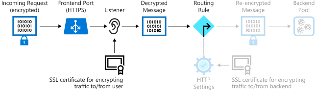

Now that you've configured the certificates for Azure Application Gateway and the backend pool, you can create a listener to handle incoming requests. The listener waits for messages, decrypt them by using the private key, then route these messages to the backend pool.

In this unit, you set up the listener with port 443 and with the SSL certificate that you created in the first exercise. The following image highlights the elements you set up in this exercise.



## Configure the listener

1. Run the following command to create a new frontend port (443) for the gateway.

    ```azurecli
    az network application-gateway frontend-port create \
      --resource-group $rgName \
      --gateway-name gw-shipping \
      --name https-port \
      --port 8443
    ```

1. Upload the SSL certificate for Application Gateway. The setup script generated this certificate in the previous exercise. The certificate is stored in the *appgateway.pfx* file in the *server-config* folder.

   The password generated for the .pfx file is *somepassword*. Don't change it in the following command.

    ```azurecli
    az network application-gateway ssl-cert create \
       --resource-group $rgName \
       --gateway-name gw-shipping \
       --name appgateway-cert \
       --cert-file server-config/appgateway.pfx \
       --cert-password somepassword
    ```

1. Run the following command to create a new listener that accepts incoming traffic on port 443. The listener uses the certificate *appgateway-cert* to decrypt messages.

    ```azurecli
    az network application-gateway http-listener create \
      --resource-group $rgName \
      --gateway-name gw-shipping \
      --name https-listener \
      --frontend-port https-port \
      --ssl-cert appgateway-cert
    ```

1. Run the following command to create a rule that directs traffic received through the new listener to the backend pool. This command might take a minute or two to finish.

    ```azurecli
    az network application-gateway rule create \
        --resource-group $rgName \
        --gateway-name gw-shipping \
        --name https-rule \
        --address-pool ap-backend \
        --http-listener https-listener \
        --http-settings https-settings \
        --rule-type Basic
        --priority 102
    ```

## Test the application gateway

1. Retrieve the public URL of the application gateway.

    ```bash
    echo https://$(az network public-ip show \
      --resource-group $rgName \
      --name appgwipaddr \
      --query ipAddress \
      --output tsv)
    ```

1. Go to the URL in a web browser.

   As before, your browser might display a warning message that says the SSL connection is using an unauthenticated certificate. This warning displays because the certificate is self-signed. You can ignore this warning and continue to the website.

1. Verify that the home page for the shipping portal appears.

You've configured the listener to listen on port 443 and decrypt the data that's ready to be passed to the backend pool. The data is re-encrypted when it's transmitted from the gateway to a server in the backend pool. With this listener in place, you've set up end-to-end encryption for the shipping portal.

You can delete these resources if needed.
