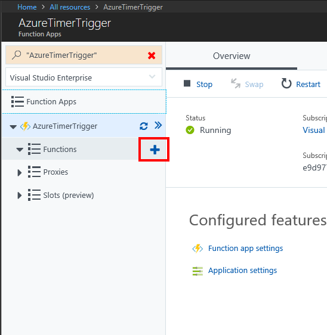

In this unit, we create an Azure function app that's invoked every 20 seconds using a timer trigger.

[!include[](../../../includes/azure-sandbox-activate.md)]

## Create an Azure function app

Let’s start by creating an Azure Function app in the portal.

1. Sign into the [Azure portal](https://portal.azure.com/learn.docs.microsoft.com?azure-portal=true) using the same account you activated the sandbox with.

1. In the left navigation, select **Create a resource**.

1. Select **Compute**.

1. Locate and select **Function App**. You can also optionally use the search bar to locate the template.

    

1. Enter a globally unique **App name**.

1. Select a **Subscription**.

1. Select the existing **Resource group** <rgn>[sandbox resource group name]</rgn>.

1. Choose **Windows** as your **OS**.

1. Choose **Consumption Plan** for your **Hosting Plan**. You're charged for each execution of your function. Resources are automatically allocated based on your application workload.

1. Select a **Location** from the available list below.

    [!include[](../../../includes/azure-sandbox-regions-first-mention-note-friendly.md)]

1. For **Runtime Stack**, leave as default *.NET*, which is the language in which we implement the function examples in this exercise.

1. Create a new **Storage** account, you can change the name if you like - it will default to a variation of the App name.

1. Select **Create**. Once the function app is deployed, go to **All resources** in the portal. The function app will be listed with type **App Service** and has the name you gave it.

## Create a timer trigger

Now we're going to create a timer trigger inside our function.

1. After the function is created, select **All resources** from the left navigation.

1. Find your function app in the list and select it.

1. On the new blade, point to **Functions** and select the plus (+) icon.

    

1. Select **Timer**.

1. Select **CSharp** as the language.

1. Select **Create this function**.

## Configure the timer trigger

We have an Azure function app with logic to print a message to the log window. We're going to set the schedule of the timer to execute every 20 seconds.

1. Select **Integrate**.

1. Enter the following value into the **Schedule** box:

    ```log
    */20 * * * * *
    ```

1. Select **Save**.

## Test the timer

Now that we've configured the timer, it will invoke the function on the interval we defined.

1. Select **TimerTriggerCSharp1**.

    > [!NOTE]
    > **TimerTriggerCSharp1** is a default name. It's automatically selected when you create the trigger.

1. Open the **Logs** panel at the bottom of the screen.

1. Observe new messages arrive every 20 seconds in the log window.

1. To stop the function from running, select **Manage** and then switch **Function State** to *Disabled*.
