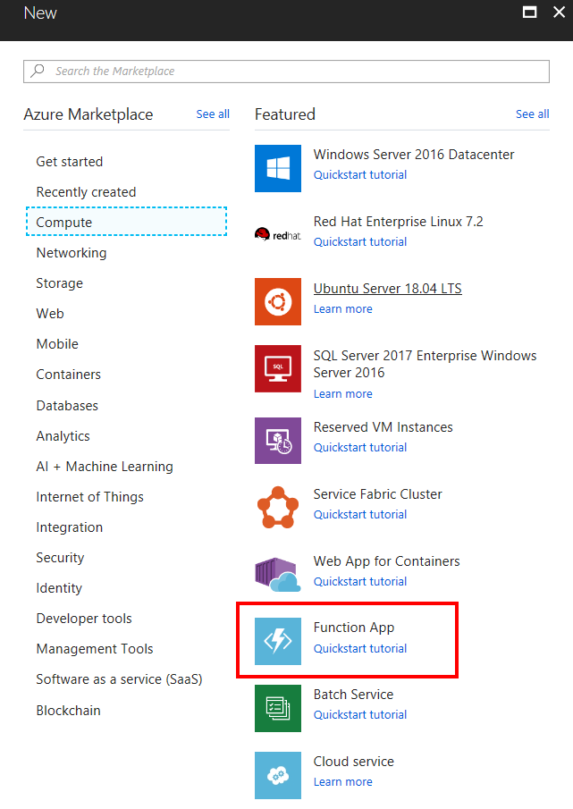

In this unit, we create an Azure function app that's invoked every 20 seconds using a timer trigger.

## Create an Azure function app

Let’s start by creating an Azure Function app in the portal.

::: zone pivot="csharp"

1. Sign in to the [Azure portal](https://portal.azure.com/learn.docs.microsoft.com?azure-portal=true) using the same account you activated the sandbox with.

1. On the Azure portal menu or from the **Home** page, select **Create a resource**.

    

1. Select **Compute**, and then select **Function App**. You can also optionally use the search bar to locate and create the new resource. The **Create Function App** pane appears.

    

1. On the **Basics** tab, enter the values for each setting.

    | Setting  | Value  |
    |---|---|
    | **Project Details** |
    | Subscription | Select the Azure subscription you'd like to use for this exercise  |
    | Resource Group | Create a new resource group called **mslearn-autoscale** |
    | **Instance Details** |
    | Function App name | *\<your-webapp-name\>* |
    | Publish | Code |
    | Runtime stack | .NET |
    | Version | 3.1 |
    | Region | select a location close to you |

1. Select **Next : Hosting**. Enter the values for each setting.

    | Setting  | Value  |
    |---|---|
    | **Storage** |
    | Storage account |  You can change the name if you like. It will default to a variation of the App name. |
    | **Operating system** |
    | Operating System | Windows |
    | **Plan** |
    | Plan type | Consumption (Serverless). When using the Consumption Plan type, you're charged for each execution of your function, and resources are automatically allocated based on your app workload.|

1. Select **Review + create**, and then select **Create**. After the function app is deployed, select **Go to resource**.

## Create a timer-triggered function

Now we're going to create a timer trigger inside our function.

1. In the menu pane for your Function App, select **Functions**, and then select the Add (**+**) button. This action starts the function creation process.

1. In the list of quick start templates, select **Timer trigger**, and then select **Add** at the bottom of the pane. The **TimerTrigger1** pane appears.

## Configure the timer trigger

We have an Azure function app with logic to print a message to the log window. We're going to set the schedule of the timer to execute every 20 seconds.

1. From the menu pane, select **Integration**. The **Integration** page appears.

1. In the **Trigger** box, select the **Trigger (myTimer)** link. The **Edit Trigger** pane appears.

1. Enter the following value into the **Schedule** box.

    ```log
    */20 * * * * *
    ```

1. Select **Save**.

::: zone-end

::: zone pivot="powershell"

1. Sign in to the [Azure portal](https://portal.azure.com/learn.docs.microsoft.com?azure-portal=true) using the same account you activated the sandbox with.

1. On the Azure portal menu or from the **Home** page, select **Create a resource**.

    

1. Select **Compute**, and then select **Function App**. You can also optionally use the search bar to locate and create the new resource.

    

1. On the **Basics** tab, enter the values for each setting.

    | Setting  | Value  |
    |---|---|
    | **Project Details** |
    | Subscription | Select the Azure subscription you'd like to use for this exercise  |
    | Resource Group | Select the existing **Resource Group** <rgn>[sandbox resource group name]</rgn> |
    | **Instance Details** |
    | Function App name | *\<your-webapp-name\>* |
    | Publish | Code |
    | Runtime stack | PowerShell Core |
    | Version | 7.0 (or latest version) |
    | Region | select a location close to you |

1. Select **Next : Hosting**. Enter the values for each setting.

    | Setting  | Value  |
    |---|---|
    | **Storage** |
    | Storage account |  You can change the name if you like. It will default to a variation of the App name. |
    | **Operating system** |
    | Operating System | Windows |
    | **Plan** |
    | Plan type | Consumption (Serverless). When using the Consumption Plan type, you're charged for each execution of your function, and resources are automatically allocated based on your app workload.|


1. Select **Review + create**, and then select **Create**. After the function app is deployed, in the Azure portal, select **Go to resource**.

## Create a timer-triggered function

Now we're going to create a timer trigger inside our function.

1. In the menu pane for your Function App, select **Functions**, and then select the Add (**+**) button. This action starts the function creation process.

1. In the list of quick start templates, select **Timer trigger**, and then select **Add** at the bottom of the pane. The **TimerTrigger1** pane appears.

## Configure the timer trigger

We have an Azure function app with logic to print a message to the log pane. We're going to set the schedule of the timer to execute every 20 seconds.

1. From the menu pane, select **Integration**. The **Integration** pane appears.

1. In the **Trigger** box, select the **Trigger (myTimer)** link. The **Edit Trigger** pane appears.

1. Enter the following value into the **Schedule** box.

    ```log
    */20 * * * * *
    ```

1. Select **Save**.

::: zone-end

## Test the timer

::: zone pivot="csharp"

Now that we've configured the timer, it will invoke the function on the interval we defined.

1. Select **TimerTrigger1**.

    > [!NOTE]
    > **TimerTrigger1** is a default name. It's automatically selected when you create the trigger.

1. In the left menu pane, under **Developer**, select **Code + Test**. The **Code + Test** pane appears.

1. Select **Test/Run**. From the right-hand pane, select **Run**. The **Logs** pane appears at the bottom of the page.

1. Observe new messages arrive every 20 seconds in the log window.

1. To stop the function from running, select **Stop**.

1. To disable the function, in the left menu pane, select **Overview**, and then select **Disable**.

::: zone-end

::: zone pivot="powershell"

Now that we've configured the timer, it will invoke the function on the interval we defined.

1. Select **TimerTrigger1**.

    > [!NOTE]
    > **TimerTrigger1** is a default name. It's automatically selected when you create the trigger.

1. In the left menu pane, under **Developer**, select **Code + Test**. The **Code + Test** pane appears.

1. Select **Test/Run**. From the left-hand pane, select **Run**. The **Logs** pane appears at the bottom of the page.

1. Observe new messages arrive every 20 seconds in the log window.

1. To stop the function from running, select **Stop**.

1. To disable the function, in the left menu pane, select **Overview**, and then select **Disable**.

::: zone-end
