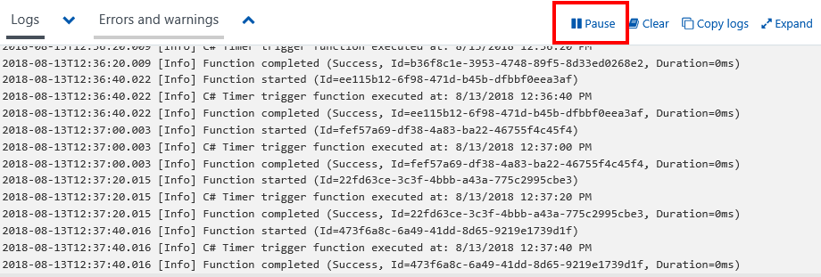

In this exercise, we're going to create an Azure Function that is invoked every 20 seconds using a timer trigger.

> [!NOTE] To complete this exercise make sure you're logged into the [Azure portal](https://portal.azure.com/) with a valid account.

## Create an Azure Function

Let’s start by creating an Azure Function in the portal.

1. In the left-hand navigation panel, click **Create a resource**.

1. Click **Compute**.

1. Locate and click **Function App**. You can also optionally use the search bar to locate the template.

    

1. Enter a unique **App name**.

1. Select a **Subscription**.

1. Create a new **Resource Group**.

1. Choose **Windows** as your **OS**.

1. Choose **Consumption Plan** for your **Hosting Plan**. This will charge you for each execution of your function and automatically allocate resources based on your application's workload.

1. Select a **Location**.

1. Create a new **Storage** account. This is required; however, we're not going to use it.

1. Turn off **Application Insights**.

1. Click **Create**.

## Create a timer trigger

Now we're going to create a timer trigger inside of our Azure Function.

1. Once the Azure Function is finished being created, select **All resources** from the left-hand navigation panel.

1. Locate and select your Azure Function.

1. On the new blade, hover your mouse over **Functions** and click the plus icon.

    

1. Select **Timer**.

1. Select **CSharp** as the language.

1. Click **Create this function**.

## Configure the timer trigger

We have an Azure Function with logic to print a message to the log window. We're now going to set the schedule of the timer to execute every 20 seconds.

1. Click **Integrate**.

1. Enter the following into the **Schedule** field.

    ```
    */20 * * * * *
    ```

1. Click **Save**.

## Start the timer

Now that we configured the timer, we're ready to start it.

1. Click **TimerTriggerCSharp1**. 

    [!NOTE] **TimerTriggerCSharp1** is a default name that was selected automatically when you created the trigger.

1. Click **Run**. 

At this point you should see a message every 20 seconds in the log window.

## Cleanup

To ensure you don't get charged for this function, make sure you select **Pause** above the log window to stop the timer.




