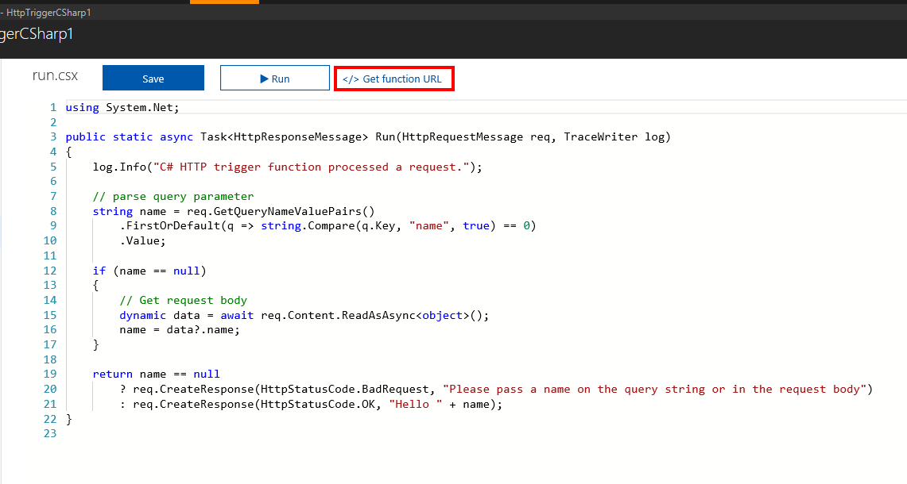

An HTTP request is a common operation on most platforms and devices. Whether it's a request to look up a word in a dictionary or to get the local weather, we send HTTP requests all the time. Azure Functions allows us to quickly create a piece of logic to execute when an HTTP request is received.

In this unit, you'll learn how to create and invoke a function using an HTTP trigger. You'll also explore some of the customization options available for HTTP triggers.

## What is an HTTP trigger?

An HTTP trigger is a trigger that executes code when it receives an HTTP request. HTTP triggers have many capabilities and customizations, including:

- Providing authorized access by supplying keys.
- Restricting which HTTP verbs are supported.
- Returning data back to the caller.
- Receiving data through query string parameters or through the request body.
- Supporting URL route templates to modify the function URL.

When you create an HTTP trigger, you need to provide a name for the trigger and choose an Authorization level.

## What is an HTTP trigger Authorization level?

An HTTP trigger Authorization level is a flag that indicates whether an incoming HTTP request needs an API key for authorization.

There are three Authorization levels:

1. Function
2. Anonymous
3. Admin

The **Function** and **Admin** levels are "key" based. To send an HTTP request, you must supply a key for authorization. There are two types of keys: *function* and *host*. The difference between the two keys is their scope. Function keys are specific to a function. Host keys apply to all functions inside the function app. If your Authorization level is set to **Function**, you can use either a *function* or a *host* key. If your Authorization level is set to **Admin**, you must supply a *host* key.

> [!IMPORTANT]
> Because host keys provide elevated access to your function app, you must transport and store them securely. 

The **Anonymous** level means that authorization isn't required. This exercise uses the Anonymous authorization level.

## How to create an HTTP trigger

Just like a timer trigger, you can create an HTTP trigger through the Azure portal. Inside your Azure function, select **HTTP trigger** from the list of predefined trigger types, then enter the logic that you want to execute and make any customizations, like restricting the use of certain HTTP verbs.

One setting that's important to understand is **Request parameter name**. This setting is a string that represents the name of the parameter that contains the information about an incoming HTTP request. By default, the name of the parameter is *req*.

## How to invoke an HTTP trigger

To invoke an HTTP trigger, you send an HTTP request to the URL for your function. To get this URL, go to the code page for your function and select the **Get function URL** link.

After you have the URL for your function, you can send HTTP requests. If your function receives data, remember that you can either use query-string parameters or supply the data through the request body.

An HTTP trigger executes when it receives an HTTP request to its function URL. HTTP triggers allow you to receive data, execute logic, and optionally return data back to the caller.
