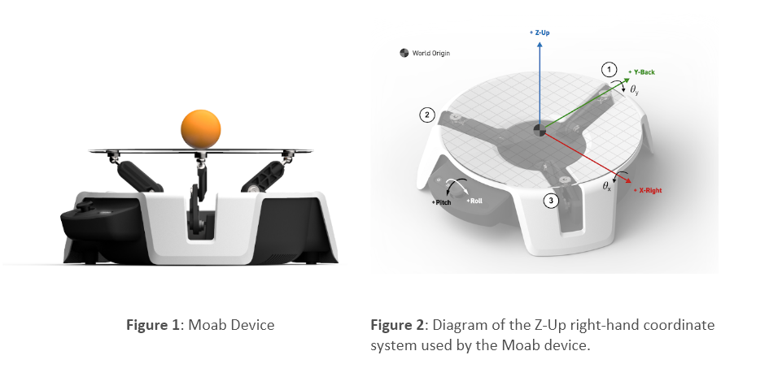
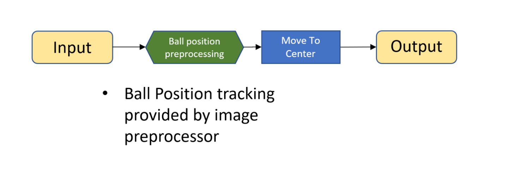

Now, let's review an example of an [AI spec document for Project Moab](https://github.com/MicrosoftDocs/mslearn-machine-teaching-for-autonomous-ai/blob/main/Bonsai%20Brain,%20AI%20Solution%20Spec%20-%20Moab%20Ball%20Balance.docx?raw=true).

We'll be explaining the different sections that are included in any AI specification document, using the Moab specification document as an example.

For this initial review of an AI Spec document, assume that you're the head of the funding team at your company. The adoption team is trying to bring a new technology to the company: Bonsai. The team has put together a deck for you to understand the problem that they're trying to solve and the benefits it brings to the company. At this stage, your only objective is to learn about the problem and make a preliminary decision about the value this project could bring to your company.

## Section 1 - Project Objective

***What task or process are you looking to improve using Machine Teaching?***

The task is balancing a ball on the plate of the Moab device in Figure 1.

Device Overview:

- The device has three arms powered by servo motors and runs off a Raspberry Pi 4.
- These arms work in tandem to control the angle of the transparent plate to keep the ball balanced.  
- Using computer vision, the Moab device tracks and maps the ball movement onto a standard 2D coordinate system (Figure 2).
- Looking at the front of the device, the x-axis runs left-to-right, and the y-axis runs front-to-back, with the plate center at location (0, 0) and a radius of r.
- The trained AI must learn how to adjust the angle of the plate to balance a ball.

## Section 2 – Business value

***In a sentence, explain the business value of developing the Brain.***

Improved balancing reduces energy consumption and wear on motors.

## Section 3 – Optimization goal

***What Key Performance Indicators (KPI) define the control or optimization of this system?***

Minimizing (time) (for the ball to reach the center of the plate and stay there).

## Section 4 - Current Methods

***How do you currently control or optimize the system?***

The system utilizes PID for lower-level control. 

## Section 5 – Limitation of the current methods

***What are the challenges and limitations of the current method(s)?***

There are three limitations:

- The ability to control well across scenarios and conditions.
- Uncertainty in measuring inputs or processes makes it difficult to control or optimize.
- In testing, it was found that lighting conditions and ceiling environments can be challenging for balancing the ball.  

## Section 6 - Machine Teaching Strategy

***In this section, you'll include the brain design.***

To find the strategies, you'll conduct interviews with subject matter experts filling up the three-column exercise as it's shown below.

**Heuristic**

| When the [environment variable list] trend in this direction or interact in this way | This is what we think it means                               | This is what you should do (to manipulate control actions)   |
| ------------------------------------------------------------ | ------------------------------------------------------------ | ------------------------------------------------------------ |
| When the ball is moving towards the plate edge               | The pitch and roll are not oriented to bring the ball to the center | Modify the pitch and roll to be oriented in the opposite direction than the ball’s velocity |

**Concept Decomposition: Monolithic**

The Moab sample is a monolithic brain (only one learning module called "Move to the center"– the blue rectangle). It also includes an advanced perception module which is a computer vision preprocessor to track the ball position (the green pentagon).

**Concept 1**: Move to the center

The trained AI must learn how to adjust the plate pitch and roll to balance a ball using the following objectives:

- The ball position (x, y) will reach the plate center at (0, 0) and stay there
- The ball position will not get near the plate edge at (| (x, y) - (0, 0) | << r)

## Section 7 – Control Actions

***What actions will the Brain need to output to control or optimize your system?***

There are two control actions or actuators at a low level for the Moab device: the pitch and the roll. The data type (decimal), units (radians), control frequency (30 Hz, i.e., 30 times per second), and servo operating range (between -1 and 1) are the parameters that you'll include in the AI spec.

## Section 8 - Constraints

***What constraints are placed on the control actions by the system or the process?***

The Moab device doesn't have any constraints.
Note, the ranges for pitch and roll have already been identified and limited on the brain side to prevent the need for the brain to learn these known constraints.

### Section 9 – Environment States

***What information do you need to pass to the Brain about the system and its environment for the Brain to learn to control or optimize the system?***

Note, this section refers to sensors that collect information from the environment, corresponding to the input in the brain design. Additionally, you'll surely want to include: the data type (decimal), the source where you'll find the data (simulator), units (meters & meters/second), measurement frequency, and operating range are the parameters that you'll find in this section of the AI spec.

For the Moab, there are four environment states:

- Position of the ball: ball_x, ball_y
- The velocity of the ball: ball_vel_x, ball_vel_y

## Section 10 - Deep Reinforcement Learning

***Describe the essential details about each of the DRL modules included in your brain design above (section 6):***

- What action is that concept taking?  
- How does the environment change?  
- What is the reward signal to train that concept?  
- What configuration variables are used to describe the scenario? (these are the lessons you're going to give the Brain to learn the task)

| Concept        | Action (*What actions does this concept apply to?*) | State (*Which states apply to this concept?*)                | Goal Objectives                                              | Configuration  (*What do* *you* *need to vary in the training to ensure that the Brain works well across scenarios?*) |
| -------------- | --------------------------------------------------- | ------------------------------------------------------------ | ------------------------------------------------------------ | ------------------------------------------------------------ |
| Move To Center | -  Plate pitch  - Plate roll                     | - x position - y position - x velocity - y velocity | - Avoid Fall Off Plate - *Ball's distance from the center must not reach values above 80% of the plate radius*  - Drive Center Of Plate - *The ball's X and Y coordinates (state.ball_x and state.ball_y) must stay within CloseEnough radial distance from the plate center* | - Initial ball conditions (initial_x, initial_y)  - Initial ball velocity conditions (initial_vel_x, initial_vel_y)  - Initial plate conditions (initial_pitch, initial_roll)  - Optional for Robustness: Ball properties (shell color and radius |

## Section 11 – Configuration Scenarios

***What scenarios should the trained Brain be able to control across?***

Note, this section refers to the first column (Configuration Variable) of the three columns table defined above within the heuristics subsection: "When this happens in the environment…(scenario)" can potentially be identifying scenarios that your SMEs care about. In other cases, it relates to the decomposition agreed upon: steady-state control could be one scenario, and machine startup could be another one. Each scenario is represented by a unique set of initial conditions, and a set of final ones (including both for failure as well as success).

Moab use case consists of only one scenario:

- From a given set of initial conditions where the ball is already on the plate, you seek to drive the ball to the center.

The table below shows the initial environment states or conditions of ball_x and ball_y position, ball_x and ball_y velocity, plate_pitch, and plate_roll to be considered for our scenario.

| Configuration variable | Range [min, max]    | Description     |
| ---------------------- | ------------------- | --------------- |
| initial_x              | [-0.05625, 0.05625] | Ball X position |
| initial_y              | [-0.05625, 0.05625] | Ball Y position |
| initial_vel_x          | [-0.02, 0.02]       | Ball X velocity |
| initial_vel_y          | [-0.02, 0.02]       | Ball Y velocity |
| initial_pitch          | [-0.2, 0.2]         | Plate pitch     |
|                        | [-0.2, 0.2]         | Plate roll      |

For balancing a ball, you want to randomize the starting ball position (initial_x and initial_y) and velocity (initial_vel_x, initial_vel_x) values for each scenario. You also want to randomize the starting plate pitch and roll as well. This will assist the Brain in learning from a wide range of starting positions, making it more effective in each scenario. Finally, you must define these six variables' variability range [min, max].

For the initial conditions above, you seek training a brain that can get the ball to the center (success), while avoiding that the ball gets too close to the edge of the plate (failure). The conditions for success are further defined in the next section.

## Section 12 - Success Criteria

***What criteria will you use to determine the project's success, and how will you measure that success?***

Note, in this section, you describe the benchmarks for the Brain in terms of the optimization goals and configuration scenarios. The following questions will help define the criteria of success for this Brain:

- How are you going to measure success?  
- What is the KPI that you're going to measure?  
- What exact scenarios will be benchmarked, and what's the benchmark procedure?  
- What is the episode length needed to convince operators that the AI is doing what it's supposed to do?
- Finally, what optimization improvement is good?

The performance of your brain will be measured by the root-mean-squared error of the distance to the center. For an assessment to be successful, ALL episodes in the assessment need to have passed the criteria.

The Brain will be benchmarked against the PID controller included in the Moab device.

## Section 13 – Simulations

***This section outlines the type of simulator and its readiness.***

Many questions need to be answered for the simulation:

- Who's building it?  
What's the validation plan?  
- When is the simulator going to be ready?  
- What is the simulation written in? In the case of the Moab example, it's a custom simulator written in python.  
- How fast is it? For Moab, it's 30 Hz.
- Is this a physics-based first principles model? For Moab, yes. 
- Is this a discrete event model? For Moab, yes. 
- Does that simulator have an API that you can connect to?  
- What error percentage describes accuracy between the simulation model and the actual system across all scenarios and equipment controlled by the brain?  

There are several types of simulators:

- A first-principle simulator is the most accurate representation of the machine or process. It's also the most time-consuming to build and it might be too slow to train the brain.
- A surrogate model built using an existing high-resolution first-principles simulation model will be less precise and faster and more appropriate to run millions of tests to train the brain.
- A data-driven simulation model is the fastest and simplest way to simulate the behavior of your machine or industrial process.  It uses raw data to build a Machine Learning model that predicts what will happen based on specific actions. The inner loop is the control frequency. In other words, whenever the brain says, "This is what I want to do," the simulator needs to respond with "This is what will happen." The drawback of the Data-Driven Simulator is that the brain is limited to the practice of what is already known by the data generated by the ML model.

An iteration is one feedback loop. The brain provides an action simulator response with the state that results from that action. Simulation speed is essential for training 20-30 different brain versions that try different rewards or state information.

The simulator needs to respond to the configuration and specify the parameters that should vary from one training episode to the next during this lesson.  

Parallelization depends on whether you can run in a container in a Virtual Machine (VM) on the cloud and whether your simulation license model allows that. For example, some commercial simulators are based on seat-based licensing models, which can impact the implementation. You might need up to 70 licenses of the simulator to run in parallel to train a brain that outperforms the current methods.

## Section 14 - Supplementary Decision Models

***Will Machine Learning (ML) models or other decision-making technology be used to supplement the environment state from the simulator?***

Sometimes there are supplementary decision-making models, such as Machine Learning models for advanced perception, classification, or prediction. These models should be included here. There won't always be ML models in your Autonomous AI brain design. Sometimes an optimizer or another control system will be built in. All non-AI components that are part of your modular brain design should be listed here.  

And there should be delivery dates associated with each module. The project may be impacted if you need a perception model that hasn't been built yet.  

## Section 15 - Deployment

***How will the brain interface with your system?***

This section answers how the brain will be deployed to control the production system. It could be deployed as Decision Support or Direct Control.

## Section 16 - Team

***This section is to ensure that people with the skill sets needed are included.***

You've arrived at the last section of the AI specification document.

In this module, you've seen an example of all the sections included in the AI specification document of Project Moab. The Moab brain is monolithic, i.e. it only has a learned module, move to center.

In industrial processes, you'll find more complex scenarios and a modular brain design will be necessary. You can find the AI Specification document for a real industrial use case, the gyratory crusher, here.
