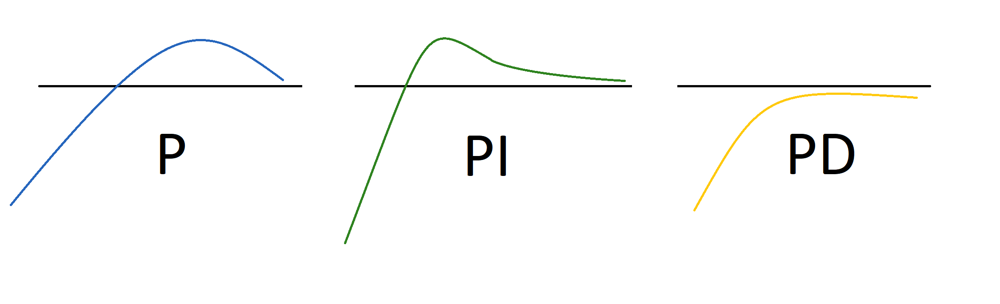

Control techniques rely on a mathematical understanding of the system to determine how to control them. They use mathematical equations to calculate the next control action, usually based on feedback. It uses well-understood mathematical relationships as a model. When you do this, you trust that the mathematical equation describes the system dynamics well enough to make good decisions.

Fundamentally, there are two types of control loops in control theory:

- **Open loop control**
- **Closed loop control** which includes Proportional-Integral-Derivative (PID) Control, Feed Forward Control, and Model Predictive Control (MPC).

## 1. Open loop control

Open-loop control assumes that the mathematical model of how the system works is so accurate and well understood, that no feedback is needed.

Let us explain this with an example. There is an equation that describes how much space a gas will take up based on its temperature and pressure. It is called the Ideal Gas Law. Suppose that you want the system to control a valve that inflates party balloons. This equation is used to calculate how much to adjust the valve open and closed to inflate balloons to a particular size. 

This is an open loop control system because the control is based on the equation and there is no feedback that tells you if the actions worked. 

Open loop control systems are easy to use and unexpensive to develop. However, if the mathematical equation is not an exact fit for the problem, it doesn't work well.

## 2. Closed loop control

Closed loop control uses feedback from the previous action.

The challenge with the example above is that the Ideal Gas Law doesn't model high pressure or low temperature gases, dense gases, or heavy gases. Therefore, most control systems take feedback after they make each control decision. Closed loop control tells what needs to be done to adjust the system.

Now we'll look at several types of closed loop control systems: Proportional-Integral-Derivative (PID) Control, Feed Forward Control, and Model Predictive Control (MPC).

### a. Proportional-Integral-Derivative (PID) control

PID control is a closed loop control system that employs feedback.

The first PID controller was invented to automatically steer ship rudders and control ship’s direction. Imagine that a ship is pointing in one direction and the captain wants to point the ship in a different direction. The controller uses math to calculate how much to move the rudder based on feedback it gets from its last action.

There are three numbers that determine how the controller will behave: the “P”, the “I” and the “D” constant.

- The “**P**” constant moves you toward the target, but if the controller keeps turning the rudder, the ship sweeps right past the target heading.
- The “**I**” constant tracks how much total error you have in the system and keeps you from overshooting the target.
- The “**D**” constant ensures that you arrive at the target destination smoothly.

Above image shows the effect of the “P”, the “I” and the “D” of the PID controller when turning the ship rudder.

#### PID strengths & weaknesses

The PID controllers are highly effective, and you can find it in almost every modern factory and machine, but it can confuse disturbances and noise for events that it needs to respond to. For example, if a PID controller controls the gas pedal on your car, it might confuse a speed bump (which is a minor and temporary disturbance) for a hill that requires significant acceleration. In this case, the controller might over accelerate and exceed the commanded speed, and then needs to slow down. 

### b. Feedforward control

Feedback control systems process the feedback and apply math in several ways to calculate the next best control action. Even when we control responding to feedback, limitations of the mathematical model sometimes lead to good decisions but might also lead to bad decisions.

Feed forward adds the ability to better identify noise and disturbances in the feedback and ignore them when calculating the next control action. This works well for controlling machines and machine components but can fail for more complex systems and processes.

#### Feedforward control strengths & weaknesses

The feed forward controllers are also widely used in the industry and are unexpensive. Regarding the limitations, both PID and feedforward controllers can only control one variable at a time, for one goal, per feedback loop. You would need two feedback/feed forward loops if you needed to control both the gas pedal and the steering wheel of the car. And neither of those loops can maximize gas mileage and maintain constant speed at the same time. Like in this example, what happens if you need to control more than one variable or pursue more than one goal? There are ways to solve this, but in real life we often see people create separate feedback loops that can't talk to each other or coordinate actions. In the same way that humans duplicate work and miscalculate what to do when they don't coordinate with each other, separate control loops don't manage multiple goals well and often waste energy.

### c. Model Predictive Control (MPC)

Model Predictive Control, or MPC, extends the capability of PID and Feedforward to control multiple inputs and multiple outputs. It uses an accurate model to try various control actions in advance and then choose the best action. It senses and acts as an optimization algorithm.

#### MPC strengths & weaknesses

MPC is the most advanced control method used in the industry currently. It's accurate and stable, right after it's developed.

MPC has three major limitations:

- The first limitation of MPC is that it's highly dependent on the system model's accuracy. Normally the system is accurate right after it's being developed, however its accuracy decreases over time with the wear of the machine or system. For example, if the brakes of a car are worn, you need to apply the brakes earlier to stop in time or if the tires wear, you cannot drive as fast or turn as sharply without losing control. The real system changes make the system model inaccurate over time. Since MPC uses the system model to look ahead and try potential actions, an outdated model will mislead it to choose actions that won't work well on the current system. Because of this, many MPC systems were installed, then later decommissioned when the system drifted from the system model.

- The second limitation is that it's expensive to develop an accurate model of the machine or process and therefore they aren't widely spread in the industry.

- The third limitation is that it's very time consuming to obtain the next best decision because of the processing time of the underlying optimization algorithm. For real-time problems, sometimes we do not have that much time to decide, therefore the decision chosen is not optimal, which has a potential huge business impact.
