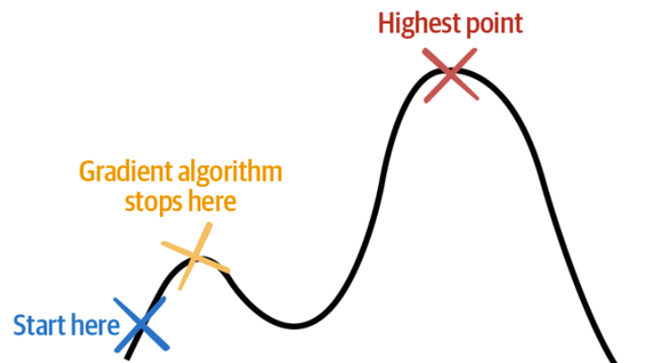
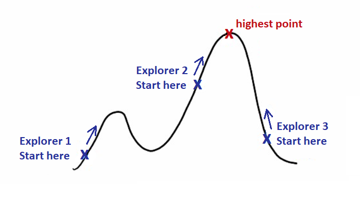

Menus, which are optimization algorithms, are another way that you can make automated decisions by conducting a search for options to evaluate decisions.

Optimization algorithms search a list of options and select a control action using an objective criteria. In this unit, we'll explore several types of optimization methods.

## Brute force search optimization

Optimization algorithms are like explorers searching the surface of the earth for the highest mountain. One way to ensure that you find the highest peak is to set foot on every square meter of the earth, take measurements at each point and then, when you're done, sort your measurements by altitude. The highest point on earth will now be at the top of your list.

Since there are 510 million square kilometers of land mass on earth, this would take many lifetimes to get your answers. This method is called **brute force search** and is only feasible when the geographical search area of potential decisions is small. For more complex geographies or state spaces, we need other methods as are introduced in the following sections.

## Gradient-based optimization

A more efficient way to search the earth for the highest peak is to walk the earth and only take steps in the direction that slopes upward the most. Using this method, you can avoid exploring much of the geography by only traveling uphill. In optimization, this class of methods is called **gradient-based methods** because the slope of a hill is called a grade or a gradient.

There are two challenges with this method. The first is that, depending on where you start your search exploration, you could end up on a tall mountain that isn't the highest point on earth (also called local maximum).

The second limitation of this method is that it can only be used in situations where you can calculate the slope of the ground where you’re walking. If there are gaps in the terrain (think vertical drops or bottomless pits), it isn't possible to calculate the slope (technically it's infinite) at the vertical drops, so you can't use gradient-based optimization methods to search for solutions in that space.

The above image shows the challenge of gradient-based method of falling into a local maximum.

## Multi-faceted optimization

Now, imagine that you would employ multiple explorers to start at different places in the landscape and search for the highest point. After each step, the explorers compare notes on their current altitude and elevation and use their combined knowledge to better map the earth. That might lead to a quicker search and avoid all explorers getting stuck in a high spot that isn't the peak of Mt. Everest. Yet, convergence to global maximum is still not guaranteed.

The image above is an example of multi-faceted optimization.

## Other optimization methods

Many of these algorithms are inspired by processes in nature. Nature has many effective ways of exploring thoroughly, much like water flowing over a patch of land. Here are a few examples:

- **Evolutionary algorithms** are inspired by Darwin’s theory of natural selection. Evolutionary algorithms spawn a population of potential solution decisions, test how well each of the solutions in the population achieve the process goals, kill off the ineffective solutions, then mutate the population to continue exploring.
- **Swarm methods** are inspired by how ants, bees, and particles swarm, move, and interact. These optimization methods explore the solution space with many explorers that move along the landscape and communicate with each other about what they find.
- **Tree methods** treat potential solutions as branches on trees. Imagine a choose-your-own-adventure novel (and other interactive fiction) that asks you to decide which direction to take at a certain point in the story. The decisions proliferate with the number of options at each decision point. Tree-based methods use various techniques to search the tree efficiently (not having to visit each branch) for solutions. Some of the more well-known tree methods are branch and bound and Monte Carlo tree search (MCTS).
- **Simulated annealing** is inspired by the way metal cools down after being heat up. All metals have a crystalline structure that cools in a common way. That structure changes more when the metal is hotter and less when it is cooler. Annealing is a process by which a material like metal is heated above its recrystallization temperature and then slowly cooled to render it more malleable for the next steps in various industrial processes. This algorithm imitates that process. Simulated annealing searches the space using different search behavior over time. Simulated annealing casts a wide search net at first (exploring more), then when it knows more, it zeroes in on the most promising areas found, exploring less over time.

### Optimization algorithms strengths & weaknesses

Optimization algorithms don't assume any knowledge of the problem, therefore are best used when we don’t know anything about the state space, and we want to explore.

Their main weakness is that they're time consuming and unless the state space is small, we might not have enough time to find an optimal decision.
