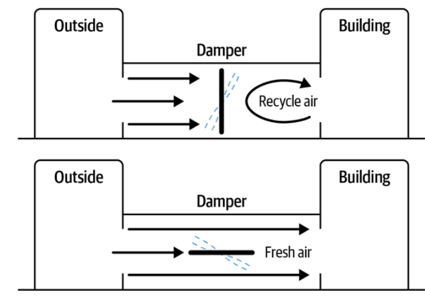

The third category of automated decision methods is manuals. Manuals document expertise from previous exploration, using expert systems and expert rules.

People use **expert rules** very often to learn and teach. Manuals are particularly useful to teach a machine how to make decisions.  There are two main ways that people in industrial settings are accessing and transferring the skills. The first way to transfer skills is with procedures and manuals. Operators refer to procedures when they follow step-by-step instructions or to get guidance that they improvise from. The second way to transfer skills is with strategies. Strategies are labeled courses of action that start with expert rules. Expert rules are bite sized pieces of expertise that transform into skills with practice. As you practice an expert rule, it builds into a strategy as you identify exceptions to the rule and learn how to accomplish the task well under lots of different conditions. 

**An expert system** is a computer program emulating the decision-making ability of a human expert. It's a method for making automated decisions based on human experience acquired by many years of training and on the job.  Expert systems leverage understanding of the system dynamics and effective strategies to control the system based on previous human trial and error.

For example, the Heat, Ventilation and Air Conditioning (HVAC) systems that control the temperature of office buildings. The system uses a damper valve that can be opened to let in fresh air in or closed to recycle air. The system can save energy by recycling air at times of day when the price of energy is high or when the air is very cold and needs to be heated up. However, recycling too much air, especially when there are many people in the building, decreases air quality as carbon dioxide builds up.

The HVAC can be controlled with two simple rules:

- Close the damper to recycle air when energy is expensive or when air is very cold or very hot.
- Open the damper to let fresh air in when the air quality is reaching legal limits.

These rules represent two fundamental strategies for controlling the system.

The image below shows two strategies to control HVAC systems.

The first control strategy, close the damper and recycle air, is perfect for saving money when energy is expensive, and temperatures are extreme. It works best when building occupancy is lower. If you let in fresh air in when the air is cold or hot, it will take a lot of resources to cool the hot air down or heat the cold air up.

The second strategy works well when energy is less expensive and building occupancy is high. We want to take the opportunity, when energy prices are lower, to heat or cool the building instead of waiting to heat and cool the building when the price of energy is a lot higher.

Even though the first two rules in our system are simple to understand and manage, we might need to add many more rules to execute these strategies under all possible conditions. These additional rules handle the details and describe things like, how much should I open the damper at various temperatures and energy prices. The real world is fuzzy, and every rule has hundreds of exceptions that would need to be codified into an expert system.

For example, the first rule tells us that we should recycle air when the energy is expensive and when the air temperature is extreme (hot or cold). How expensive should the energy be to justify recycling air? And how much should you close the damper valve to recycle air?

That depends on the carbon dioxide levels in the rooms and on the outdoor temperature. It's fuzzy—and the right answer depends on the surface of the landscape defined by the relationships between energy prices, outdoor air temperatures, and number of people in the building.

## Expert systems & Expert rules strengths & weaknesses

We should use expert systems or rules when we have a lot of expert knowledge available or when there are constraints to the system that must be complied with. They're reliable and explainable.

The main drawback is the tediousness of managing exceptions and maintaining the rules. It's prone to errors as it's a manual process. It's also fixed; it doesn't learn on its own.
