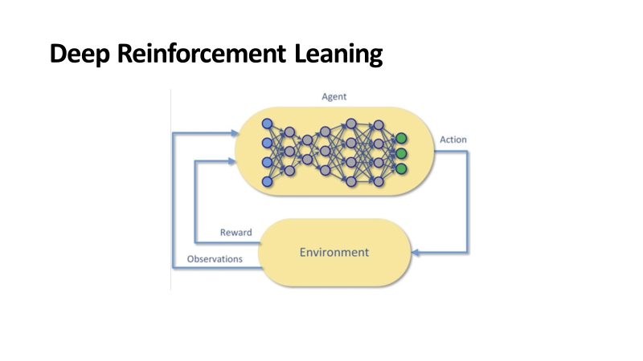

First, we analyze the two types of AI methodologies that are included in Autonomous intelligence: Machine Learning and Deep Reinforcement Learning.

**Machine Learning** models are computer algorithms that use data to make estimations (educated guesses). Machine learning models differ from traditional algorithms in how they're designed. The models are a system of interconnected “nodes” (artificial neurons) which are physiological imitations of the neurons in our brains. They accept different weights (or values of importance) based on the effect that the weight of each node has on the output of the entire network. A machine learning algorithm uses data to get better at a specific task. Spam filters are examples of machine learning models. Machine learning models learn from data over time as they operate. There are two main categories of machine learning models: **Supervised learning** and **Unsupervised learning**. Using supervised learning, you train the computer to apply a label to a given input. For example, you can train a classifier by exposing it to labeled pictures of cats and dogs. Once it's trained, the model classifies unlabeled new pictures of cats and dogs.

**Unsupervised learning** is used to find patterns or hidden structures in datasets that haven't been categorized or labeled.

**Deep learning** is a Machine Learning algorithm that uses multiple layers to progressively extract higher-level features from the raw input. The network learns how to represent complex relationships between network input and output as the weights of each node evolve. So, a deep learning algorithm associates success in a task with certain conditions and assign more weight to relevant nodes, thus strengthening relationships analogous to neural pathways in a biological brain.

In Machine Learning, we have to manually specify the features. For example, if you need to predict house prices, you need to specify which features impact the price of a house (ex: number of bedrooms, proximity to good schools etc.). However, Deep Learning algorithms are designed to automatically detect features on their own. They can also work with unstructured data. This feature of Deep Learning is called **Representation Learning** – it's the ability to learn data representations that make it easier to extract useful information when building classifiers or other predictors. This ability makes Deep Learning algorithms more powerful, but it also adds to the complexity of the algorithm in terms of the need for data (they need millions of data points) and computing resources.

Another type of Machine Learning is **Reinforcement Learning (RL)**. Unlike supervised learning and unsupervised learning that operate using a static dataset, RL works with data from a dynamic environment. In this case, the goal isn't to cluster data or label data, but to find the best sequence of actions to generate the optimal outcome. Reinforcement learning solves the problem of finding the best sequence of actions by allowing a software agent to interact with the environment and learn from it. We can think of the agent as a function. It takes in state observations from the interaction with the environment (the inputs) and maps them to actions that the agent should take at each step (the outputs). This function is called the policy. Given a set of observations that is, the state, the policy decides which action to take. The policy changes dynamically based on the actions taken from the environment and the reward collected. The goal of the agent is to maximize the long-term reward, not just the reward at each step.

Reinforcement Learning was originally an evolution of control theory in the 1960s by Richard Sutton and a few others. They stored the learning from the function in a table. A table imposes a limit on the scalability of RL since it requires millions and billions of rows. If we combine the representation learning ability through deep neural networks with reinforcement learning, we get **Deep Reinforcement Learning (DRL)**. DRL overcomes the challenges of RL in two ways. First, if the state space and action space become too large, and it isn't possible to use a table to store these representations, DRL helps to store these learnings in a neural network. The neural network can then build and respond to complex, non-linear relationships. Second, **Neural Networks** follow the **Universal Approximation theorem** that says that for any function there exists a network that can approximate that function. That means that, in theory, DRL can handle large state spaces and can control any system. DRLs (Deep Reinforcement Learning) have exhibited human-like abilities in playing games like Go and even surpassed the best human players in these games.

In Reinforcement Learning, an agent is under the control of the machine learning algorithm. At each step, the agent observes states and interacts with the environment and learns the consequences of its actions via trial and error. The agent learns to alter its behavior in response to the reward received due to its actions.

In the previous image, the DRL agent observes the environment. It decides on an action that is executed in the environment, and is positively rewarded if the action favors a goal. Otherwise, it's negatively rewarded.

Deep Reinforcement Learning has some of the following unique qualities:

- **Change behavior in response to changing conditions**: In response to changes in the process being modeled, DRL can learn and change its behavior by practicing over many scenarios.
- **Control through fuzzy, non-linear correlations**. By virtue of being based on neural networks, DRLs can learn complex, non-linear relationships. These relationships require decisions to be made across fuzzy, non-linear correlations difficult or impossible to be made by even experts on the matter.
- **Act on complex perception**. DRLs can act on complex perception such as visual perception, sound perception, understanding of categories or classifications to control the system well.
- **Respond to environment changes that aren't directly measured**. Rarely is every key system variable measured, yet human operators control systems well. Automated systems don't control systems and processes when the system inputs or the system itself changes in unknown ways, yet control under these conditions is often required in real-world systems. DRL algorithms can handle these situations where system changes can't be measured.
- **Learn Strategy**. Human operators frequently use strategy to decide and teach which control actions to pursue. Deep Reinforcement Learning can automatically learn strategies.

When any or all of these conditions are identified in industrial machinery or processes, it's a sign that using these Autonomous Intelligence technologies as components of Machine Teaching can help us outperform the current methods used to control the industrial system.
