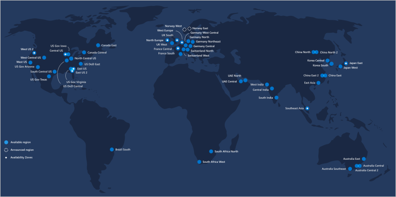

Microsoft Azure is made up of datacenters located around the globe. When you leverage a service or create a resource such as a SQL database or virtual machine, you are using physical equipment in one or more of these locations.

The specific datacenters aren't exposed to end users directly; instead, Azure organizes them into _regions_.

## What is a region?

A **region** is a geographical area on the planet containing at least one, but potentially multiple datacenters that are nearby and networked together with a low-latency network. Azure intelligently assigns and controls the resources within each region to ensure workloads are appropriately balanced. 

When you deploy a resource in Azure, you will often need to choose the region where you want your resource deployed. 

> [!IMPORTANT]
> Some services or virtual machine features are only available in certain regions, such as specific virtual machine sizes or storage types. There are also some global Azure services that do not require you to select a particular region, such as Microsoft Azure Active Directory, Microsoft Azure Traffic Manager, and Azure DNS. 

A few examples of regions are *West US*, *Canada Central*, *West Europe*, *Australia East*, and *Japan West*. Here's a view of all the available regions as of December 2018:

### Why is this important?

Azure has more global regions than any other cloud provider. This gives you the flexibility to bring applications closer to your users no matter where they are. It also provides better scalability, redundancy, and preserves data residency for your services.

### Special Azure regions

Azure has specialized regions that you might want to use when building out your applications for compliance or legal purposes. These include:

- *US DoD Central*, *US Gov Virginia*, *US Gov Iowa* and more: These are physical and logical network-isolated instances of Azure for US government agencies and partners. These datacenters are operated by screened US persons and include additional compliance certifications.

- *China East*, *China North* and more: These regions are available through a unique partnership between Microsoft and 21Vianet, whereby Microsoft does not directly maintain the datacenters.

- *Germany Central* and *Germany Northeast*: 
These regions are available through a data trustee model whereby customer data remains in Germany under control of T-Systems, a Deutsche Telekom company, acting as the German data trustee. Any user or enterprise who needs their data to reside in Germany can use this service.

Regions are what you use to identify the location for your resources, but there are two other terms you should also be aware of: _geographies_ and _availability zones_.
