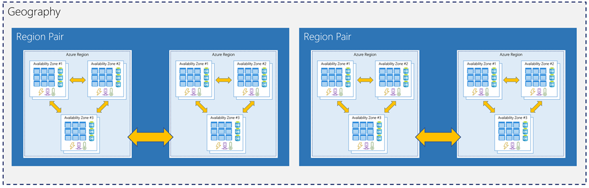

Availability zones are created using one or more datacenters, and there is a minimum of three zones within a single region. However, it's possible that a large enough disaster could cause an outage large enough to affect even two datacenters. That's why Azure also creates _region pairs_.

## What is a region pair?

Each Azure region is always paired with another region within the same geography (such as US, Europe, or Asia) at least **300 miles away**. This approach allows for the replication of resources (such as virtual machine storage) across a geography that helps reduce the likelihood of interruptions due to events such as natural disasters, civil unrest, power outages, or physical network outages affecting both regions at once. If a region in a pair was affected by a natural disaster, for instance, services would automatically fail over to the other region in its region pair.

Examples of region pairs in Azure are West US paired with East US, and SouthEast Asia paired with East Asia.

Since the pair of regions is directly connected and far enough apart to be isolated from regional disasters, you can use them to provide reliable services and data redundancy. Some services offer automatic geo-redundant storage using region pairs.

Additional advantages of region pairs include:

- If there's an extensive Azure outage, one region out of every pair is prioritized to make sure at least one is restored as quick as possible for applications hosted in that region pair.
- Planned Azure updates are rolled out to paired regions one region at a time to minimize downtime and risk of application outage.
- Data continues to reside within the same geography as its pair (except for Brazil South) for tax and law enforcement jurisdiction purposes.

Having a broadly distributed set of datacenters allows Azure to provide a high guarantee of availability. Let's explore what that means.
