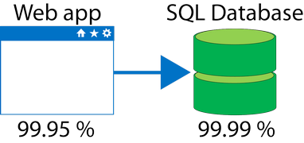
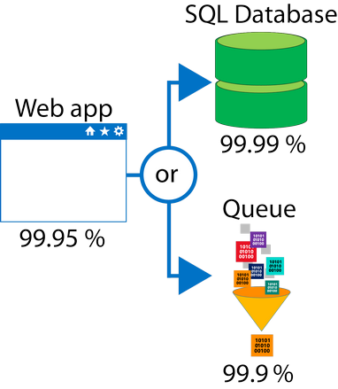

When combining SLAs across different service offerings, the resultant SLA is called a *Composite SLA*. The resulting composite SLA can provide higher or lower uptime values, depending on your application architecture.

## Calculating downtime

Consider an App Service web app that writes to Azure SQL Database. These Azure services currently have the following SLAs:

In this example, if either service fails the whole application will fail. In general, the individual probability values for each service are independent. However, the composite SLA value for this application is:

`99.95 percent × 99.99 percent = 99.94 percent`

> [!NOTE]
> For SLA and downtime calculations, remember that any time you see a number with the label or symbol for "percent" (`%`), that number is divided by 100. If you were entering the SLA calculation above, the actual values would be `0.9995 * 0.9999 = 0.9994`.

This means the **combined probability of failure** is higher than the individual SLA values. This isn't surprising, because an application that relies on multiple services has more potential failure points.

Conversely, you can improve the composite SLA by creating independent fallback paths. For example, if the SQL Database is unavailable, you can put transactions into a queue for processing at a later time.

With this design, the application is still available even if it can't connect to the database. However, it fails if both the database _and_ the queue fail simultaneously.

If the expected percentage of time for a simultaneous failure is **0.0001 × 0.001**, the composite SLA for this combined path of a database _or_ queue would be:

`1.0 − (0.0001 × 0.001) = 99.99999 percent`

Therefore, if we add the queue to our web app, the total composite SLA is:

`99.95 percent × 99.99999 percent = ~99.95 percent`

Notice we've improved our SLA behavior. However, there are trade-offs to using this approach: the application logic is more complicated, you are paying more to add the queue support, and there may be data-consistency issues you'll have to deal with due to retry behavior.
